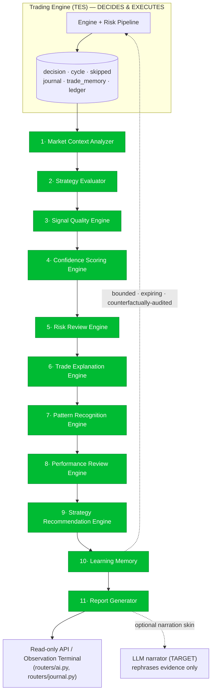

# TradeLogX Nexus — AI Decision Engine Specification (ADES)

*Eighth blueprint in the series: `PRD` → `APP_FLOW_AUDIT` → `TRD` → `SAD` → `DDS` → `API_SPEC` → `TES` → **ADES**. This is the blueprint for every AI feature in the platform. **The AI Decision Engine does not execute trades.** The Trading Engine (TES) decides and executes; the AI Decision Engine **observes, evaluates, explains, scores, analyzes, learns, and recommends.***

> **Version 1.0 · 2026-07-22 · Principle: the AI observes and explains; the Trading Engine decides and executes**

---

## Reading guide — as-built vs. target (read first)

Consistent with the SAD/DDS/API/TES, every module is tagged: 🟢 **EXISTS** · 🟡 **PARTIAL** · 🔴 **NEW/TARGET**.

**The central, verified finding — and it is a strength, not a gap:** *There is **no LLM anywhere** in this system.* A whole-repo scan for `anthropic`/`openai`/`claude`/`gpt`/embeddings/langchain returns nothing but exchange API keys — no model SDK, no inference endpoint, no embedding backend (the one `openai` string in the tree is a transitive dev-dependency inside a Supabase package's `node_modules`, unused). Today's "AI" is **100% deterministic, rule-based synthesis over real engine data**, and the code says so in its own comments:

> *"None of this claims to be an LLM embedding model — it is honest local retrieval."* (`services/trade_memory.py:12`)
> *"cosine over a numeric feature vector — honest local retrieval, not an LLM embedding."* (`routers/journal.py:170`)

**Why this matters for the brief.** The requirements demand the AI *"never hallucinate… every explanation must reference actual data… all conclusions derived from real engine data."* A deterministic, formula-based engine **cannot hallucinate by construction** — every number is arithmetic over stored trades, and unmeasured fields are stamped `"Not checked"` / `"not captured"` rather than invented. So the current design already satisfies the hardest requirement. This spec therefore does two things: (1) **specifies the real, existing rule-based engine** as the source of truth (it is more complete than most "AI" layers), and (2) designs an **optional LLM narration layer** (🔴) that is strictly a *presentation skin* over the deterministic evidence — the LLM may rephrase computed facts into fluent prose but is **structurally forbidden from introducing any claim not already in the evidence bundle** (§12).

**Maturity today:** the market-context analyzer, the two real confidence scorers (with published weights), the per-cycle explanation engine, pattern mining, the counterfactual falsifier, the bounded learning book, periodic reviews, and the 8-category per-trade memory are **all real and battle-used**. **AI Decision Engine readiness: 7.0 / 10** (§15) — the highest score in the blueprint set, because explainability and honesty are already first-class.

---

## 1. Executive Summary

The AI Decision Engine is the platform's **transparent analyst**: it watches everything the Trading Engine does, scores it, explains it in plain language backed by real data, mines patterns across history, and recommends bounded, evidence-backed improvements — while never touching an order. Its design rests on five commitments:

1. **Observe-only, by architecture.** Every analysis module reads from durable stores (`decision_store`, `journal`, `trade_memory`, ledger) and returns dicts. None places or modifies orders. The one place learning feeds back into trading (bounded risk multipliers + gate reasons in the risk pipeline) is explicitly fenced, expiring, and counterfactually audited (§12).
2. **Deterministic and reproducible.** Same trades in → same scores, same explanations, same recommendations out. This is what makes AI output auditable and testable — and impossible to hallucinate.
3. **Evidence or silence.** Every score cites its components; every claim is sample-gated (a "68% better in London" insight is suppressed unless the bucket is large enough and the effect big enough); every unmeasured field is an honest marker, never a fabricated number.
4. **Human-in-the-loop for change.** The AI *suggests*; a human *approves*. Every path that could alter live strategy/risk (evolution, retune, lessons) is gated behind explicit human approval — the AI never rewrites the strategy.
5. **Composable, cached, async.** The AI layer re-implements nothing — it composes the engine's own intelligence (`ai_intelligence` orchestrates `market_analysis` + `brain` + `explain` + `memory`), served through short-TTL caches and background rollups so analysis never blocks trading.

**What it can do today (real):** explain every trade, rejected trade, skipped setup, and exit; score signal/setup quality on two published models; produce a 0–100 confidence with a per-component breakdown; detect winning/losing patterns, repeated mistakes, and best/worst conditions; review daily/weekly/monthly/yearly performance; recommend one-click settings changes with evidence; and drive the per-trade Observation Terminal. **The target** adds the optional LLM narration skin, richer pattern coverage, and calibration hardening — all on the same deterministic substrate.

---

## 2. AI Decision Engine Architecture

### 2.1 The pipeline (target = today's real modules, formalized)

**The heavy dashed line is the only feedback into trading** — bounded risk multipliers and gate reasons (§12). Everything else is a one-way read.

### 2.2 Module catalog (all 🟢 unless noted)
| # | Module | Responsibility | As-built |
|---|---|---|---|
| 1 | **Market Context Analyzer** | Trend/momentum/volatility/liquidity/structure/S&D/regime/HTF/macro | `market_analysis.py`, `market_context.py`, `regime.py`, `mtf_engine.py` |
| 2 | **Strategy Evaluator** | How well the strategy's rules matched current conditions | `strategies/brain.py`, `decision_gate.py` |
| 3 | **Signal Quality Engine** | Grade each signal excellent/good/average/weak/rejected | `explain.build_scores`, `brain.py` grade bands |
| 4 | **Confidence Scoring Engine** | 0–100 confidence with per-factor breakdown | `brain.py` (weighted 100), `explain.py` (5×20) |
| 5 | **Risk Review Engine** | Post-hoc review of risk/RR/exposure/stop safety | `ai_intelligence.py` risk block, `risk_engine.py` |
| 6 | **Trade Explanation Engine** | Human-readable why (entry/reject/skip/exit) from real data | `explain.build_cycle_report`, `coach.py` |
| 7 | **Pattern Recognition Engine** | Winning/losing patterns, mistakes, best/worst conditions | `memory_insights.py`, `memory.py` |
| 8 | **Performance Review Engine** | Daily/weekly/monthly/strategy/portfolio/session reviews | `trade_memory_manager.run_reviews`, `performance.py`, `daily_report.py` |
| 9 | **Strategy Recommendation Engine** | Evidence-backed, human-approved improvements | `lessons.py`, `ai_intelligence.settings_recommendations`, `evolution.py`, `retune.py` |
| 10 | **Learning Memory** | Bounded, expiring, falsifiable self-corrections + reviewable log | `learning.py`, `counterfactual.py`, `trade_memory*`, `LessonStore` |
| 11 | **Report Generator** | Trade/daily/weekly/monthly/strategy/portfolio/risk reports | `explain`, `daily_report`, `memory_insights`, `coach`, `audit_export` |
| — | **LLM Narrator** | Optional fluent-prose skin over the evidence bundle | 🔴 target |

---

## 3. Market Context Analysis Design

### 3.1 Per-symbol technical read (🟢 `market_analysis.analyze()`)
Requires ≥40 bars or returns `{available: false, note: "insufficient history…"}` (never guesses on thin data). Structured output (verified shape):
```
{ available, price, atr, atr_pct,
  bias,                       # Bullish/Bearish/Neutral by 3-vote majority
  trend:      { ema8, ema33, ema8_vs_ema33, price_vs_ema33, strength, strength_label,
                swing_highs, swing_lows },
  structure:  { state, break_of_structure, change_of_character },
  zones:      { demand, supply },
  levels:     { supports, resistances, nearest_support, nearest_resistance },
  volume:     { label, ratio_vs_20bar },
  volatility: { label, atr_pct },
  liquidity:  { equal_highs, equal_lows, sweep },
  last_candle }
```
Covers the brief's **trend · momentum · volatility · liquidity · volume · structure (BOS/CHoCH) · supply/demand · S/R · higher-timeframe bias**. Every definition is documented in-module so each number is auditable.

### 3.2 Regime, MTF, and macro
- **Regime** (`regime.RegimeDetector.detect`) → `Regime(name ∈ {Trending, Ranging, High/Low/Extreme Volatility}, trend_strength, atr_pct, detail)` via Kaufman efficiency ratio + ATR% — the brief's **market phase**.
- **MTF** (`mtf_engine`) → Weekly=macro, Daily=confirm, 4H=structure, 15M=setup, 5M=trigger; HTF must agree or "no trade" — the brief's **HTF bias**.
- **Macro/sentiment** (`market_context.market_context`) → `fear_greed, btc_dominance, total_mcap, eth_btc, funding_rate, open_interest, news, liquidations, economic_calendar, sentiment_summary`. **Fail-closed**: key-gated sources return `{available:false, note:"Not connected — add a … key"}`; when live sources are down it emits *"Live sentiment sources unavailable — not faking a value."* The brief's **news · correlation · liquidity** context.

### 3.3 Output contract (target)
A single `MarketContext` object stamped on every decision (already largely present in `decision_store.regime`/`htf_bias` + `journal.market_snapshot`), so downstream modules and the Observation Terminal read one canonical context per bar.

---

## 4. Confidence Scoring Model

**Two real, distinct scorers** (the spec must not conflate them). Both are published, deterministic, and component-decomposed.

### 4.1 Engine quality gate — `TradeBrain.evaluate()` (🟢 `strategies/brain.py`, 0–100)
The score that actually gates trades. Eight weighted components summing to 100, plus penalties and hard blocks:

| Component | Weight | Basis |
|---|---:|---|
| HTF alignment | 22 | with-trend `12 + 10·min(1, strength/0.45)`; neutral 11; reversals fade |
| Regime fit | 18 | lookup by regime name |
| RR quality | 14 | `14·min(1, rr/2.0)` |
| Stop safety | 10 | sweet-spot ~1.2%: `5 + 5·safe` |
| Volatility | 10 | full inside ATR% band 0.4–3% |
| Momentum | 12 | `12·band(RSI, 50,70,40,82)` |
| Structure | 8 | correct side of EMA50 → 8 else 2 |
| Volume | 6 | last vs 20-bar avg |
| *S/R distance* | −8 max | penalty for entering under opposing S/R |
| *Loss streak* | −min(15, 5·(losses−2)) | penalty after 3 losses |

`score = clamp(round(raw − streak_penalty), 0, 100)`. **Hard blocks** (score-independent): `rr<1.0`, stop too tight/wide, ATR too low, against a strong HTF trend (non-reversal), choppy regime (non-reversal), loss-streak cooldown. **Grade bands:** `blocked` / `high ≥80` / `acceptable ≥60` / `weak <60`.

### 4.2 Presentation score — `explain.build_scores()` (🟢 `services/explain.py`, 5 × 20 = 100)
The five-category breakdown shown in the UI:
- **Trend /20** = EMA8/33 alignment(8) + strength(6) + swing agreement(6)
- **Structure /20** = trending(8) + BOS aligned(8) + no-CHoCH(4)
- **Supply/Demand /20** = zone proximity(12) + structure-side(8)
- **Volume /20** = `(ratio−0.6)/0.8·20`
- **Risk /20** = `min(12, rr/3·12)` + headroom(8)

`total`, label `strong ≥80 / watchlist ≥65 / skip-quality <65`, and it carries `engine_score` (the TradeBrain score) alongside with a note that they are distinct.

### 4.3 Human confidence bands & the unified decision object
`ai_intelligence.analyze_setup()` composes both → `confidence_pct` with bands **Very High ≥85 · High ≥70 · Medium ≥55 · Low ≥40 · Very Low** (also served at `/ai/confidence-levels`). The canonical record is `decision_gate.build_decision()` → `{setup_quality_score, volume_score, rr_score, confidence, passed_rules, failed_rules, decision, reason, components}`; **when the gate is disabled it returns `null` scores with an honest reason, never invented numbers.** The brief's **Excellent/Good/Average/Weak/Rejected** maps to the grade bands + the decision (`BUY/SELL/WAIT/SKIP`).

### 4.4 Signal Quality → the required 5-tier grade (target normalization)
Formalize one `SignalQuality ∈ {excellent, good, average, weak, rejected}` = f(engine grade band, presentation label, decision), stamped on every signal so the UI and analytics share one vocabulary. *(Today the two label sets coexist; unifying them is a small target.)*

---

## 5. Trade Explanation Design

### 5.1 Per-cycle Decision Report (🟢 `explain.build_cycle_report()`)
One report per **closed candle** (every bar, including WAIT/SKIP): `{ts, symbol, timeframe, price, decision, side, score, market_analysis, checklist, scores, reasons, recommendation, links}`. It narrates the actual branch taken from real `outcome.kind` (no-signal / hold / opened / pending / closed / **rejected → append ❌ {failed_rule}**). `build_checklist()` yields 8 **PASS / FAIL / N/A** rules — `N/A` when there is genuinely no direction, rather than guessing.

### 5.2 Mentor explanation (🟢 `services/coach.py`, over replay trades)
- `explain_trade()` → per-trade `why / why_not / why_trust` from real `entry_reasons, score, mtf, loss_analysis`.
- `coach_review()` → `{headline, why_won, why_lost, common_mistakes, weak_conditions, suggestions, confidence_score, stability_score, attribution, sample_explanations}`, where `confidence_score = round(100·(0.6·min(1,pf/2) + 0.4·sample_factor))`.
- `attribution()` → net-R buckets `by_session / by_regime / by_setup / by_side / by_symbol`.

### 5.3 The required narrative (grounded, never fabricated)
The brief's example ("opened because HTF bullish → liquidity sweep → BOS → FVG retest → risk passed; size adjusted because volatility rose; leverage reduced because ATR exceeded threshold") maps **directly** to real fields: `market_analysis.trend/liquidity.sweep/structure.break_of_structure/zones`, the passed checklist rules, and the sizing multiplier stack. The **LLM narrator (§12, target)** may render these into a single flowing paragraph — but only from this evidence bundle; it receives the structured facts, not the market.

---

## 6. Pattern Recognition Design

### 6.1 Mining engine (🟢 `services/memory_insights.build_review()`)
Nightly arithmetic over real stored trades → `{overall, risk_adjusted, sharpe, sortino, max_drawdown_abs, avg_hold, by_symbol, by_strategy, by_session, by_weekday, by_setup_grade, best/worst_setup, best/worst_session, mistakes, winning_patterns, coaching, evidence_note}`. Buckets sorted by expectancy. **Sample-gated by design:** `MIN_BUCKET=5`, `EARLY_SIGNAL_MAX=10`, `EVIDENCE_MIN=30`; a coaching claim ("X% better in London") is emitted **only** when `|effect| ≥ 15%` **and** bucket ≥ 5 — otherwise it stays silent, because a thin sample "could read as a fabricated edge."

### 6.2 Mistake library & Strategy DNA
- `_mistake_library()` → frequency-ranked recorded mistakes with `{count, loss_attributed, examples, repeated(≥2)}` — the brief's **repeated mistakes**.
- `services/memory.py` mines best/worst **regime · session · symbol** per strategy into a **DNA profile** (preferred market/volatility/session/trend/symbols) used as a live filter — the brief's **best/worst conditions, most profitable symbols/sessions/strategy-versions**.

### 6.3 Coverage (honest)
Winning/losing patterns, repeated mistakes, best/worst conditions, best symbols/sessions, and per-strategy DNA are **real**. Per-**strategy-version** attribution is 🟡 (needs `strategy_version_id` on records, DDS) and lands with the versioning rollout.

---

## 7. Performance Review Design

| Cadence | Engine | Output |
|---|---|---|
| **Live track record** | `services/performance.py` | win rate, profit factor, expectancy, max DD, longest losing streak, equity curve, per-trade Sharpe/Sortino (honestly *not* annualised) |
| **Nightly / weekly / monthly / yearly** | `trade_memory_manager.run_reviews()` → `memory_insights.build_review` | full periodic rollup stamped `generated_at`; served at `/trade-memory/reviews?period=…` |
| **Daily digest** | `daily_report.build_report()` | today/week/all-time P&L + win rate, open positions, `active_learned_rules`, `lessons_today`, watchdog findings, gate `saved_r`/`costing`; Telegram-rendered |

Reviews by **strategy / portfolio / market-condition / session** are the `by_*` buckets above. **Target:** per-strategy and per-portfolio reviews become first-class once `accounts`/`strategy_versions` land (DDS); the review *engine* is unchanged.

---

## 8. Recommendation Engine Design

Every recommendation is **evidence-backed and human-approved** — the AI never edits the strategy itself.

- **`lessons.lessons_from_results()`** → `{lesson, suggested_fix, confidence, evidence}`; requires ≥5 trades; confidence scales with sample (`min(95, 55 + n·3)`). Produces concrete lessons like "loses 68% when 4H bullish but 15M bearish" from real replay frames. `LessonStore` enforces a lifecycle: **Suggested → Tested → Approved / Rejected / Archived** — *"the bot can suggest, but only a human approves."*
- **`ai_intelligence.settings_recommendations()`** → each rec maps to **one editable setting** with a concrete value: `{id, title, why, setting, current, suggested, unit, severity}`. Config-hygiene recs fire off current settings; behaviour recs require real coach evidence.
- **`evolution.py` / `retune.py`** → versioned strategy upgrades and validated replacements (train/test split on real candles). Both hard-gate live promotion behind explicit human confirmation: *"no function here auto-applies anything to live."*
- **The falsifier — `counterfactual.CounterfactualTracker`**: records every **vetoed** trade as a virtual trade, settles it pessimistically (stop-before-target, taker costs both sides), and scores each rule: `saved = −Σr` → verdict `saving ≥2R / costing ≤−2R / neutral / collecting`. `costing_rules()` (rules that blocked winners) are fed back to the learning book to be dropped. This is what keeps recommendations honest: a rule that *sounds* smart but blocks winners is measured and falsified.

Maps to the brief's **risk / indicator / entry / exit / sizing / filter / timeframe** recommendations, each "with supporting evidence."

---

## 9. Learning Memory Design

### 9.1 The learning book (🟢 `services/learning.py`, bounded & expiring)
`classify()` is pure and detects 8 named patterns, each with evidence `{trades, net_pnl, win_rate}`: symbol-leak, side-leak, revenge-trades, session-leak, slipped-stops, low-conviction, regime-leak, edge-regime, edge-conviction. `update()` applies **bounded, expiring** corrections: `MIN_RISK_MULT=0.5`, `MAX_CONF_BUMP=0.15`, `MAX_BOOST=1.25`, `EXPIRY_DAYS=14`. Corrections **falsify immediately** when the counterfactual tracker says a rule is costing, and **relax** when unconfirmed past expiry. The full apply/relax/falsify timeline lives in `self.history` — **reviewable**, per the brief.

### 9.2 Durable memory (🟢 `trade_memory` + `LessonStore` + reviews)
Stores past reviews, per-trade explanations (8-category), winning/losing setups, repeated errors, improvement history, and strategy evolution — all queryable, similarity-searchable (honest cosine, not embeddings), and human-reviewable. Maps to DDS `learning_history`, `trade_memories`, `ai_reviews`, `ai_suggestions`.

### 9.3 The honest feedback boundary (§12 expands)
Learning is the **one** module that feeds back into trading — only through **bounded, expiring, counterfactually-audited** risk multipliers and gate reasons in the risk pipeline, with "defense always outranks offense" (a positive boost only applies when nothing else is throttling). It never places orders and never edits the strategy.

---

## 10. Report Generation Design

| Report | Source | Tag |
|---|---|---|
| **Trade report** | `explain.build_cycle_report` + `journal` sections | 🟢 |
| **Daily report** | `daily_report.build_report/format_report` (+Telegram) | 🟢 |
| **Weekly / Monthly / Yearly** | `trade_memory_manager.run_reviews` → `memory_insights` | 🟢 |
| **Strategy review** | `coach.coach_review` + `strategy_health`/`league` | 🟢 |
| **Portfolio review** | `performance` + `portfolio_risk` + allocation | 🟡 |
| **Risk report** | `risk_engine` + `portfolio_risk` + circuit state | 🟡 |
| **Performance report** | `performance.py` | 🟢 |
| **Compliance/audit bundle** | `audit_export.build_bundle` — SHA-256-hashed, self-verifying, paper-only | 🟢 |

**Target:** one `ReportGenerator` façade with a consistent envelope + optional LLM executive-summary paragraph (narration skin) at the top of each report, generated only from the report's own computed figures.

---

## 11. Explainability Framework

Every AI output must carry: **evidence · reasoning · supporting indicators · confidence · references to real market data.** How that's enforced (🟢, pervasive):

- **Component decomposition** — every score ships its parts (`components`, the 5×20 breakdown, `passed_rules`/`failed_rules`), so a number is never a black box.
- **Honest markers, not fabrication** — a read the strategy didn't compute is `"Not checked"` (`decision_journal._BRAIN_NOT_CHECKED`); a missing snapshot is `"Not captured for this entry."`; missing MFE/MAE is `"not tracked"`; unwired macro sources report `"Configured — provider endpoint not wired yet"`. `decision_gate` returns `null` (not 0) when a gate is off.
- **Sample-gating** — insights self-suppress below evidence thresholds so a thin sample can't read as a fabricated edge.
- **Provenance** — every panel names its source store; the per-trade AI reflection is stamped `"Composed from the trade's real review + evolution memory (no invented insight)."`
- **Calibration honesty** — `confidence_accuracy()` reports whether higher-confidence setups actually won more, and says so plainly below ~10 graded trades rather than implying a trend.

### 11.1 Bot Observation Terminal — per-trade provenance (🟢)
Clicking a trade assembles from three real stores:
| Panel | Source |
|---|---|
| Market Context | `journal.market_snapshot` + `decision_store.regime/htf_bias` |
| Trade Reason | `journal.entry_decision.main_reason` + `decision_store.reason` |
| Confidence | `decision_store.confidence` + `brain_score` |
| Strategy Version | `journal`/`trade_memory.strategy` (version) *(🟡 version id)* |
| Entry Checklist | `journal.checklist.entry_reads` (PASS/FAIL/**Not checked**) |
| Risk Checklist | `journal.checklist.risk_gates` |
| Execution Details | ledger fill (price, size, fees, slippage) |
| AI Commentary | `trade_memory._reflect()` — what went well/wrong/repeat/never-again |
| Improvement Suggestions | `lessons` + `coach.suggestions` |

---

## 12. Safety & Validation Rules

**The AI must NEVER: place orders · modify trades · override the Trading Engine · invent market data · invent strategy conditions · hallucinate explanations.** How each is guaranteed:

| Rule | Guarantee | As-built |
|---|---|---|
| **Never places/modifies orders** | The entire observe/explain/score/report surface (`ai_intelligence`, `explain`, `coach`, `market_analysis`, `memory_insights`, `counterfactual`, `routers/ai.py`, `routers/journal.py`) has **no broker/order/execution write** — it only reads stores and returns dicts. | 🟢 (verified) |
| **Never overrides the engine** | The AI cannot change a decision after the fact; the engine's gate is authoritative. | 🟢 |
| **Never invents data** | Honest markers + fail-closed context + sample-gating (§11). | 🟢 |
| **Never hallucinates** | Deterministic arithmetic; no generative model in the loop today. | 🟢 |
| **Human approval for change** | Evolution/retune/lessons require explicit human confirmation; *"Risk is never increased automatically; the Risk Manager and Safety Center are never bypassed."* | 🟢 |

### 12.1 The one honest feedback boundary (must be documented, not hidden)
The **Learning Memory** is the sole module that influences *future* trading — and it does so under strict fences, in the risk pipeline only:
- **Gate:** a learned block can veto an entry (`reject("learning", why)`), always recording the human-readable reason.
- **Risk sizing:** bounded multipliers `risk_multiplier / side_multiplier / boost_multiplier`, each clamped (`0.5 … 1.25`), folded into the effective risk; a positive boost applies **only when nothing else is throttling** ("defense always outranks offense").
- **Self-falsifying:** every learned rule is graded by the counterfactual tracker and dropped when it costs; unconfirmed rules expire in 14 days.

This is **not** the AI executing — it is a bounded, auditable risk modulation inside the engine, and it never opens/closes a position or edits a strategy. The distinction is the safety contract: *the AI can make the engine more cautious within limits; it can never make it act.*

### 12.2 The LLM narrator (target) — constrained by construction
If an LLM narration skin is added, it operates under a hard contract: it receives **only the structured evidence bundle** (scores, components, checklist, real market fields) and is instructed to **rephrase, never add**. Its output is validated against the bundle (every referenced number must appear in the evidence); it has **no tool access, no data access, no order access**. It is a language renderer over facts the deterministic engine already produced — so the "never hallucinate" guarantee survives. When unavailable, the deterministic templates (already the default today) render the same content in plainer prose.

---

## 13. AI Testing Strategy

**Trade explanations** — golden-fixture trades → assert the explanation cites the exact real fields (BOS/sweep/FVG/RR) and never emits a value absent from the snapshot; `"Not checked"` appears where the read was uncomputed.
**Confidence scoring** — property tests on both scorers: components sum to their caps; monotonicity (better RR → higher rr_quality); hard blocks force `blocked` regardless of score; disabled gate → `null`, not 0.
**Recommendation quality** — every recommendation carries non-empty `evidence` and maps to a real editable setting; no rec fires below its sample threshold; a rule the counterfactual tracker marks `costing` is dropped.
**Pattern detection** — seeded trade sets with a planted edge → the miner surfaces it; sets below threshold → it stays silent (no fabricated edge).
**Performance reports** — determinism (same trades → same review); figures reconcile with the ledger; Sharpe/Sortino labeled non-annualised.
**Calibration** — `confidence_accuracy` reports "calibrated" only when high-conf win rate actually exceeds low-conf; honest verdict below the sample floor.
**Anti-hallucination (the flagship suite, 🔴 for the LLM path)** — fuzz the evidence bundle; assert every number in any narrated output is present in the bundle; assert no order/tool call is ever emitted; assert the narrator degrades to templates when disabled.
**Regression** — snapshot key explanations/scores; a code change that alters them fails CI unless intended.

Current real coverage: the deterministic scorers, miners, and reports are covered by the 870-test backend suite; the LLM-narration contract tests are new work with the narrator.

---

## 14. AI Performance Optimization

| Target | Approach | As-built |
|---|---|---|
| **Low latency** | pure functions over already-stored data; no recompute of the engine | 🟢 |
| **Caching** | short-TTL caches on hot reads (`/ai/analyze` 20 s, `/ai/insights` 30 s) via `services/ttl_cache.py` | 🟢 |
| **Async / background** | periodic reviews run as scheduled rollups (`run_reviews`), not on the request path | 🟢 |
| **Scalable inference** | deterministic math scales linearly; the (target) LLM narrator is async, cached per-trade, and off the hot path | 🟡 |
| **Memory** | bounded stores + sampled mining; similarity is O(n·d) cosine over small feature dicts | 🟢 |
| **Cost control (LLM)** | narrate on demand + cache by content hash; cheap/fast model tier for routine narration, larger tier only for deep reviews | 🔴 |

Because the analytical layer never blocks trading and reads pre-computed state, its performance profile is already strong; the only new cost vector is the optional LLM narrator, which is deliberately async, cached, and non-blocking.

---

## 15. AI Decision Engine Readiness Score

| Dimension | Score | Notes |
|---|---:|---|
| **Explainability** | 9/10 | Every trade/reject/skip/exit explained from real fields; PASS/FAIL/**Not checked** checklists. Best-in-class. |
| **Anti-hallucination / honesty** | 10/10 | No generative model; honest markers, fail-closed context, sample-gating — cannot fabricate by construction. |
| **Confidence scoring** | 8/10 | Two published, component-decomposed models; needs the unified 5-tier `SignalQuality` label. |
| **Market context** | 8/10 | Rich technical + regime + MTF + macro; some macro sources unwired (honestly flagged). |
| **Pattern recognition** | 7/10 | Real mining, mistake library, DNA; per-strategy-version attribution pending. |
| **Performance review** | 8/10 | Nightly→yearly rollups + daily digest + live track record. |
| **Recommendation engine** | 8/10 | Evidence-backed, human-approval lifecycle, counterfactually falsified. Genuinely strong. |
| **Learning memory** | 8/10 | Bounded, expiring, self-falsifying, reviewable — unusually disciplined. |
| **Report generation** | 7/10 | Full cadence + self-verifying audit bundle; portfolio/risk reports partial. |
| **Separation from execution** | 9/10 | Observe layer is order-free; the one feedback path is bounded, audited, and documented — not hidden. |
| **Narration / UX polish** | 4/10 | Template prose today; the fluent LLM skin is the main target. |
| **Testing** | 6/10 | Deterministic parts well covered; LLM-contract + calibration gates are new. |

### **Overall: 7.0 / 10** — *"A transparent, honest, deterministic analyst that already refuses to hallucinate — its main gap is fluent narration, not trustworthiness."*

This is the **highest score in the blueprint set**, and deservedly: the requirements' hardest demand — *never hallucinate, always cite real data, stay separate from execution* — is already met by architecture, not by discipline alone. The current engine explains, scores, mines, reviews, and recommends entirely from real computed values, with published formulas and honest "Not checked" markers. The path to 9+/10 is **presentation and coverage, not trust**: unify the signal-quality label, add per-strategy-version attribution, complete portfolio/risk reports, and (optionally) layer the constrained LLM narrator (§12.2) that makes the same honest evidence read like a human analyst — without ever being allowed to invent a word beyond it.

---

*End of AI Decision Engine Specification v1.0. The AI observes and explains; the Trading Engine (TES) decides and executes. Consistent with TES §11 (decision recording), DDS §4.8 (AI tables), and API §2.12 (`/ai/*`). This completes the eight-part blueprint set: PRD · Audit · TRD · SAD · DDS · API · TES · ADES.*
