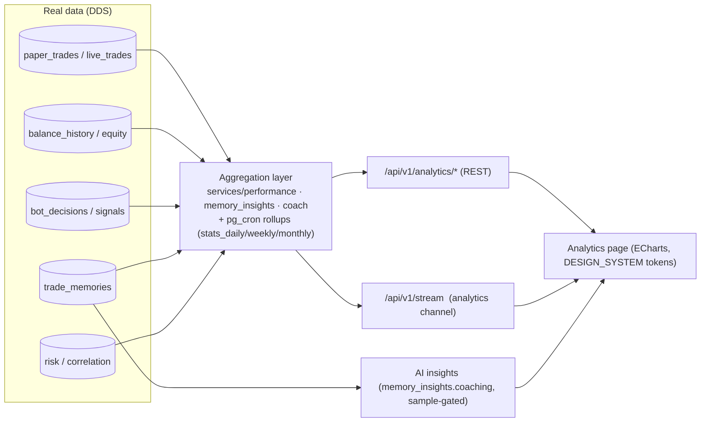

# TradeLogX Nexus — Analytics Module Specification

*Institutional-grade performance analytics — real data only. Grounded in the existing backend, consistent with the canonical `DESIGN_SYSTEM.md` (ECharts, dark institutional) and the DDS/API/ADES. This is the implementation blueprint for the Analytics module.*

> **Version 1.0 · 2026-07-22 · ECharts · real-data-only · dark-first**

---

## Reading guide — grounded, honest, no fake data

Tags: 🟢 **EXISTS** (a real endpoint/computation today) · 🟡 **PARTIAL** (data exists, needs surfacing/rollup) · 🔴 **NEW**.

**Verified up front (MVP audit):** the current Analytics page is **already free of fake statistics, placeholders, and demo charts** — it binds to `/strategy/performance` + `/paper/trades`, derives the equity curve / win-loss / daily-PnL from real trades, and shows an explicit "backend not reachable" state. So "remove all fake data" is a **standing principle here, not a cleanup** — every metric/chart/table in this spec must trace to a real endpoint or render an honest `available:false` empty state (never a fabricated number). Much of the requested analytics **already has real backing** (`services/performance.py`, `services/memory_insights.py`, `services/coach.py`, `routers/analytics.py`); the gaps are new *views* over that data (calendar, heatmap, by-hour) and a few new metrics (Calmar, recovery factor, current drawdown).

---

## 1. Analytics Architecture

**Principle:** Analytics is a **read model** over the immutable ledger (never a second source of truth). Live values poll/stream; heavy aggregates are **materialized** (DDS §4.10) and refreshed on schedule, so the page is O(1) regardless of trade count. Every figure is reconstructable from the ledger — the honesty guarantee.

---

## 2. Dashboard Layout

Eight tabbed sections (top segmented control), each a token-spaced card grid (DESIGN_SYSTEM §8):

| Tab | Content | Backing |
|---|---|---|
| **Overview** | KPI tiles + equity curve + PnL calendar strip | 🟢/🔴 |
| **Performance** | equity/daily/weekly/monthly/yearly charts + streaks | 🟢/🟡 |
| **Risk** | drawdown, exposure, correlation, risk-per-trade, position-size history | 🟢/🟡 |
| **Strategies** | setup performance + strategy comparison | 🟢/🟡 |
| **Market Analysis** | market-condition + time analysis + heatmap | 🟡/🔴 |
| **Trade Analysis** | distribution (long/short, duration, size), win/loss | 🟢/🔴 |
| **AI Insights** | generated insights + bot analytics | 🟢 |
| **Portfolio Analytics** | allocation, exposure, per-symbol, performance history | 🟢/🟡 |

**Layout rules:** filter bar sticky at top (§11 filters); KPI tiles 4→3→2→1 across breakpoints; charts full-width on their row; tables below charts; every card has loading/empty/error states; numbers mono + `tabular-nums`, P&L sign-prefixed + colored.

---

## 3. Required Charts (ECharts)

| # | Chart | Spec | Backing |
|---|---|---|---|
| 1 | **Equity Curve** | line/area: portfolio growth + balance + **drawdown overlay** (area below) + trade markers; zoom/pan (dataZoom); time filters | 🟢 `/paper/equity-curve` (+ 🔴 drawdown overlay, markers) |
| 2 | **Daily Performance** | grouped bars: daily PnL, win rate, trades, risk, return | 🟡 rollup `stats_daily` |
| 3 | **Weekly Performance** | bars + line: weekly return, profit, drawdown, consistency | 🟡 `stats_weekly` |
| 4 | **Monthly Performance** | interactive month bars (green/red) | 🟢 (backtesting has monthly returns) → 🟡 for live |
| 5 | **Yearly Performance** | portfolio growth by year | 🟡 `stats_monthly`→year |
| 6 | **PnL Calendar** | day-grid heat cells (profit/loss/trades/win-rate; color intensity by |PnL|); **click day → trades that day** | 🔴 new (`/analytics/pnl-calendar`) |
| 7 | **Trade Heatmap** | hour × weekday matrix; profitability intensity | 🔴 new (`by_hour` + `by_weekday`) |
| 8 | **Trade Distribution** | long/short, win/loss, duration histogram, position-size histogram, order-type | 🟢/🔴 |
| 9 | **Confidence Distribution** | bot confidence buckets + calibration | 🟢 `/ai/confidence-accuracy` |
| 10 | **Correlation Matrix** | symbol×symbol heatmap | 🟢 `/risk/correlation` |

All charts: ECharts canvas, `chart-grid #1C2336` / `chart-axis #5B6478`, mono tabular tooltips, `animation` on aggregates (off on candles), theme-aware (DESIGN_SYSTEM §10).

---

## 4. KPI Definitions

Formulas + backing. 🟢 = computed today.

| KPI | Definition | Backing |
|---|---|---|
| Net Profit | Σ realized PnL − fees | 🟢 performance |
| Gross Profit / Gross Loss | Σ wins / Σ losses | 🟢 (`gross_win`/`gross_loss`) |
| Win Rate / Loss Rate | wins/total ; 1−win | 🟢 |
| Profit Factor | gross_win / gross_loss | 🟢 |
| Average RR | mean planned/realized R | 🟢 (memory `avg_rr`) |
| Average Win / Average Loss | mean win PnL / mean loss PnL | 🟢/🟡 |
| Average Trade Duration / Holding Time | mean(closed−opened) | 🟢 (`avg_hold_seconds`) |
| Expectancy | mean R per trade | 🟢 |
| Sharpe / Sortino | mean/σ (and downside σ) of per-trade R | 🟢 (**per-trade R, honestly not annualised**) |
| **Calmar Ratio** | annualized return / max drawdown | 🔴 new |
| **Recovery Factor** | net profit / max drawdown | 🔴 new (trivial from existing) |
| Maximum Drawdown | max peak-to-trough on equity | 🟢 |
| **Current Drawdown** | (peak − current)/peak | 🔴 (equity known; KPI new) |
| Longest Winning / Losing Streak | max consecutive | 🟡 (losing 🟢; winning new) |
| Largest Winning / Losing Trade | max/min single PnL | 🟡 (derivable) |
| Current Equity / Peak Equity | last / max equity point | 🟡 (in equity curve; surface as KPI) |

**Rule:** every KPI tile shows the number **and** its sample (`n=…`); below the reliability floor it says so (never implies significance it lacks — the ADES honesty pattern).

---

## 5. Database Dependencies (DDS)

| Analytic | Source table (DDS) | Note |
|---|---|---|
| PnL / win-rate / factors | `paper_trades` / `live_trades` | immutable ledger |
| Equity / drawdown / calendar | `balance_history` + `equity_curve` (rollup) | day-grained snapshots |
| Daily/weekly/monthly | `stats_daily` / `stats_weekly` / `stats_monthly` (matviews, §4.10) | `pg_cron` refresh |
| Drawdown history | `drawdown_daily` | |
| Distribution / heatmap / time | `paper_trades` (ts, side, size, hold) + `trade_memories` (session/weekday/regime) | |
| Setup / market-condition | `trade_memories` (setup_grade, regime, session) | |
| Symbol analysis | `paper_trades.symbol` grouped | |
| Correlation | `candles` → `mv_risk_metrics` | |
| Bot analytics | `bot_decisions` / `signals` (fired/rejected/waiting) + `confidence_scores` | |
| Risk / exposure | `exposures`, `risk_limits`, positions | |

Today these live in SQLite (`ledger.db`, `trade_memory.db`, `decisions.db`); the Postgres+matview form is DDS §10 (Sprint 9). Analytics reads the aggregation services now; matviews make it scale.

---

## 6. API Requirements

**Existing (🟢 — reuse, re-map to `/api/v1/analytics/*`):**
- `/strategy/performance` — win rate, PF, expectancy, Sharpe/Sortino, max DD, streak, equity.
- `/paper/equity-curve` — equity series. `/paper/trades` — trade list (filterable).
- `/trade-memory/reviews?period=` — nightly/weekly/monthly/yearly rollups (memory_insights: by_symbol/session/weekday/setup, best/worst, mistakes).
- `/coach/review`, `/coach/leaderboard` — attribution (by_session/symbol/regime/setup/side).
- `/ai/confidence-accuracy`, `/ai/confidence-levels` — bot decision calibration.
- `/risk/correlation`, `/risk/portfolio`, `/risk/summary`, `/risk/recovery` — risk analytics.
- `/decisions/latest`, `/decisions/rejected`, `/skipped/summary` — signals accepted/rejected.
- `/audit/export?fmt=csv|json` — export.
- `/strategy/compare`, `/strategy/league`, `/strategy/health` — strategy comparison.

**New (🔴):**
- `GET /analytics/pnl-calendar?from&to` → `[{day, pnl, trades, win_rate}]`.
- `GET /analytics/heatmap?dim=hour_weekday` → matrix cells.
- `GET /analytics/time?by=hour|session|weekday|month|quarter` → buckets (session/weekday exist; hour/quarter new).
- `GET /analytics/market-condition` → per-regime/volatility/volume buckets (regime exists via coach).
- `GET /analytics/symbols` → per-symbol {win_rate, profit, avg_rr, trades, drawdown}.
- `GET /analytics/distribution?by=direction|duration|size|order_type`.
- `GET /analytics/kpis` → the full §4 KPI set (adds Calmar, recovery factor, current DD, winning streak, largest win/loss).
- `GET /analytics/bot` → {generated, accepted, rejected, confidence_dist, accuracy, avg_confidence, missed_opportunities (counterfactual), false_signals}.
- `GET /analytics/report?fmt=pdf|xlsx` → 🔴 (CSV/JSON exist).

All under the `/api/v1` envelope with the standard filter/sort/paginate params (API §4.5).

---

## 7. WebSocket Events

Today realtime is SSE + a 2.5 s `useLive` poll; the target `/api/v1/stream` **`analytics`** channel (API §5) pushes:
| Event | Payload | Trigger |
|---|---|---|
| `equity.updated` | `{equity, drawdown, ts}` | balance snapshot |
| `pnl.updated` | `{day, pnl, trades}` | trade close |
| `kpi.updated` | changed KPI deltas | rollup tick |
| `trade.closed` | trade row | on close (blotter + calendar cell) |
| `position.updated` | live position | mark-to-market |

Until the gateway lands, the page uses the shared poller (dedup/backoff/visibility-pause) — charts still "update automatically", just via poll not push. **No fabricated live ticks** — a value updates only when the backend produces one.

---

## 8. AI Analytics Integration (ADES)

Deterministic, non-hallucinating, sample-gated (ADES §6). The **AI Insights** tab renders `memory_insights.coaching` + `coach.coach_review` — each insight is a real computed comparison, emitted only when the bucket is large enough (`_MIN_BUCKET=5`) and the effect big enough (≥15%):
- *"Your expectancy in the London session (+0.42R vs +0.18R overall)."* → real `by_session` delta.
- *"You lose most on Mondays (−0.31R over 22 trades)."* → real `by_weekday`.
- *"BTC outperforms ETH (+0.5R vs −0.1R)."* → real `by_symbol`.
- *"Average RR drops after 3 consecutive losses."* → real streak analysis.
- *"Best in trending regimes."* → real `by_regime` (coach attribution).
Every insight carries its evidence (`{trades, win_rate, expectancy}`); below threshold it **stays silent** rather than inventing an edge. Bot analytics (accuracy, false signals, missed opportunities) come from `confidence_accuracy` + the counterfactual tracker.

---

## 9. Performance Optimization

- **Materialize, don't compute live:** daily/weekly/monthly stats + equity + drawdown are matviews/agg tables refreshed by `pg_cron` (DDS §7) — the page never runs `GROUP BY` over the full ledger.
- **Cache** hot reads (short-TTL, like `/ai/*` today); **cursor pagination** on the trade table.
- **ECharts:** canvas renderer, `dataZoom` for large series, downsample equity to daily for the full-range view, lazy-load off-screen tab charts.
- **Client:** the `useLive` shared poller dedups identical requests and pauses on hidden tabs; virtualize the trades table.
- **Bundle:** lazy-load the Analytics route + ECharts chunk (QA-4).

---

## 10. Responsive Design (DESIGN_SYSTEM §15)

- **≥1440:** KPI 4-col; charts 2-up where sensible; calendar full month grid.
- **1024–1439:** KPI 3-col; charts stacked; heatmap scrolls.
- **768–1023:** KPI 2-col; charts full-width; tables horizontal-scroll in container.
- **≤480:** KPI 1-col; calendar → compact week strips; charts full-width, reduced panes; sticky filter bar becomes a filter sheet.
Body never scrolls horizontally; wide charts/tables scroll inside their own container.

---

## 11. Accessibility Requirements (WCAG 2.2 AA)

- **Accessible charts:** each chart ships a visually-hidden **data-table fallback** + an `aria-label` one-line summary (e.g. "Equity grew 12% over 30 days, max drawdown 4%"). Calendar/heatmap cells are keyboard-focusable with `aria-label` per cell ("Jul 14: +$120, 3 trades, 67% win").
- **Never color-only:** P&L sign-prefixed (+/−) and labeled, not just green/red; heatmap cells carry the number.
- **Keyboard:** filter bar, tabs, calendar day selection, table sort all keyboard-operable; visible gold focus ring.
- **Reduced motion:** chart transitions respect `prefers-reduced-motion`.
- **Contrast:** all text/bg ≥ AA; muted only for ≥14 px labels.

---

## 12. Testing Plan

- **Unit:** each KPI formula (net/gross, PF, expectancy, Sharpe/Sortino, Calmar, recovery, drawdown, streaks) against golden trade sets; empty/thin-sample → honest zero/`available:false`, never fabricated.
- **Aggregation:** calendar/heatmap/time buckets reconcile with the raw trades (sum of days == total PnL); rollup determinism (same trades → same matview).
- **API:** every `/analytics/*` endpoint returns the envelope + honest empty state; filters (date/strategy/symbol/direction/win-loss) apply correctly.
- **AI insights:** an insight fires only above sample+effect thresholds; each carries non-empty evidence; a planted edge is surfaced, a thin one is suppressed.
- **Export:** CSV/JSON byte-verify; (new) PDF/XLSX render without fabricated fields.
- **Frontend:** charts render from real endpoints; loading/empty/error states; visual-regression; axe a11y (chart fallbacks present).
- **No-fake-data guard:** a test asserts no Analytics component renders a hardcoded numeric array (the Bucket-A guard).

---

## 13. Analytics Module Readiness Score

| Dimension | Score | Notes |
|---|---:|---|
| Core KPIs | 8/10 | Most computed; Calmar/recovery/current-DD/winning-streak new. |
| Performance charts | 7/10 | Equity/monthly real; daily/weekly/yearly need rollups + drawdown overlay. |
| Time/market analysis | 6/10 | by_session/weekday/regime/symbol real; hour/quarter/heatmap/calendar new. |
| Setup / strategy comparison | 7/10 | by_setup + compare + league real; unify into one view. |
| Bot analytics | 7/10 | signals/confidence/accuracy/missed-opportunities real; decision-time new. |
| AI insights | 9/10 | Deterministic, sample-gated, evidence-backed. |
| Data integrity (no fake data) | 10/10 | Verified: Analytics has none today. |
| Real-time | 5/10 | Poll today; WS gateway is the upgrade. |
| Export | 6/10 | CSV/JSON real; PDF/XLSX new. |
| Responsive / a11y | 6/10 | Solid base; accessible-chart fallbacks + mid breakpoints new. |
| Performance (scale) | 6/10 | Works; matviews make it O(1). |

### **Overall: 7.0 / 10** — *"A real, honest analytics core with strong AI insight; the work is new views (calendar/heatmap/time), a few metrics, matview rollups, and the WS/export upgrades — not a rebuild."*

The foundation is genuinely strong: real KPIs, real per-bucket breakdowns, deterministic AI insights, and **zero fake data**. Completing this spec — the calendar/heatmap/time views, Calmar/recovery/current-DD, `stats_*` matviews (DDS §4.10), the `analytics` WS channel (API §5), and PDF/XLSX export — lifts it to institutional grade (**9/10**) while integrating seamlessly with the existing design system.

---

*End of Analytics Module Specification v1.0. Every metric/chart/table traces to a real endpoint or an honest empty state — no fake statistics, ever. Consistent with DDS §4.10 (analytics tables), API §4.5/§5 (filters, WS), ADES §6–7 (insights), and DESIGN_SYSTEM §10 (charts).*
