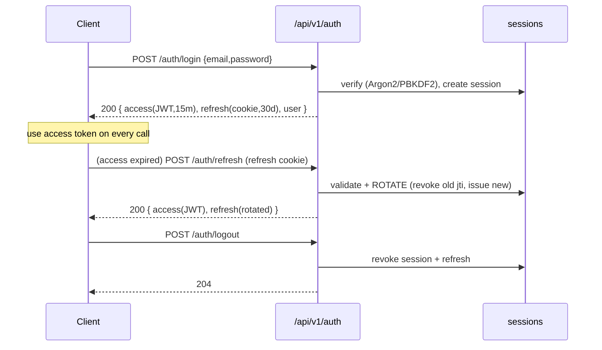

# TradeLogX Nexus — API Specification (OpenAPI 3.1)

*Sixth document in the series: `PRD` → `APP_FLOW_AUDIT` → `TRD` → `SAD` → `DDS` → **API Spec**. This is the official contract between the frontend, backend, trading engine, AI engine, analytics engine, and future mobile clients. REST for request/response; WebSocket for realtime.*

> **Version 1.0 · 2026-07-22 · Contract: `/api/v1` · Engine: FastAPI (Python 3.10–3.12)**

---

## Reading guide — as-built vs. target (read first)

Consistent with the SAD/DDS, every endpoint is tagged:

- 🟢 **EXISTS** — a real route on the running backend today. The spec gives its **versioned, enveloped v1 form**; the current path is shown so engineers see the delta.
- 🟡 **PARTIAL** — behaviour exists but shape differs (unversioned, bare dict, or folded into another route). Reshaped here.
- 🔴 **NEW** — required by the PRD/TRD scope (JWT, live trading, exchange, admin) but not built yet.

**Ground truth today** (verified route-by-route against the code):

- **~253 endpoints**, mounted **flat at the root** — `FastAPI(title="TradeLogX Nexus")`, default version `0.1.0`, **no `/api`, no `/api/v1`, no router prefixes, no OpenAPI tags**. `/openapi.json`, `/docs` (Swagger), `/redoc` are served (FastAPI defaults) and are **publicly reachable**.
- **Auth is a stateless HMAC cookie** (`hub_session`, 7-day, signed with `HUB_SECRET`) **plus an `X-Webhook-Secret` header** for control/writes. **No JWT, no refresh tokens, no OAuth on the backend** (the landing site has Supabase Auth, not yet unified — SAD §10 / Phase B).
- **No unified response envelope** — endpoints return raw ad-hoc dicts; errors are inconsistent (`{"error": …}` in hand-written paths vs `{"detail": …}` from the framework).
- **Realtime is Server-Sent Events only** (`GET /events/stream`, `/events/state`); there are **no WebSocket endpoints**. The Binance market feed is an internal `ccxt.pro` bridge, not client-facing. The React dashboard actually uses a **2.5 s `useLive` poller**, not the SSE stream.
- **Rate limiting** is in-process sliding-window, applied **only** to `/login`, `/signup` (12 / 5 min) and `/webhook*` (120 / min), **POST only**.
- **Pagination** is a bare `limit` + a few filters (`symbol`, `mode`, `q`, `period`); **no `page`/`offset`/`sort`/`total`** anywhere.

This spec therefore defines the **destination contract** — `/api/v1`, JWT lifecycle, one response envelope, RBAC, a real WebSocket gateway, and standardized pagination/filter/sort — reachable **incrementally** from today's surface (§10 versioning & migration). The **as-built → v1 route map** is Appendix A.

---

## 1. API Architecture Overview

### 1.1 Surfaces & consumers
```
   React dashboard ─┐        ┌─ REST  /api/v1/*      (request/response, JSON)
   Landing site   ──┤──HTTPS─┤─ WS    /api/v1/stream (realtime push, JSON frames)
   Mobile (future)──┘        └─ Webhook /api/v1/webhooks/tradingview (HMAC)
                                   │
                        FastAPI (asyncpg pool) ── Postgres/Supabase (DDS)
                                   │
                  trading-engine · ai-engine · analytics-engine (internal)
```

### 1.2 Principles
- **Resource-oriented REST**, plural nouns, verbs only for actions that aren't CRUD (`:start`, `:stop`, `:emergency-stop` as sub-resources or action suffixes).
- **One version prefix** (`/api/v1`) on every endpoint; the web UI, mobile, and integrations all bind to the same contract.
- **One response envelope** (§6) and **one error model** (§7) — no route returns a bare value.
- **Stateless auth** via short-lived JWT access tokens + rotating refresh tokens (§3); every request is independently authorizable (mobile-friendly, horizontally scalable).
- **RBAC** (`admin` / `operator` / `viewer`) enforced per operation and mirrored to DB RLS (DDS §8).
- **Realtime is push, not poll** — the WebSocket gateway replaces the current 2.5 s polling for live data; REST remains the source of truth for reads.
- **Idempotency** on money-moving POSTs via `Idempotency-Key` header (dedupes retries; DDS `client_order_id`).
- **Everything documented by OpenAPI 3.1** — FastAPI emits the machine schema; this document is the human contract + the conventions the schema can't express.

### 1.3 Module map (17 REST modules + 1 realtime gateway)
`auth` · `users` · `exchanges` · `strategies` · `paper` · `live` · `bots` · `market-data` · `analytics` · `portfolio` · `journal` · `ai` · `risk` · `notifications` · `admin` · `system` · `webhooks` · **`stream` (WS)**.

---

## 2. Complete Endpoint Catalog

Base URL: `https://api.trade-logx.com/api/v1` (prod) · `http://localhost:8000/api/v1` (dev).
Auth column: **🌐** public · **🔑** access-token (any authenticated role) · **✍️** write (operator+ RBAC) · **👑** admin · **🪝** webhook-HMAC.
Tag: 🟢 exists · 🟡 partial · 🔴 new. *(As-built path in parentheses where it differs.)*

### 2.1 `auth` — authentication & session
| Method | Path | Auth | Tag | Purpose |
|---|---|---|---|---|
| POST | `/auth/register` | 🌐 | 🟢 (`/signup`) | Create account |
| POST | `/auth/login` | 🌐 | 🟢 (`/login`) | Password login → tokens |
| POST | `/auth/logout` | 🔑 | 🟢 (`/auth/logout`) | Revoke session/refresh |
| POST | `/auth/refresh` | 🌐* | 🔴 | Exchange refresh token → new access token |
| POST | `/auth/password/forgot` | 🌐 | 🔴 | Send reset email |
| POST | `/auth/password/reset` | 🌐* | 🔴 | Reset via token |
| POST | `/auth/password/change` | 🔑 | 🟢 (`/auth/change-password`) | Change while signed in |
| POST | `/auth/email/verify` | 🌐* | 🔴 | Verify email via token |
| POST | `/auth/email/resend` | 🔑 | 🔴 | Resend verification |
| GET | `/auth/oauth/{provider}` | 🌐 | 🟡 | Begin OAuth (google/github) |
| GET | `/auth/oauth/{provider}/callback` | 🌐 | 🟡 | OAuth callback → tokens |
| GET | `/auth/session` | 🔑 | 🟢 (`/auth/status`) | Current session/user |
| GET | `/auth/sessions` | 🔑 | 🔴 | List active sessions/devices |
| DELETE | `/auth/sessions/{id}` | 🔑 | 🔴 | Revoke a session |
| POST | `/auth/mfa/enroll` | 🔑 | 🔴 | Begin TOTP enrollment (future) |
| POST | `/auth/mfa/verify` | 🔑 | 🔴 | Verify TOTP challenge (future) |

*`🌐*` = no access token, but carries a single-use token (refresh/reset/verify) in the body.

### 2.2 `users` — profile & preferences
| Method | Path | Auth | Tag | Purpose |
|---|---|---|---|---|
| GET | `/users/me` | 🔑 | 🟡 | Current profile |
| PATCH | `/users/me` | 🔑 | 🟡 | Update profile |
| PUT | `/users/me/avatar` | 🔑 | 🔴 | Upload avatar |
| GET | `/users/me/preferences` | 🔑 | 🟢 (`/user/settings`) | UI/workspace prefs (namespaced) |
| PUT | `/users/me/preferences/{namespace}` | ✍️ | 🟢 (`POST /user/settings`) | Save a namespace blob |
| DELETE | `/users/me/preferences/{namespace}` | ✍️ | 🟢 (`DELETE /user/settings`) | Reset a namespace |
| GET | `/users/me/notification-settings` | 🔑 | 🟡 (`/notifications/status`) | Notification prefs |
| PUT | `/users/me/notification-settings` | ✍️ | 🟡 (`/notifications`) | Update notification prefs |
| GET | `/users/me/activity` | 🔑 | 🔴 | Activity history (from `activity_logs`) |

### 2.3 `exchanges` — venue connections 🔴 (live scope; paper-only today)
| Method | Path | Auth | Tag | Purpose |
|---|---|---|---|---|
| GET | `/exchanges` | 🔑 | 🟡 (`/brokers`) | Supported exchanges catalog |
| GET | `/exchanges/connections` | 🔑 | 🔴 | List my connections |
| POST | `/exchanges/connections` | ✍️ | 🔴 | Connect (store encrypted keys) |
| GET | `/exchanges/connections/{id}` | 🔑 | 🔴 | Connection detail |
| DELETE | `/exchanges/connections/{id}` | ✍️ | 🔴 | Disconnect |
| POST | `/exchanges/connections/{id}:validate` | ✍️ | 🔴 | Validate API keys |
| GET | `/exchanges/connections/{id}/status` | 🔑 | 🔴 | Connection status |
| GET | `/exchanges/connections/{id}/health` | 🔑 | 🟡 (`/health/bot`) | WS/connection health |
| POST | `/exchanges/connections/{id}:sync-balances` | ✍️ | 🔴 | Sync balances |
| POST | `/exchanges/connections/{id}:sync-positions` | ✍️ | 🔴 | Sync positions |

### 2.4 `strategies` — builder, versions, rules
| Method | Path | Auth | Tag | Purpose |
|---|---|---|---|---|
| GET | `/strategies` | 🔑 | 🟢 (`/strategy/custom`) | List strategies |
| POST | `/strategies` | ✍️ | 🟢 (`POST /strategy/custom`) | Create |
| GET | `/strategies/{id}` | 🔑 | 🟢 | Get one |
| PATCH | `/strategies/{id}` | ✍️ | 🟢 (`/strategy/custom/{id}/meta`) | Update meta/definition |
| DELETE | `/strategies/{id}` | ✍️ | 🟢 (`/strategy/custom/{id}`) | Delete (soft) |
| POST | `/strategies/{id}:duplicate` | ✍️ | 🟢 (`/strategy/custom/{id}/duplicate`) | Duplicate |
| POST | `/strategies/{id}:favorite` | ✍️ | 🟢 (`/strategy/custom/{id}/favorite`) | Toggle favorite |
| GET | `/strategies/{id}/versions` | 🔑 | 🟢 (`/strategy/custom/{id}/history`) | Version history |
| POST | `/strategies/{id}/versions/{v}:restore` | ✍️ | 🟢 (`/strategy/custom/{id}/restore`) | Restore version |
| POST | `/strategies/{id}:deploy` | ✍️ | 🟢 (`/strategy/custom/{id}/deploy`) | Deploy as live config |
| POST | `/strategies/{id}:simulate` | ✍️ | 🟢 (`/strategy/custom/simulate`) | Backtest/simulate |
| POST | `/strategies/{id}:optimize` | ✍️ | 🟢 (`/strategy/custom/optimize`) | Parameter sweep |
| POST | `/strategies/{id}:ai-review` | ✍️ | 🟢 (`/strategy/ai-review`) | AI review of a spec |
| GET | `/strategies/{id}/indicators` | 🔑 | 🟡 | Indicators (from spec) |
| GET | `/strategies/{id}/rules` | 🔑 | 🟡 | Entry/exit/risk/size/leverage rules |
| GET | `/strategies/blocks` | 🔑 | 🟢 (`/strategy/blocks`) | Builder block catalog |
| GET | `/strategies/templates` | 🔑 | 🟢 (`/strategy/templates`) | Templates |
| GET | `/strategies:compare` | 🔑 | 🟢 (`/strategy/compare`) | Compare strategies |
| GET | `/strategies/registry` | 🔑 | 🟢 (`/strategies/registry`) | Built-in registry |
| POST | `/strategies/{id}:enable` / `:disable` | ✍️ | 🟡 (`/strategy/select`) | Enable/disable for the engine |

### 2.5 `paper` — paper account, orders, positions, trades, replay
| Method | Path | Auth | Tag | Purpose |
|---|---|---|---|---|
| GET | `/paper/account` | 🔑 | 🟢 (`/paper/account`) | Balances/PnL |
| PUT | `/paper/account/initial-capital` | ✍️ | 🟢 (`/paper/initial-capital`) | Set starting capital |
| POST | `/paper/account:reset` | ✍️ | 🟡 | Reset paper account |
| POST | `/paper:start` / `/paper:stop` | ✍️ | 🟡 (`/paper-trading/*`) | Start/stop paper trading |
| GET | `/paper/positions` | 🔑 | 🟢 (`/paper/positions`) | Open positions |
| POST | `/paper/positions/{id}:close` | ✍️ | 🟢 (`/paper/close`) | Close a position |
| GET | `/paper/orders` | 🔑 | 🔴 | Paper orders |
| GET | `/paper/trades` | 🔑 | 🟢 (`/paper/trades`) | Closed trades (paginate/filter/sort) |
| GET | `/paper/trades:export` | 🔑 | 🟢 (`/paper/trades/export`) | CSV/JSON export |
| GET | `/paper/equity-curve` | 🔑 | 🟢 (`/paper/equity-curve`) | Equity series |
| GET | `/paper/replay` | 🔑 | 🟢 (`/replay/run`,`/replay/stats`) | Replay run/stats |
| POST | `/paper/replay/sessions` | ✍️ | 🔴 | Create replay session |
| POST | `/paper/replay/sessions/{id}:play\|pause\|step\|seek` | ✍️ | 🔴 | Replay controls |
| GET | `/paper/replay/sessions/{id}/trades` | 🔑 | 🟡 | Replay trades |

### 2.6 `live` — live trading 🔴 (paper-only today; full lifecycle by design)
| Method | Path | Auth | Tag | Purpose |
|---|---|---|---|---|
| POST | `/live/bots/{id}:start` | ✍️ | 🟡 (`/bots/{id}/go-live`) | Start live bot |
| POST | `/live/bots/{id}:stop` | ✍️ | 🟡 (`/bots/{id}/stop`) | Stop live bot |
| POST | `/live:emergency-stop` | ✍️ | 🟢 (`/emergency-stop`,`/controls/stop-all`) | Kill switch |
| GET | `/live/positions` | 🔑 | 🔴 | Open live positions |
| GET | `/live/orders` | 🔑 | 🔴 | Live orders |
| POST | `/live/orders` | ✍️ | 🔴 | Place order (Idempotency-Key) |
| DELETE | `/live/orders/{id}` | ✍️ | 🔴 | Cancel order |
| GET | `/live/trades` | 🔑 | 🔴 | Live trades |
| GET | `/live/positions/{id}/history` | 🔑 | 🔴 | Position state history |
| GET | `/live/executions` | 🔑 | 🔴 | Order executions/fills |
| GET | `/live/execution-logs` | 🔑 | 🟡 (`/ledger/logs`) | Routing/execution logs |

### 2.7 `bots` — engine & decisions
| Method | Path | Auth | Tag | Purpose |
|---|---|---|---|---|
| GET | `/bots` | 🔑 | 🟢 (`/bots/live`) | List bot instances |
| POST | `/bots` | ✍️ | 🟢 (`POST /bots`) | Create bot |
| GET | `/bots/{id}` | 🔑 | 🟡 | Bot detail |
| PATCH | `/bots/{id}` | ✍️ | 🟡 | Update config |
| POST | `/bots/{id}:start` / `:stop` / `:pause` / `:resume` | ✍️ | 🟢 (`/bots/{id}/*`) | Lifecycle |
| GET | `/bots/{id}/status` | 🔑 | 🟢 (`/engine/status`,`/system/status`) | Status/heartbeat |
| GET | `/bots/{id}/health` | 🔑 | 🟢 (`/health/bot`) | Health detail |
| GET | `/engine/mode` · PUT `/engine/mode` | 🔑/✍️ | 🟢 (`/engine/mode`) | Auto/manual mode |
| POST | `/engine:start` / `:stop` | ✍️ | 🟢 (`/engine/start\|stop`) | Engine on/off |
| PUT | `/engine/timeframe` | ✍️ | 🟢 (`/engine/timeframe`) | Set timeframe |
| GET | `/engine/diagnostics` | 🔑 | 🟢 (`/engine/diagnostics`) | Internals |
| POST | `/controls:pause-all` / `:stop-all` / `:resume` | ✍️ | 🟢 (`/controls/*`) | Global controls |
| GET | `/controls/state` | 🔑 | 🟢 (`/controls/state`) | Control-switch state |
| GET | `/bots/decisions` | 🔑 | 🟢 (`/decisions/latest`,`/engine/cycles`) | Decision history |
| GET | `/bots/decisions/{id}` | 🔑 | 🟢 (`/engine/cycles/{id}`) | Decision detail |
| GET | `/bots/decisions/{id}/explanation` | 🔑 | 🟡 (`/journal/{trade_id}`) | Trade explanation |
| GET | `/bots/signals` | 🔑 | 🟢 (`/decisions/latest`) | Signal history |
| GET | `/bots/signals?status=rejected` | 🔑 | 🟢 (`/decisions/rejected`,`/skipped/trades`) | Rejected signals |
| GET | `/bots/signals?status=waiting` | 🔑 | 🟡 | Waiting signals |
| GET | `/bots/approvals` · POST `/bots/approvals/{id}:approve\|reject` | 🔑/✍️ | 🟢 (`/approvals*`) | Idea approval queue |
| POST | `/bots/grid:start` / `:stop` · GET `/bots/grid/status` | ✍️/🔑 | 🟢 (`/grid/*`) | 24/7 grid bot |

### 2.8 `market-data` — assets, symbols, candles, derivatives
| Method | Path | Auth | Tag | Purpose |
|---|---|---|---|---|
| GET | `/market-data/asset-classes` | 🔑 | 🟢 (`/symbols/asset-classes`) | Asset classes |
| GET | `/market-data/symbols` | 🔑 | 🟢 (`/symbols`) | Symbol universe (filter) |
| GET | `/market-data/symbols:search` | 🔑 | 🟢 (`/symbols/search`) | Search |
| GET | `/market-data/symbols/{symbol}` | 🔑 | 🟢 (`/symbols/info`) | Symbol detail |
| POST | `/market-data/symbols:sync` | ✍️ | 🟢 (`/symbols/sync`) | Refresh universe |
| GET | `/market-data/candles` | 🔑 | 🟢 (`/replay/run`) | OHLCV (symbol,tf,range) |
| GET | `/market-data/ticker/{symbol}` | 🔑 | 🔴 | Latest price/quote |
| GET | `/market-data/funding-rates` | 🔑 | 🟢 (`/market/funding`) | Perp funding |
| GET | `/market-data/open-interest` | 🔑 | 🔴 | Open interest |
| GET | `/market-data/economic-calendar` | 🔑 | 🟢 (`/econ/protection`) | Macro events |
| GET | `/market-data/coverage` | 🔑 | 🟢 (`/data/coverage`) | Historical coverage |
| POST | `/market-data:backfill` · GET `.../backfill/status` | ✍️/🔑 | 🟢 (`/data/backfill*`) | Backfill |
| GET | `/market-data/integrity` | 🔑 | 🟢 (`/data/integrity`) | Integrity check |
| POST | `/market-data:sync` / `:sync-all` | ✍️ | 🟢 (`/data/sync*`) | Sync candles |

### 2.9 `analytics` — dashboards, performance, labs
| Method | Path | Auth | Tag | Purpose |
|---|---|---|---|---|
| GET | `/analytics/dashboard` | 🔑 | 🟡 (`/system/status`) | Dashboard summary |
| GET | `/analytics/performance` | 🔑 | 🟢 (`/strategy/performance`,`/performance/track-record`) | Performance |
| GET | `/analytics/equity-curve` | 🔑 | 🟢 (`/paper/equity-curve`) | Equity curve |
| GET | `/analytics/pnl` | 🔑 | 🟡 | PnL breakdown |
| GET | `/analytics/drawdown` | 🔑 | 🟡 | Drawdown series |
| GET | `/analytics/risk-metrics` | 🔑 | 🟢 (`/risk/summary`,`/risk/portfolio`) | Risk metrics |
| GET | `/analytics/trade-distribution` | 🔑 | 🟡 | R-multiple histogram |
| GET | `/analytics/win-rate` | 🔑 | 🟡 | Win-rate history |
| GET | `/analytics/strategy-performance` | 🔑 | 🟢 (`/strategy/health`,`/strategy/league`) | Per-strategy |
| GET | `/analytics/labs/{walk-forward\|monte-carlo\|out-of-sample\|sliced}` | 🔑 | 🟢 (`/lab/*`) | Optimization labs |
| GET | `/analytics/coach/{review\|leaderboard}` | 🔑 | 🟢 (`/coach/*`) | Coach |
| GET | `/analytics/scanner` | 🔑 | 🟢 (`/scanner/scan`) | Market scanner |
| GET | `/analytics/execution-quality` | 🔑 | 🟢 (`/execution/quality`) | Execution quality |
| GET | `/analytics/audit:export` | 🔑 | 🟢 (`/audit/export`) | Compliance export |

### 2.10 `portfolio`
| Method | Path | Auth | Tag | Purpose |
|---|---|---|---|---|
| GET | `/portfolio/balances` | 🔑 | 🟡 (`/paper/account`) | Balances |
| GET | `/portfolio` | 🔑 | 🟡 | Portfolio snapshot |
| GET | `/portfolio/allocation` | 🔑 | 🟢 (`/allocation/report`) | Allocation plan |
| GET | `/portfolio/exposure` | 🔑 | 🟢 (`/risk/portfolio`,`/risk/correlation`) | Exposure |
| GET | `/portfolio/profit` | 🔑 | 🟡 | Realized/unrealized |
| GET | `/portfolio/performance-history` | 🔑 | 🟡 | Periodic performance |

### 2.11 `journal`
| Method | Path | Auth | Tag | Purpose |
|---|---|---|---|---|
| GET | `/journal` | 🔑 | 🟢 (`/journal`,`/journal/trades`) | Journal entries |
| GET | `/journal/{id}` | 🔑 | 🟢 (`/journal/{trade_id}`) | One entry |
| PATCH | `/journal/{id}` | ✍️ | 🟢 (`PATCH /journal/{id}`) | Edit |
| DELETE | `/journal/{id}` | ✍️ | 🟢 (`DELETE /journal/{id}`) | Delete |
| POST | `/journal/{id}/notes` | ✍️ | 🟢 (`/trade-memory/{id}/notes`) | Add note |
| PATCH | `/journal/notes/{noteId}` | ✍️ | 🟡 | Edit note |
| DELETE | `/journal/notes/{noteId}` | ✍️ | 🟡 | Delete note |
| GET/POST/DELETE | `/journal/{id}/attachments` | 🔑/✍️ | 🔴 | Attachments/screenshots |
| GET | `/journal/tags` · POST/DELETE `/journal/{id}/tags` | 🔑/✍️ | 🟡 (`/marketplace/{id}/tags`) | Tags |
| GET | `/journal/memory` | 🔑 | 🟢 (`/trade-memory/*`) | AI trade memory (search) |

### 2.12 `ai`
| Method | Path | Auth | Tag | Purpose |
|---|---|---|---|---|
| GET | `/ai/market-analysis` | 🔑 | 🟢 (`/ai/analyze`,`/ai/insights`) | Market analysis |
| POST | `/ai/trade-review` | ✍️ | 🟡 | Review a trade |
| GET | `/ai/suggestions` | 🔑 | 🟢 (`/ai/recommendations`,`/evolution/upgrades`) | AI suggestions |
| POST | `/ai/suggestions/{id}:apply` | ✍️ | 🟢 (`/evolution/upgrades/{id}/promote`) | Apply suggestion |
| GET | `/ai/pattern-analysis` | 🔑 | 🟡 (`/mtf/analyze`) | Pattern analysis |
| GET | `/ai/confidence-analysis` | 🔑 | 🟢 (`/ai/confidence-accuracy`,`/ai/confidence-levels`) | Confidence calibration |
| GET | `/ai/risk-suggestions` | 🔑 | 🟡 (`/risk/recovery`) | Risk suggestions |
| POST | `/ai/strategy-review` | ✍️ | 🟢 (`/strategy/ai-review`) | Strategy review |
| GET | `/ai/learning-history` | 🔑 | 🟢 (`/learning/report`,`/evolution/lessons`) | Learning history |
| GET | `/ai/coach` | 🔑 | 🟢 (`/ai/coach`,`/coach/review`) | Coaching |

### 2.13 `risk`
| Method | Path | Auth | Tag | Purpose |
|---|---|---|---|---|
| GET | `/risk/profile` · PUT `/risk/profile` | 🔑/✍️ | 🟢 (`/risk/summary`,`/settings`) | Risk profile |
| GET | `/risk/limits` · PUT `/risk/limits` | 🔑/✍️ | 🟡 | Daily/weekly/monthly/exposure limits |
| GET | `/risk/position-limits` | 🔑 | 🟡 | Position limits |
| POST | `/risk:position-size` | ✍️ | 🟢 (`/risk/position-size`) | Position-size calc |
| GET | `/risk/circuit-breaker` · POST `:arm`/`:reset` | 🔑/✍️ | 🟡 (`/safety/*`) | Circuit breaker |
| GET | `/risk/correlation` | 🔑 | 🟢 (`/risk/correlation*`) | Correlation |
| GET | `/risk/recovery` | 🔑 | 🟢 (`/risk/recovery`) | Recovery state |

### 2.14 `notifications`
| Method | Path | Auth | Tag | Purpose |
|---|---|---|---|---|
| GET | `/notifications` | 🔑 | 🟢 (`/ledger/alerts`) | List (paginate/filter) |
| GET | `/notifications/unread-count` | 🔑 | 🟡 | Unread badge count |
| POST | `/notifications/{id}:read` · POST `:read-all` | ✍️ | 🟡 | Mark read |
| DELETE | `/notifications/{id}` | ✍️ | 🟡 | Delete |
| GET/PUT | `/notifications/preferences` | 🔑/✍️ | 🟡 (`/notifications*`) | Preferences |
| POST | `/notifications:test` | ✍️ | 🟢 (`/notifications/test`,`/alerts/test`) | Send test |

### 2.15 `admin` 👑
| Method | Path | Auth | Tag | Purpose |
|---|---|---|---|---|
| GET | `/admin/health` | 👑 | 🟢 (`/production/readiness`,`/bot-os`) | System health |
| GET | `/admin/users` · POST `/admin/users` | 👑 | 🟢 (`/users`) | Manage users |
| PATCH/DELETE | `/admin/users/{id}` | 👑 | 🟡 | Update/disable user |
| GET | `/admin/logs` | 👑 | 🟢 (`/ledger/logs`) | System/audit logs |
| GET/PUT | `/admin/feature-flags` | 👑 | 🔴 | Feature flags |
| PUT | `/admin/maintenance-mode` | 👑 | 🔴 | Maintenance toggle |
| GET | `/admin/statistics` | 👑 | 🟡 | Platform statistics |
| POST | `/admin/ops/{backup\|drill}` · GET `/admin/ops/{backups\|watchdog\|storage}` | 👑 | 🟢 (`/ops/*`) | Ops |

### 2.16 `system` & `webhooks` (public / HMAC)
| Method | Path | Auth | Tag | Purpose |
|---|---|---|---|---|
| GET | `/system/health` | 🌐 | 🟢 (`/health`) | Liveness/readiness |
| GET | `/system/version` | 🌐 | 🟢 (`/version`) | Build/version |
| POST | `/webhooks/tradingview` | 🪝 | 🟢 (`/webhook/tradingview`) | TradingView alert intake |

---

## 3. Authentication Flow

### 3.1 Token model (target)
- **Access token** — JWT (RS256), **15 min** TTL, sent as `Authorization: Bearer <jwt>`. Claims: `sub` (user id), `tenant`, `role`, `scopes`, `iat`, `exp`, `jti`.
- **Refresh token** — opaque, **30 day** TTL, **rotating** (each refresh issues a new one and revokes the old — reuse detection). Stored `httpOnly; Secure; SameSite=Strict` cookie (web) or secure storage (mobile). Server keeps a hash in `sessions` (DDS §4.1) for revocation.
- **Backend keeps issuing the 7-day HMAC `hub_session` cookie** during migration (§10) so the current dashboard keeps working while clients move to Bearer tokens. Both are accepted; new clients use Bearer.

### 3.2 Login → refresh → logout


### 3.3 Register / verify / reset
- `POST /auth/register` → creates `users` row (Argon2id hash), sends verification email, returns tokens with `email_verified:false`; gated features require verification.
- `POST /auth/email/verify {token}` → marks verified.
- `POST /auth/password/forgot {email}` → always `204` (no account enumeration); emails a single-use, 30-min reset token.
- `POST /auth/password/reset {token,newPassword}` → sets password, revokes all sessions.

### 3.4 OAuth (🟡 landing has it via Supabase)
`GET /auth/oauth/google` → 302 to provider → `…/callback` → backend links `oauth_accounts`, issues tokens. Unifies the landing's Supabase Auth with the backend identity (DDS §8.5).

### 3.5 As-built today
Password login sets the `hub_session` HMAC cookie (`username|exp|HMAC_SHA256(HUB_SECRET,…)`, 7 d); control writes additionally require `X-Webhook-Secret`. No refresh/JWT/OAuth on the backend yet.

---

## 4. REST API Specification (conventions)

### 4.1 Every request
- **Base**: `/api/v1`. **Headers**: `Authorization: Bearer <jwt>` (or `X-Webhook-Secret` legacy), `Content-Type: application/json`, `Accept: application/json`, optional `Idempotency-Key` (writes), `X-Request-Id` (traced end-to-end, echoed back).
- **Methods**: `GET` (read, safe, cacheable) · `POST` (create / non-idempotent action) · `PUT` (full replace / set) · `PATCH` (partial update) · `DELETE` (remove). Non-CRUD actions use a `:verb` suffix (`/bots/{id}:start`).
- **Path params**: resource ids are UUIDs (DDS). **Query params**: filtering/sorting/pagination (§ below).

### 4.2 Validation
- Server-side, schema-first (Pydantic → OpenAPI). Unknown fields rejected (`extra=forbid`) on writes. Money/qty as decimal strings or numbers coerced to `NUMERIC(20,8)`. Enums validated against the catalogs in Appendix C. Violations → `422` with per-field `details` (§7).

### 4.3 Worked example — list trades (🟢 `/paper/trades`)
**Request**
```http
GET /api/v1/paper/trades?symbol=BTCUSDT&status=closed&source=paper&from=2026-07-01&to=2026-07-22&sort=-closed_at&page=1&limit=50 HTTP/1.1
Authorization: Bearer eyJhbGciOiJSUzI1Ni␣…
Accept: application/json
```
**200**
```json
{
  "success": true,
  "message": "OK",
  "data": {
    "items": [
      { "id": "9f1c…", "symbol": "BTCUSDT", "side": "long", "size": "0.50000000",
        "entry": "61250.00000000", "exit": "62010.00000000", "pnl": "380.00000000",
        "rr": "1.90", "fees": "1.24000000", "source": "paper", "status": "closed",
        "openedAt": "2026-07-20T09:14:03Z", "closedAt": "2026-07-21T15:02:44Z" }
    ],
    "pagination": { "page": 1, "limit": 50, "total": 214, "totalPages": 5,
                    "next": "/api/v1/paper/trades?...&page=2", "previous": null }
  },
  "timestamp": "2026-07-22T11:40:00Z"
}
```

### 4.4 Worked example — create strategy (🟢 `POST /strategy/custom`)
**Request** `POST /api/v1/strategies` + `Idempotency-Key: 2f8c…`
```json
{ "name": "SMC Momentum", "kind": "custom", "symbol": "BTCUSDT", "timeframe": "4h",
  "definition": { "side": "long", "entry": {"rules":[{"lhs":"rsi(14)","op":"<","rhs":30}]},
                  "exit": {"rules":[{"lhs":"rsi(14)","op":">","rhs":70}]},
                  "risk": {"stopType":"atr","stopValue":2.0,"maxRiskPct":1.0} } }
```
**201**
```json
{ "success": true, "message": "Strategy created", "timestamp": "2026-07-22T11:41:00Z",
  "data": { "id": "c0ffee…", "name": "SMC Momentum", "currentVersionId": "v1-…", "version": 1 } }
```

### 4.5 Pagination · filtering · sorting (standard)
- **Pagination** (query): `page` (1-based, default 1), `limit` (default 25, max 200). Response always carries `data.pagination { page, limit, total, totalPages, next, previous }`. High-volume archives (decisions, trades, candles) also accept **cursor** `?cursor=<opaque>&limit=` (keyset on `(ts,id)`) — preferred for deep pages; `next` then carries the cursor URL.
- **Filtering** (query, AND-combined): `from`/`to` (ISO date-time, on the resource's time field) · `strategy` (id) · `exchange` (code) · `symbol` · `status` · `type` (trade/order type) · `direction` (`long`/`short`) · `marketCondition` (regime). Repeat a param for `IN` (`?symbol=BTCUSDT&symbol=ETHUSDT`).
- **Sorting**: `sort=<field>` ascending, `sort=-<field>` descending, comma-separated for multi-key. Allowed fields per resource: `date|createdAt|closedAt`, `pnl|profit`, `loss`, `confidence`, `duration`, `rr`. Default `-createdAt`. Unknown field → `422`.

### 4.6 Caching & conditional
`GET`s return `ETag`; clients may send `If-None-Match` → `304`. Reference data (`/market-data/symbols`, `/exchanges`) sets `Cache-Control: public, max-age=…`; user data is `private, no-store`.

---

## 5. WebSocket Specification

### 5.1 Gateway (target)
Single multiplexed endpoint: **`wss://api.trade-logx.com/api/v1/stream`**. Auth on connect: `?access_token=<jwt>` query or `Authorization` header during the upgrade; the server validates the JWT, binds the socket to `tenant_id`, and **RLS-scopes every event** (a client only ever receives its own tenant's events). Subprotocol `tlx.v1.json`.

### 5.2 Client → server frames
```json
{ "op": "subscribe",   "channels": ["bot.status", "trades", "market.BTCUSDT.1m"] }
{ "op": "unsubscribe", "channels": ["market.BTCUSDT.1m"] }
{ "op": "ping" }
```
Server acks `{ "op": "subscribed", "channels": [...] }`; heartbeats every 15 s (`{ "op":"ping" }` / `pong`); idle sockets closed after 60 s without pong.

### 5.3 Server → client event envelope
```json
{ "op": "event", "channel": "trades", "type": "trade.closed",
  "ts": "2026-07-22T11:42:00Z", "seq": 10432, "data": { /* resource payload */ } }
```
`seq` is monotonic per socket for gap detection; on reconnect a client may send `{ "op":"resume", "since": 10432 }` to replay missed events (bounded buffer, else `410 stream-gap` → client refetches via REST).

### 5.4 Event catalog (channels → types)
| Channel | Event `type`s | Payload | As-built |
|---|---|---|---|
| `market.{symbol}.{tf}` | `market.tick`, `candle.new` | ticker / closed OHLCV bar | 🟡 internal `ws_feed` (ccxt.pro) → gateway |
| `bot.status` | `bot.started`, `bot.stopped`, `bot.paused`, `bot.health` | bot status snapshot | 🟢 SSE `lifecycle` |
| `decisions` | `decision.made`, `signal.fired`, `signal.rejected`, `signal.waiting` | decision/signal object | 🟢 SSE `signal` |
| `orders` | `order.new`, `order.partial`, `order.filled`, `order.cancelled` | order/fill | 🟢 SSE `order`,`fill` |
| `trades` | `trade.opened`, `trade.closed` | trade record | 🟢 SSE `trade_closed` |
| `positions` | `position.updated` | position | 🟡 |
| `account` | `balance.updated` | balance snapshot | 🟡 |
| `risk` | `risk.blocked`, `circuit.tripped` | risk event | 🟢 SSE `risk_block` |
| `notifications` | `notification.created` | notification | 🟡 (poll today) |
| `replay.{sessionId}` | `replay.tick`, `replay.finished` | replay frame | 🟡 |
| `strategy` | `strategy.updated`, `version.promoted` | strategy/version | 🟡 |
| `system` | `run.finished`, `maintenance` | lifecycle | 🟢 SSE `run_finished` |

### 5.5 As-built realtime (today)
- **SSE** `GET /events/stream` (session-gated, `text/event-stream`, `data: {json}\n\n`, 15 s heartbeat comment, `deque(maxlen=2000)` replay via `GET /events/state`). Event `type` ∈ `signal|order|fill|trade_closed|risk_block|run_finished|lifecycle|bar`.
- **No WebSocket endpoints.** The Binance feed is an internal `ccxt.pro watch_ohlcv` bridge (`data/ws_feed.py`), not client-facing.
- React uses a **2.5 s `useLive` poller** (deduped, backoff, tab-visibility-aware), not SSE. The WS gateway (§5.1) replaces both for live data; the poller remains a graceful fallback.

---

## 6. Request & Response Schemas

### 6.1 Standard envelope (mandatory on every REST response)
**Success**
```json
{ "success": true, "data": { }, "message": "", "timestamp": "2026-07-22T11:40:00Z" }
```
**Error**
```json
{ "success": false,
  "error": { "code": "VALIDATION_ERROR", "message": "…", "details": [ ] },
  "timestamp": "2026-07-22T11:40:00Z" }
```
- List payloads put rows under `data.items` and page info under `data.pagination` (§4.5).
- `message` is human, safe to surface; machine logic keys off `error.code` / HTTP status, never the message string.
- `X-Request-Id` echoed as a header on every response (success and error) for correlation with logs.

### 6.2 Reusable component schemas (OpenAPI `components/schemas`)
`Envelope`, `ErrorEnvelope`, `Error`, `Pagination`, `Money` (`string`, pattern `^-?\d+(\.\d{1,8})?$`), `Timestamp` (RFC 3339), `UUID`, plus domain schemas `User`, `Session`, `Strategy`, `StrategyVersion`, `Order`, `Position`, `Trade`, `Decision`, `Signal`, `Candle`, `Notification`, `RiskProfile`, `RiskLimit`, `JournalEntry`, `AiSuggestion`, `ExchangeConnection` (mirroring DDS §4). Enums centralized (Appendix C).

### 6.3 As-built delta
Today responses are **bare dicts** (`{"saved":true,"ns":"dashboard"}`, `{"authenticated":true,…}`) and errors split between `{"error":…}` (hand-written) and `{"detail":…}` (FastAPI). The envelope + error model above is the normalization target; a compatibility shim (§10) wraps legacy handlers so the switch is transparent to old clients during migration.

---

## 7. Error Code Reference

### 7.1 HTTP status usage
| Status | When | Envelope `error.code` examples |
|---|---|---|
| **200** OK | Successful GET/PUT/PATCH/action | — |
| **201** Created | POST created a resource | — |
| **202** Accepted | Async job queued (backfill, backup, replay) | — |
| **204** No Content | DELETE / logout / mark-read | — |
| **400** Bad Request | Malformed JSON, bad param types | `BAD_REQUEST` |
| **401** Unauthorized | Missing/expired/invalid token | `UNAUTHENTICATED`, `TOKEN_EXPIRED` |
| **403** Forbidden | Authenticated but lacks role/scope | `FORBIDDEN`, `INSUFFICIENT_ROLE` |
| **404** Not Found | Unknown id / route | `NOT_FOUND` |
| **409** Conflict | Duplicate / state conflict / idempotency replay mismatch | `CONFLICT`, `ALREADY_EXISTS`, `IDEMPOTENCY_CONFLICT` |
| **422** Unprocessable | Schema/validation failure | `VALIDATION_ERROR` |
| **429** Too Many Requests | Rate limit exceeded (+`Retry-After`) | `RATE_LIMITED` |
| **500** Internal | Unhandled server error (`X-Request-Id` for support) | `INTERNAL_ERROR` |
| **503** Unavailable | Maintenance mode / dependency down | `SERVICE_UNAVAILABLE` |

### 7.2 Domain error codes (stable, documented)
`AUTH_INVALID_CREDENTIALS`, `AUTH_EMAIL_UNVERIFIED`, `AUTH_MFA_REQUIRED`, `REFRESH_REUSE_DETECTED`, `EXCHANGE_KEY_INVALID`, `EXCHANGE_UNREACHABLE`, `STRATEGY_INVALID_SPEC`, `ORDER_REJECTED`, `RISK_LIMIT_BREACHED`, `CIRCUIT_BREAKER_TRIPPED`, `INSUFFICIENT_BALANCE`, `REPLAY_STATE_INVALID`, `WEBHOOK_SIGNATURE_INVALID`. Each maps to a fixed HTTP status and is enumerated in the OpenAPI `responses`.

### 7.3 Validation error shape (`422`)
```json
{ "success": false, "timestamp": "2026-07-22T11:40:00Z",
  "error": { "code": "VALIDATION_ERROR", "message": "Request validation failed",
    "details": [
      { "field": "definition.risk.maxRiskPct", "rule": "lte", "message": "must be ≤ 5" },
      { "field": "symbol", "rule": "required", "message": "field required" } ] } }
```

---

## 8. Security Model

| Control | Design | As-built |
|---|---|---|
| **JWT auth** | RS256 access (15 m) + rotating refresh (30 d), `jti` revocation, reuse detection | 🔴 (HMAC cookie today) |
| **OAuth** | Google/GitHub via `/auth/oauth/*`, linked in `oauth_accounts` | 🟡 (landing only) |
| **RBAC** | `admin`/`operator`/`viewer` + fine scopes; enforced per-op **and** mirrored to Postgres RLS (DDS §8) | 🟡 (`is_admin` only) |
| **API-key security** | exchange keys encrypted at rest (pgcrypto/Vault), never returned, decrypt only in the trading worker (DDS §8.4) | 🔴 |
| **Input validation** | schema-first, `extra=forbid`, decimal money, enum whitelists | 🟢 (Pydantic, partial) |
| **Rate limiting** | per-module (§9), distributed (Redis) in prod | 🟡 (in-proc, auth+webhook only) |
| **Replay protection** | webhook HMAC + timestamp window + `alert_id` dedupe; `Idempotency-Key` on money POSTs; refresh-token reuse detection | 🟢 (alert_id dedupe + HMAC) |
| **CORS** | explicit allow-list (`HUB_CORS_ORIGINS`), `credentials` only for the cookie origin; Bearer clients are origin-agnostic | 🟢 (allow-list; `*` warns on cloud) |
| **CSRF** | Bearer tokens are CSRF-immune; the legacy cookie path uses `SameSite=Strict` + a double-submit token on writes | 🟡 (SameSite=Lax, no token) |
| **XSS** | JSON-only API (no HTML reflection in v1), strict output encoding, CSP on the SPA; user text escaped in journals/notes | 🟡 |
| **Transport/headers** | HTTPS only, HSTS, `X-Content-Type-Options: nosniff`, `Referrer-Policy`, `frame-ancestors` CSP | 🟡 (frame-ancestors only) |
| **Secrets at boot** | fail-closed on default `HUB_SECRET`; keys from env/Vault | 🟢 |

---

## 9. Rate Limiting Policy

Token-bucket per `(identity, bucket)` where identity = user id (authenticated) or client IP (public). Prod uses a shared store (Redis) so limits hold across replicas. Every limited response sets `X-RateLimit-Limit`, `X-RateLimit-Remaining`, `X-RateLimit-Reset`, and `Retry-After` on `429`.

| Bucket | Scope | Limit (default) | Env override |
|---|---|---|---|
| **auth** | `/auth/login`, `/auth/register`, password/reset | 12 / 5 min per IP | `HUB_RL_AUTH_MAX` (🟢 today) |
| **webhook** | `/webhooks/*` | 120 / min per source | `HUB_RL_WEBHOOK_MAX` (🟢 today) |
| **trading** | live/paper order & control writes | 60 / min per user | 🔴 |
| **market-data** | candles/ticker/derivatives reads | 600 / min per user | 🔴 |
| **analytics** | analytics/labs (compute-heavy) | 120 / min per user | 🔴 |
| **ai** | AI review/analysis (expensive) | 20 / min per user | 🔴 |
| **admin** | admin ops | 30 / min per admin | 🔴 |
| **default** | everything else | 300 / min per user | 🔴 |

*Today only `auth` and `webhook` buckets exist, POST-only, single-process. The rest are the target.*

---

## 10. API Versioning Strategy

- **URI versioning**: `/api/v1/*`. The major version changes **only on a breaking change** (removed field/endpoint, changed type/semantics, auth model change). Additive changes (new endpoints, new optional fields) ship within `v1`.
- **Deprecation policy**: a deprecated `v1` endpoint returns `Deprecation: true` + `Sunset: <date>` headers and a `warnings[]` entry in the envelope for **≥ 2 release cycles / 6 months** before removal; `v2` runs in parallel during the window. Migration notes ship in `CHANGELOG` + this doc's Appendix A.
- **Version negotiation**: URI is authoritative; an optional `Accept: application/vnd.tlx.v1+json` is honored for content negotiation but not required.
- **Migration from today (unversioned → v1)** — non-breaking, incremental:
  1. **Mount the current flat routers under `/api/v1`** (add `prefix="/api/v1"` at include time); keep the legacy flat paths mounted **in parallel** (alias) so the running dashboard is unaffected.
  2. **Wrap responses** in the envelope via a response middleware; add a `?raw=1` escape hatch during transition so old TS interfaces keep working until the frontend adopts `data.*`.
  3. **Normalize errors** (`{"error"}`/`{"detail"}` → error envelope) in one exception handler.
  4. **Add tags + version + descriptions** to the FastAPI app so `/openapi.json` is a real contract; group by the 17 modules.
  5. **Issue JWTs alongside the cookie**; accept both; move clients to Bearer.
  6. **Retire the legacy flat aliases** once the frontend + integrations are on `/api/v1` (a `v1` sunset of the *unversioned* alias, not of `v1` itself).

---

## 11. OpenAPI 3.1 Documentation

FastAPI emits the machine schema at **`GET /api/v1/openapi.json`** (3.1.0). The app is configured:
```python
app = FastAPI(
    title="TradeLogX Nexus API", version="1.0.0",
    summary="AI-assisted multi-asset trading platform API",
    docs_url="/api/v1/docs", redoc_url="/api/v1/redoc",
    openapi_url="/api/v1/openapi.json",
    openapi_tags=[{"name": m} for m in MODULES],   # 17 module tags
)
```
Representative excerpt (patterns the full generated schema follows — components + two fully-specced operations):

```yaml
openapi: 3.1.0
info:
  title: TradeLogX Nexus API
  version: 1.0.0
  summary: AI-assisted multi-asset trading platform API
  license: { name: Proprietary }
servers:
  - url: https://api.trade-logx.com/api/v1
  - url: http://localhost:8000/api/v1
security:
  - bearerAuth: []
components:
  securitySchemes:
    bearerAuth: { type: http, scheme: bearer, bearerFormat: JWT }
    webhookSecret: { type: apiKey, in: header, name: X-Webhook-Secret }
  schemas:
    Envelope:
      type: object
      required: [success, data, timestamp]
      properties:
        success: { type: boolean, const: true }
        data: {}
        message: { type: string }
        timestamp: { type: string, format: date-time }
    ErrorEnvelope:
      type: object
      required: [success, error, timestamp]
      properties:
        success: { type: boolean, const: false }
        error: { $ref: '#/components/schemas/Error' }
        timestamp: { type: string, format: date-time }
    Error:
      type: object
      required: [code, message]
      properties:
        code: { type: string }
        message: { type: string }
        details:
          type: array
          items:
            type: object
            properties:
              field: { type: string }
              rule: { type: string }
              message: { type: string }
    Pagination:
      type: object
      properties:
        page: { type: integer, minimum: 1 }
        limit: { type: integer, minimum: 1, maximum: 200 }
        total: { type: integer }
        totalPages: { type: integer }
        next: { type: [string, "null"] }
        previous: { type: [string, "null"] }
    Money: { type: string, pattern: '^-?\d+(\.\d{1,8})?$' }
    Trade:
      type: object
      properties:
        id: { type: string, format: uuid }
        symbol: { type: string }
        side: { type: string, enum: [long, short] }
        size: { $ref: '#/components/schemas/Money' }
        entry: { $ref: '#/components/schemas/Money' }
        exit: { type: [string, "null"] }
        pnl: { type: [string, "null"] }
        rr: { type: [number, "null"] }
        source: { type: string, enum: [paper, backtest, live, replay] }
        status: { type: string, enum: [open, closed] }
        openedAt: { type: string, format: date-time }
        closedAt: { type: [string, "null"], format: date-time }
  responses:
    Unauthorized:
      description: Missing or invalid credentials
      content: { application/json: { schema: { $ref: '#/components/schemas/ErrorEnvelope' } } }
    ValidationError:
      description: Schema validation failed
      content: { application/json: { schema: { $ref: '#/components/schemas/ErrorEnvelope' } } }
paths:
  /auth/login:
    post:
      tags: [auth]
      security: []
      summary: Password login
      requestBody:
        required: true
        content:
          application/json:
            schema:
              type: object
              required: [email, password]
              properties:
                email: { type: string, format: email }
                password: { type: string, minLength: 8 }
      responses:
        '200':
          description: Authenticated
          content:
            application/json:
              schema:
                allOf:
                  - $ref: '#/components/schemas/Envelope'
                  - properties:
                      data:
                        type: object
                        properties:
                          accessToken: { type: string }
                          expiresIn: { type: integer, example: 900 }
                          user: { type: object }
        '401': { $ref: '#/components/responses/Unauthorized' }
        '422': { $ref: '#/components/responses/ValidationError' }
        '429':
          description: Too many attempts
          headers: { Retry-After: { schema: { type: integer } } }
  /paper/trades:
    get:
      tags: [paper]
      summary: List paper trades
      parameters:
        - { name: symbol, in: query, schema: { type: string } }
        - { name: status, in: query, schema: { type: string, enum: [open, closed] } }
        - { name: source, in: query, schema: { type: string, enum: [paper, backtest, live, replay] } }
        - { name: from, in: query, schema: { type: string, format: date-time } }
        - { name: to, in: query, schema: { type: string, format: date-time } }
        - { name: sort, in: query, schema: { type: string, example: '-closedAt' } }
        - { name: page, in: query, schema: { type: integer, default: 1 } }
        - { name: limit, in: query, schema: { type: integer, default: 25, maximum: 200 } }
      responses:
        '200':
          description: Page of trades
          content:
            application/json:
              schema:
                allOf:
                  - $ref: '#/components/schemas/Envelope'
                  - properties:
                      data:
                        type: object
                        properties:
                          items: { type: array, items: { $ref: '#/components/schemas/Trade' } }
                          pagination: { $ref: '#/components/schemas/Pagination' }
        '401': { $ref: '#/components/responses/Unauthorized' }
```
The full 253-operation schema is generated by the framework from typed handlers + Pydantic models; the remaining gap is typing the `dict = Body(...)` handlers so every write has a real request schema.

## 12. Swagger Specification

- **Swagger UI** at `/api/v1/docs`, **ReDoc** at `/api/v1/redoc`, both rendering the schema above. **In production these are auth-gated** (behind `viewer`+ or an internal allow-list) — unlike today where they're public.
- Each operation carries a `summary`, `description`, `operationId` (stable, `module_action`), tag, request/response examples, and enumerated error responses. `Try it out` uses the `bearerAuth`/`webhookSecret` schemes.
- A published, versioned static bundle (Redocly) is generated in CI from `/openapi.json` so mobile/partner devs get a browsable contract without hitting prod.

---

## 13. API Testing Plan

**Unit (handler/schema)**
- [ ] Every endpoint has ≥1 happy-path + ≥1 validation-failure test.
- [ ] Envelope shape asserted (success + error) on a representative per module.
- [ ] Enum/decimal/date validators reject bad input with `422` + correct `details`.
- [ ] AuthZ: each protected op returns `401` unauth, `403` wrong-role.

**Integration (cross-module)**
- [ ] Auth lifecycle: register → verify → login → refresh (rotation + reuse detection) → logout revokes.
- [ ] Strategy → deploy → bot start → decision → paper trade → journal appears (full flow).
- [ ] Idempotency-Key: duplicate order POST books once.
- [ ] Webhook: valid HMAC accepted, bad signature `401`, replayed `alert_id` deduped.
- [ ] Pagination/filter/sort: totals correct, deep cursor pages stable, unknown sort `422`.
- [ ] RLS isolation: user A cannot read/write user B's resources (mirrors DDS §12).

**API validation (contract)**
- [ ] `/openapi.json` is valid 3.1 (spectral lint in CI); no `dict`-typed request bodies remain.
- [ ] Response bodies conform to declared schemas (schemathesis / Dredd against a seeded DB).
- [ ] Every documented `error.code` is reachable by a test.
- [ ] Backward-compat: `v1` contract snapshot diffed in CI; breaking change fails the build.

**Performance**
- [ ] p95 latency budgets: reads < 150 ms, list < 300 ms, analytics < 800 ms (cache/matview), auth < 250 ms.
- [ ] Rate-limit buckets enforce limits and emit correct headers under load (k6).
- [ ] WebSocket: 1k concurrent sockets, event fan-out < 250 ms, reconnect+resume replays without gaps.
- [ ] Market-data reads served from cache/partition pruning, not full scans (DDS §7).

---

## 14. API Readiness Score

Scoring the **current implementation** against this target (the spec itself is complete).

| Dimension | Score | Notes |
|---|---:|---|
| **Endpoint coverage** | 8/10 | ~253 real endpoints already cover most modules; live/exchange/admin are the gaps. |
| **REST design consistency** | 4/10 | Flat namespace, mixed action styles, `dict` bodies, no resource-oriented nesting. |
| **Versioning** | 1/10 | None — unversioned flat paths. |
| **Auth model** | 3/10 | Working HMAC cookie + secret header, but no JWT/refresh/OAuth/RBAC. |
| **Response consistency** | 2/10 | Bare dicts, two error styles, no envelope. |
| **Validation** | 6/10 | Pydantic on typed handlers; many untyped `dict` bodies. |
| **Pagination/filter/sort** | 3/10 | `limit` + a few filters; no page/offset/sort/total. |
| **Realtime** | 4/10 | Working SSE + internal WS feed, but no client WS gateway; UI polls at 2.5 s. |
| **Rate limiting** | 3/10 | Only auth+webhook, single-process. |
| **Security** | 4/10 | CORS allow-list, secret-boot guard, HMAC webhook, frame-ancestors; missing RBAC/CSRF/most headers. |
| **OpenAPI/docs** | 5/10 | FastAPI auto-emits 3.1 + Swagger, but untitled version, no tags, untyped bodies, publicly exposed. |
| **Testing/contract** | 6/10 | Strong test suite (870 backend + 96 root), but no contract/lint/RLS-isolation gates yet. |

### **Overall: 4.2 / 10** — *"Comprehensive, working, single-owner API; not yet a versioned, enveloped, JWT-secured public contract."*

The surface area and behaviour are genuinely strong (8/10 coverage) and FastAPI already gives an OpenAPI 3.1 base. The distance to this spec is **structural, not functional**: prefix under `/api/v1`, wrap in one envelope, normalize errors, add JWT/RBAC, standardize pagination, promote the WS gateway, and tighten rate limiting — all reachable incrementally (§10) with the app running throughout. Executing §10 lifts this to **8.5+/10**.

---

## Appendix A — As-built → v1 route map (index)
The per-module tables in §2 carry the exact legacy path in parentheses for every 🟢/🟡 endpoint. Rule of thumb: legacy `X` → `/api/v1/<module>/X` with the envelope; action verbs (`/engine/start`) → `:start` sub-actions; bare `limit` lists gain `page`/`sort`/`pagination`. The unversioned flat paths remain mounted as aliases through the migration window (§10) and are sunset last.

## Appendix B — HTTP status quick card
`200` ok · `201` created · `202` async-queued · `204` no-content · `400` malformed · `401` unauthenticated · `403` forbidden · `404` not-found · `409` conflict/idempotency · `422` validation · `429` rate-limited (+`Retry-After`) · `500` internal (+`X-Request-Id`) · `503` maintenance.

## Appendix C — Canonical enums
`order_side` (long,short,buy,sell) · `order_type` (market,limit,stop,stop_limit,trailing_stop) · `order_status` (new,partial,filled,cancelled,rejected,expired) · `account_mode` (paper,live,replay) · `trade_source` (paper,backtest,live,replay) · `trade_result` (win,loss,breakeven) · `decision` (BUY,SELL,WAIT,SKIP) · `severity` (info,warning,critical) · `role` (admin,operator,viewer). *(Single source of truth shared with DDS Appendix A.)*

---

*End of API Specification v1.0. Implement in the order of §10; gate merges on the §13 contract + RLS-isolation checks. Consistent with SAD §6 (API architecture) and DDS (resource schemas); this document supersedes SAD §6 in depth.*
