# TradeLogX Nexus — Database Design Specification (DDS)

*Companion to `docs/PRD` (product), `docs/APP_FLOW_AUDIT.md` (flow), `docs/TRD.md` (requirements), and `docs/SAD.md` (architecture). This document is the **implementable database blueprint**: the complete normalized, multi-tenant PostgreSQL/Supabase schema, plus the honest migration path from what is on disk today.*

> **Version 1.0 · 2026-07-22 · Target engine: PostgreSQL 15+ (Supabase-managed)**

---

## Reading guide — as-built vs. target (read this first)

This DDS is **honest about maturity**, exactly like the SAD. Every table is tagged:

- 🟢 **EXISTS** — a real table/store on disk today (SQLite or Supabase mirror). The DDS specifies its **normalized Postgres target**; the current shape is quoted so engineers see the delta.
- 🟡 **PARTIAL** — the data exists today but denormalized (inside a JSON blob, or as a code-enforced enum). The DDS extracts it into first-class tables.
- 🔴 **NEW** — greenfield. Required by the PRD/TRD scope (live trading, exchange connections, granular AI) but not built yet. Paper-only today.

**Ground truth today** (verified store-by-store against the codebase):

- Storage is a **fleet of per-concern SQLite files** under `HUB_DATA_DIR` (`hub.db`, `ledger.db`, `cycles.db`, `decisions.db`, `skipped.db`, `trade_memory.db`, `journal.db`, `account.db`, `watchlists.db`, `market_data.db`) plus **JSON documents** (`custom_strategies.json`, `providers.json`, `lessons.json`, `strategy_versions.json`, `runtime_settings.json`, `grid.json`, …).
- An **optional Supabase (Postgres) mirror** exists for the ledger (`SupabaseLedger`) and per-namespace settings (`SupabaseSettingsStore`), selected at boot when `SUPABASE_URL`/`SUPABASE_KEY` are set, falling back to SQLite otherwise. The only committed schema SQL is `automation-hub/data/ledger_schema.sql`.
- The system is **single-owner**: no `user_id`/`tenant_id` on any table except the two Phase-C pilots (`market_prefs`, `custom_strategies`). No foreign keys (SQLite FKs off). No RLS.
- The **landing site** uses Supabase Auth (`auth.users`) directly; the **backend** uses an HMAC-signed cookie over a local `users` table. These two identities are **not yet unified** (SAD §10, Phase B).

The DDS therefore describes the **destination**: one Postgres database, UUID keys, real foreign keys, `tenant_id` everywhere, Row-Level Security, and the new tables live trading needs — reachable **incrementally** from today's stores without a rewrite (§10 Migration Strategy).

---

## 1. Executive Summary

TradeLogX Nexus is an AI-assisted, multi-asset trading platform (paper today; live-capable by design). Its data divides into four pressure classes, and the schema is optimized around them:

| Class | Character | Examples | Design response |
|---|---|---|---|
| **Identity & config** | Low-volume, read-heavy, security-critical | users, profiles, exchange keys, strategies, risk profiles, settings | 3NF, FK integrity, RLS, encrypted secrets |
| **Transactional ledger** | Medium-volume, write-then-read, money-accurate | orders, positions, trades, executions, balances | `NUMERIC(20,8)`, idempotency keys, immutable trade records, per-account isolation |
| **Time-series / telemetry** | High-volume, append-only, time-ordered | candles, funding, open-interest, bot decisions, logs | Time partitioning, BRIN indexes, retention/rollup, TimescaleDB-ready |
| **Derived analytics** | Read-heavy dashboards over the above | daily/weekly/monthly stats, equity curve, drawdown | Materialized views + aggregation tables, refreshed on schedule |

**Design pillars:** Third Normal Form; UUID (`gen_random_uuid()`) primary keys; foreign keys with explicit cascade rules; a **standard audit envelope** on every table (`id, created_at, updated_at, created_by, updated_by`, plus `deleted_at` for soft-deletable entities); `tenant_id` as the leading column and RLS anchor on every user-owned table; `TIMESTAMPTZ` throughout; `NUMERIC(20,8)` for all money and prices (never `float`); enums enforced by `CHECK` or native `ENUM`; deliberate indexing for the trading hot paths; time-partitioning for the firehose tables.

**Scope:** ~90 tables across 17 modules. **Readiness of the *current* implementation** against this target: **4.5 / 10** (§14) — strong domain coverage and honest retention discipline, but denormalized storage, no FKs/RLS, float money, and split identity. **Readiness of *this design*** to be implemented: complete and unambiguous.

---

## 2. Complete Database Architecture

### 2.1 Physical topology (target)

```
                       ┌─────────────────────────────────────────────┐
                       │           Supabase (PostgreSQL 15+)          │
                       │                                              │
   FastAPI backend ───▶│  auth.*      (Supabase Auth — identity)      │
   (asyncpg pool)      │  public.*    (application schema, this DDS)  │
                       │  RLS on every tenant table                   │
   Landing (browser)──▶│  storage.*   (screenshots / attachments)     │
   via anon key + RLS  │  cron / pg_cron (rollups, retention)         │
                       └─────────────────────────────────────────────┘
                                    │              │
                          logical replica     nightly logical
                          (read analytics)    backup + PITR (WAL)
```

- **One database, schema-separated.** `auth` (Supabase-managed identity), `public` (this application schema), `storage` (Supabase object storage for screenshots/attachments), `analytics` (materialized views + rollups), optionally `market` (time-series, TimescaleDB extension) so the firehose can be scaled/partitioned independently.
- **Connection model.** Backend connects through Supabase's PgBouncer (transaction pooling) with an `asyncpg` pool; the browser (landing) talks PostgREST with the anon key, constrained entirely by RLS.
- **Extensions:** `pgcrypto` (secret encryption + `gen_random_uuid()`), `pg_stat_statements` (query telemetry), `pg_cron` (scheduled rollups/retention), `timescaledb` (optional, for `candles`/`funding_rates`/`open_interest`).

### 2.2 The standard audit envelope (applies to every table)

Every table in this DDS carries these columns unless explicitly noted. They are referenced below as **[std]** to avoid 90× repetition — but they are mandatory.

| Column | Type | Constraints | Notes |
|---|---|---|---|
| `id` | `UUID` | `PRIMARY KEY DEFAULT gen_random_uuid()` | surrogate key; never a natural key |
| `tenant_id` | `UUID` | `NOT NULL REFERENCES tenants(id) ON DELETE CASCADE` | RLS anchor + data locality; leading index column. *(user-owned tables only)* |
| `created_at` | `TIMESTAMPTZ` | `NOT NULL DEFAULT now()` | immutable insert stamp |
| `updated_at` | `TIMESTAMPTZ` | `NOT NULL DEFAULT now()` | maintained by `set_updated_at()` trigger |
| `created_by` | `UUID` | `REFERENCES users(id) ON DELETE SET NULL` | actor who created the row (nullable for system writes) |
| `updated_by` | `UUID` | `REFERENCES users(id) ON DELETE SET NULL` | actor who last mutated the row |
| `deleted_at` | `TIMESTAMPTZ` | `NULL` | **soft delete**: non-null = hidden. Present only on tables tagged *soft-delete* |

**Conventions enforced globally:**

- `set_updated_at()` `BEFORE UPDATE` trigger on every table maintains `updated_at`.
- **Money/prices/sizes:** `NUMERIC(20,8)` (8 dp covers crypto satoshis and FX pips), `NOT NULL` on realized amounts. **Never `float`.** *(Today paper P&L is `REAL`/float — acceptable for simulation, mandatory to fix for live.)*
- **Enums:** native `CREATE TYPE … AS ENUM` for stable domains (`order_side`, `order_status`, `account_mode`, …); `CHECK` constraints for evolving ones.
- **Soft delete** for user-authored, restore-worthy entities (strategies, journals, watchlists, notes). **Hard delete** (with cascade) for dependent/ephemeral rows. **Never delete** immutable financial records (`trades`, `order_executions`, audit logs) — archive instead.
- **JSONB, not TEXT-JSON**, for the intentionally-schemaless payloads (`spec_json`, `report_json`, `sections_json`, `features_json`) — indexable via GIN, queryable, validated by `CHECK (jsonb_typeof(col) = 'object')`.

### 2.3 Module map (17 modules → schema)

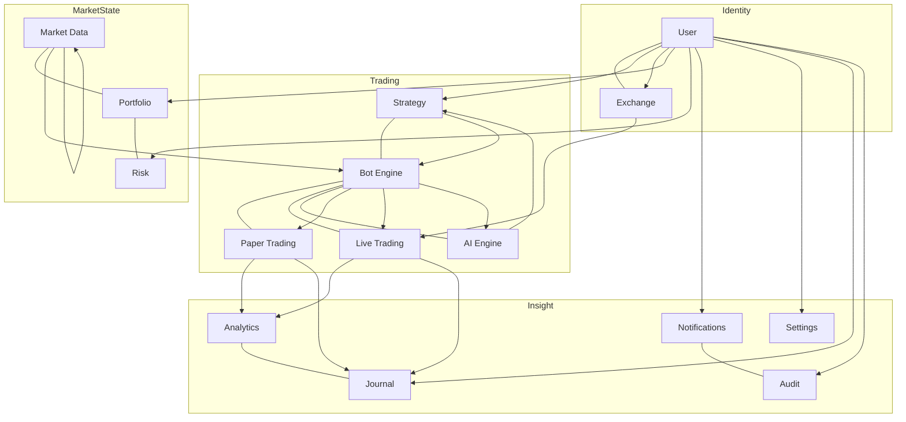

---

## 3. Entity Relationship Diagram (ERD)

**Core transactional spine** (the money path). Cardinalities: `||--o{` = one-to-many, `||--||` = one-to-one, `}o--o{` = many-to-many (via junction).

```mermaid
erDiagram
  tenants           ||--o{ users : contains
  users             ||--|| profiles : has
  users             }o--o{ roles : "user_roles"
  roles             }o--o{ permissions : "role_permissions"
  users             ||--o{ sessions : opens
  users             ||--o{ oauth_accounts : links

  tenants           ||--o{ exchange_connections : owns
  supported_exchanges ||--o{ exchange_connections : typed_by
  exchange_connections ||--o{ exchange_api_keys : holds
  exchange_connections ||--o{ websocket_sessions : maintains

  tenants           ||--o{ strategies : authors
  strategies        ||--o{ strategy_versions : has
  strategy_versions ||--o{ entry_rules : defines
  strategy_versions ||--o{ exit_rules : defines
  strategy_versions ||--o{ risk_rules : defines
  strategy_versions ||--o{ position_size_rules : defines
  strategy_versions ||--o{ leverage_rules : defines
  strategy_versions ||--o{ strategy_indicators : uses
  strategy_indicators ||--o{ indicator_parameters : configures
  strategy_versions ||--o{ strategy_performance : scores

  tenants           ||--o{ accounts : owns
  accounts          ||--o{ orders : places
  exchange_connections ||--o{ orders : routes
  orders            ||--o{ order_executions : fills
  accounts          ||--o{ positions : holds
  positions         ||--o{ position_history : audits
  accounts          ||--o{ trades : books
  accounts          ||--o{ balance_history : tracks

  strategy_versions ||--o{ bot_instances : runs
  accounts          ||--o{ bot_instances : trades_for
  bot_instances     ||--o{ bot_decisions : emits
  bot_decisions     ||--o{ signals : yields
  bot_instances     ||--o{ bot_events : logs

  bot_decisions     ||--o{ ai_reviews : reviewed_by
  trades            ||--o{ ai_trade_analysis : analyzed_by
  strategy_versions ||--o{ ai_suggestions : suggests

  accounts          ||--o{ replay_sessions : runs
  replay_sessions   ||--o{ replay_trades : produces

  assets            ||--o{ symbols : quoted_as
  symbols           ||--o{ candles : sampled_into
  symbols           ||--o{ funding_rates : accrues
  symbols           ||--o{ open_interest : reports

  tenants           ||--o{ wallets : holds
  wallets           ||--o{ balances : itemizes
  accounts          ||--o{ portfolio_allocations : plans
  accounts          ||--o{ exposures : incurs

  trades            ||--o{ trade_journal : documented_by
  trade_journal     ||--o{ trade_notes : annotated_with
  trade_journal     ||--o{ attachments : attaches
  trade_journal     }o--o{ tags : "journal_tags"

  tenants           ||--o{ risk_profiles : configures
  risk_profiles     ||--|| circuit_breakers : arms

  users             ||--o{ notifications : receives
  users             ||--o{ activity_logs : generates
  users             ||--o{ user_settings : personalizes
```

*(Per-module ERD fragments are inlined in each subsection of §4. Time-series tables — `candles`, `market_data`, `funding_rates`, `open_interest` — are reference data keyed by `symbol_id`, deliberately **not** tenant-scoped, and are shown separate from the tenant spine.)*

---

## 4. Complete Table Specifications

> Format per table: **tag · purpose**, then columns (`Column | Type | Constraints | Notes`), then **PK / FK / Indexes / Unique / RLS / Retention**. **[std]** = the standard audit envelope from §2.2. Enum values are listed at first use.

### 4.1 USER MODULE

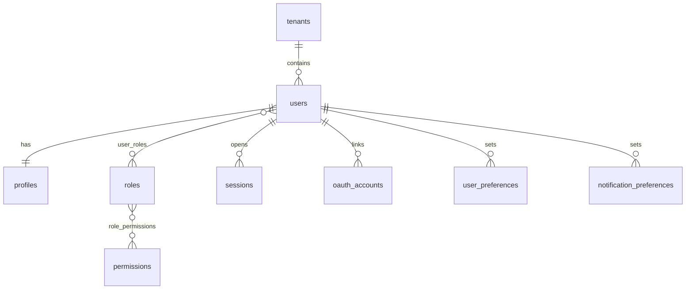

#### `tenants` 🔴 NEW — the isolation root
The RLS anchor. In single-owner mode one seed row (`'__owner__'`) exists; multi-user creates one per account owner. *(Maps to `services/tenancy.py::OWNER_TENANT` today.)*

| Column | Type | Constraints | Notes |
|---|---|---|---|
| `id` | UUID | PK DEFAULT gen_random_uuid() | |
| `slug` | TEXT | NOT NULL UNIQUE | stable handle; `'__owner__'` for the legacy owner |
| `name` | TEXT | NOT NULL | display name |
| `plan` | TEXT | NOT NULL DEFAULT 'personal' CHECK (plan IN ('personal','pro','institutional')) | billing tier |
| `status` | TEXT | NOT NULL DEFAULT 'active' CHECK (status IN ('active','suspended','closed')) | |
| *(created_at, updated_at)* | | | no `tenant_id` (this **is** the tenant); no `created_by` |

- **Indexes:** UNIQUE(slug). **RLS:** members can read their own tenant; only service role writes. **Retention:** permanent.

#### `users` 🟢 EXISTS (`users(username PK, password_hash, salt, role, created_at)`)
Operator/user accounts. Target reconciles the backend `users` table with Supabase `auth.users` — see §8.5.

| Column | Type | Constraints | Notes |
|---|---|---|---|
| `id` | UUID | PK DEFAULT gen_random_uuid() | **replaces `username` PK**; == `auth.users.id` when Supabase-Auth-backed |
| `tenant_id` | UUID | NOT NULL FK tenants(id) ON DELETE CASCADE | |
| `email` | CITEXT | NOT NULL UNIQUE | case-insensitive; the login identity |
| `username` | CITEXT | UNIQUE | legacy handle; kept for the operator console |
| `password_hash` | TEXT | | PBKDF2-HMAC-SHA256, 200k iters *(today)* → delegated to Supabase Auth in target |
| `salt` | TEXT | | per-user; null when auth is delegated |
| `role` | TEXT | NOT NULL DEFAULT 'operator' CHECK (role IN ('admin','operator','viewer')) | coarse gate; fine-grained via `user_roles` |
| `mfa_enabled` | BOOLEAN | NOT NULL DEFAULT false | TOTP (landing already supports) |
| `status` | TEXT | NOT NULL DEFAULT 'active' CHECK (status IN ('active','disabled','locked')) | |
| `last_login_at` | TIMESTAMPTZ | | |
| *(created_at, updated_at, created_by, updated_by, deleted_at)* | | | **soft-delete** |

- **FK:** `tenant_id`→tenants. **Indexes:** UNIQUE(email), UNIQUE(username), `(tenant_id)`. **Unique:** email, username. **RLS:** a user reads/updates only their own row; admins read tenant peers. **Retention:** soft-delete, purge 90 d after `deleted_at`.

#### `profiles` 🟡 PARTIAL (landing stores first/last/country in `auth user_metadata`)
1:1 extension of `users` for display/KYC-lite data — separated so the hot `users` row stays lean.

| Column | Type | Constraints | Notes |
|---|---|---|---|
| `id` | UUID | PK DEFAULT gen_random_uuid() | |
| `user_id` | UUID | NOT NULL UNIQUE FK users(id) ON DELETE CASCADE | 1:1 |
| `first_name` | TEXT | | |
| `last_name` | TEXT | | |
| `country` | CHAR(2) | CHECK (country ~ '^[A-Z]{2}$') | ISO-3166 |
| `avatar_url` | TEXT | | Supabase storage ref |
| `timezone` | TEXT | NOT NULL DEFAULT 'UTC' | IANA tz |
| `bio` | TEXT | | |
| *(created_at, updated_at)* | | | |

- **FK:** user_id→users (UNIQUE ⇒ 1:1). **RLS:** owner-only. **Retention:** follows `users`.

#### `roles` 🔴 NEW · `permissions` 🔴 NEW · junctions `user_roles`, `role_permissions`
Formalizes today's two-value `role` into RBAC. `roles`(`id`,`name` UNIQUE,`description`, [std-lite]); `permissions`(`id`,`code` UNIQUE e.g. `strategy.write`,`trade.execute`,`description`). Junctions:

- **`user_roles`** (M:N): `user_id` FK users, `role_id` FK roles, `PRIMARY KEY(user_id, role_id)`, [std audit]. RLS: admin-managed.
- **`role_permissions`** (M:N): `role_id` FK roles, `permission_id` FK permissions, `PRIMARY KEY(role_id, permission_id)`. Reference data; service-role write only.

#### `sessions` 🟡 PARTIAL (today: stateless HMAC cookie, no table — `app.py::_sign_session`)
Persisted sessions for revocation, device list, and audit. *(The HMAC cookie stays as the transport; this table records/optionally-validates it.)*

| Column | Type | Constraints | Notes |
|---|---|---|---|
| `id` | UUID | PK | session id (also the cookie subject) |
| `user_id` | UUID | NOT NULL FK users(id) ON DELETE CASCADE | |
| `token_hash` | TEXT | NOT NULL | SHA-256 of the signed token — never store the raw token |
| `ip` | INET | | |
| `user_agent` | TEXT | | |
| `expires_at` | TIMESTAMPTZ | NOT NULL | 7-day default (matches `SESSION_DAYS`) |
| `revoked_at` | TIMESTAMPTZ | | logout / forced revoke |
| *(created_at)* | | | |

- **FK:** user_id→users. **Indexes:** `(user_id)`, `(expires_at)` partial `WHERE revoked_at IS NULL`. **RLS:** owner reads own sessions. **Retention:** delete 30 d after `expires_at`.

#### `oauth_accounts` 🟡 PARTIAL (landing does Google/GitHub via Supabase Auth)
Links external identities. `id`, `user_id` FK, `provider` CHECK IN ('google','github','apple'), `provider_account_id` TEXT, `access_token_enc` BYTEA (pgcrypto), `refresh_token_enc` BYTEA, `expires_at`, [std]. **Unique:** `(provider, provider_account_id)`. RLS owner-only.

#### `user_preferences` 🟢 EXISTS (`user_settings(username,namespace,data)` — see 4.16) · `notification_preferences` 🔴 NEW
`notification_preferences`: `id`, `user_id` FK, `channel` CHECK IN ('in_app','email','telegram','webhook'), `category` CHECK IN ('trade','risk','system','ai'), `enabled` BOOLEAN DEFAULT true, `config_json` JSONB (e.g. telegram chat id), [std]. **Unique:** `(user_id, channel, category)`. RLS owner-only.

---

### 4.2 EXCHANGE MODULE

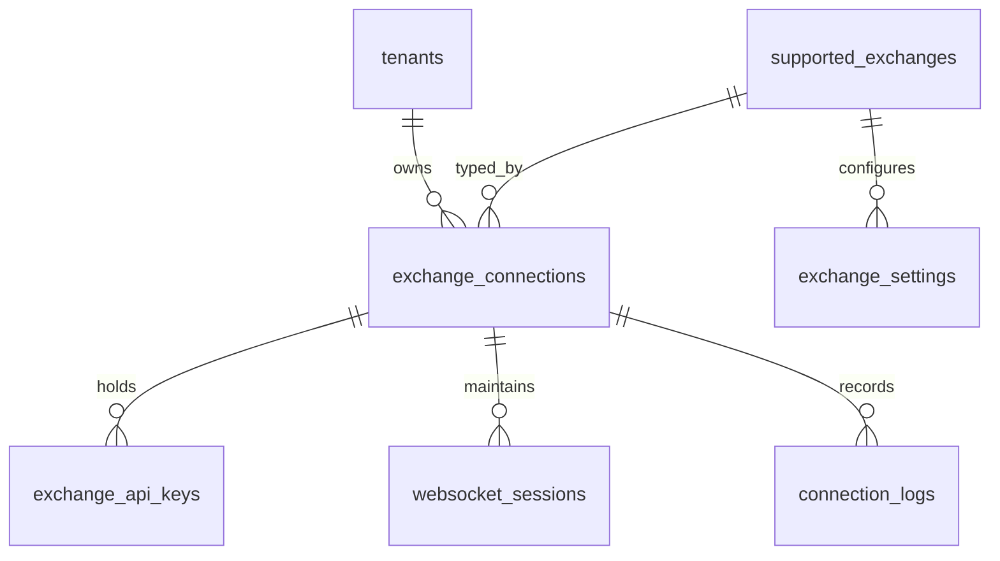

#### `supported_exchanges` 🟡 PARTIAL (today: `bots.exchange` free-text + Binance-only market feed)
Reference catalog of integratable venues.

| Column | Type | Constraints | Notes |
|---|---|---|---|
| `id` | UUID | PK | |
| `code` | TEXT | NOT NULL UNIQUE | 'binance_usdm','bybit','coinbase',… |
| `name` | TEXT | NOT NULL | |
| `asset_classes` | TEXT[] | NOT NULL | {'crypto','futures','spot'} |
| `capabilities` | JSONB | NOT NULL DEFAULT '{}' | {ws:true, testnet:true, max_leverage:125} |
| `enabled` | BOOLEAN | NOT NULL DEFAULT true | |
| *(created_at, updated_at)* | | | no tenant (global reference) |

- **Unique:** code. **RLS:** world-readable, service-role write. **Retention:** permanent.

#### `exchange_connections` 🔴 NEW (live scope)
A tenant's link to a venue. Live trading's entry point.

| Column | Type | Constraints | Notes |
|---|---|---|---|
| `id` | UUID | PK | |
| `tenant_id` | UUID | NOT NULL FK tenants ON DELETE CASCADE | |
| `exchange_id` | UUID | NOT NULL FK supported_exchanges(id) ON DELETE RESTRICT | |
| `label` | TEXT | NOT NULL | user's name for it |
| `environment` | TEXT | NOT NULL DEFAULT 'testnet' CHECK (environment IN ('testnet','mainnet')) | |
| `status` | TEXT | NOT NULL DEFAULT 'disconnected' CHECK (status IN ('connected','disconnected','error','revoked')) | |
| `scopes` | TEXT[] | NOT NULL DEFAULT '{}' | {'read','trade'} — never 'withdraw' |
| `last_checked_at` | TIMESTAMPTZ | | |
| *(created_at, updated_at, created_by, updated_by, deleted_at)* | | | soft-delete |

- **FK:** tenant, exchange. **Indexes:** `(tenant_id, status)`. **Unique:** `(tenant_id, exchange_id, label)`. **RLS:** owner-only. **Retention:** soft-delete; keep for audit.

#### `exchange_api_keys` 🔴 NEW — **encrypted secrets** (see §8.4)
Separated from the connection so the ciphertext is isolated and least-exposed.

| Column | Type | Constraints | Notes |
|---|---|---|---|
| `id` | UUID | PK | |
| `tenant_id` | UUID | NOT NULL FK tenants ON DELETE CASCADE | |
| `connection_id` | UUID | NOT NULL FK exchange_connections(id) ON DELETE CASCADE | |
| `api_key_enc` | BYTEA | NOT NULL | `pgp_sym_encrypt` (pgcrypto) or Supabase Vault ref |
| `api_secret_enc` | BYTEA | NOT NULL | never returned to the client |
| `passphrase_enc` | BYTEA | | some venues |
| `key_fingerprint` | TEXT | NOT NULL | SHA-256 prefix for display/dedupe (safe to show) |
| `rotated_at` | TIMESTAMPTZ | | |
| *(created_at, updated_at, created_by, deleted_at)* | | | soft-delete on rotation |

- **FK:** connection. **Unique:** `(connection_id, key_fingerprint)`. **RLS:** **no direct client read** — accessible only via a `SECURITY DEFINER` function to the backend service role; `SELECT` denied to `authenticated`. **Retention:** keep encrypted history; purge 30 d after revoke.

#### `exchange_settings` 🔴 NEW
Per-connection trading config: `id`, `tenant_id`, `connection_id` FK, `default_leverage` NUMERIC(6,2), `margin_mode` CHECK IN ('isolated','cross'), `position_mode` CHECK IN ('one_way','hedge'), `max_slippage_bps` INT, `config_json` JSONB, [std]. **Unique:** `(connection_id)` (1:1). RLS owner-only.

#### `websocket_sessions` 🟡 PARTIAL (today: in-process Binance WS, 250 ms throttle — not persisted)
Observability for live market/user-data streams: `id`, `tenant_id`, `connection_id` FK, `stream_type` CHECK IN ('market','user_data'), `status` CHECK IN ('open','closed','reconnecting'), `connected_at`, `disconnected_at`, `messages` BIGINT, `last_error`, [std-lite]. **Index:** `(connection_id, status)`. RLS owner-only. **Retention:** 14 d.

#### `connection_logs` 🟢 EXISTS-ish (today: `bot_logs` stage='webhook'/'execution')
Append-only connection lifecycle: `id`, `tenant_id`, `connection_id` FK, `ts` TIMESTAMPTZ, `level` CHECK IN ('info','warning','error'), `event` TEXT, `detail_json` JSONB. **No `updated_*`** (immutable). **Index:** `(connection_id, ts DESC)` + BRIN(ts). **Partition:** monthly by `ts`. **Retention:** 90 d.

---

### 4.3 STRATEGY MODULE

Normalizes today's `custom_strategies.json` (`{sid:{definition, versions[30], favorite, tags, folder}}`, already `tenant_id`-scoped, Phase C-2) into first-class rule tables so strategies are queryable, diffable, and shareable.

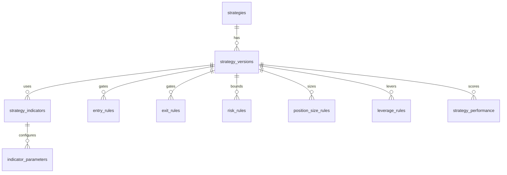

#### `strategies` 🟢 EXISTS (`custom_strategies.json` record head)
| Column | Type | Constraints | Notes |
|---|---|---|---|
| `id` | UUID | PK | (was JSON `sid`) |
| `tenant_id` | UUID | NOT NULL FK tenants ON DELETE CASCADE | already present as `tenant_id` in JSON |
| `name` | TEXT | NOT NULL | |
| `kind` | TEXT | NOT NULL DEFAULT 'custom' CHECK (kind IN ('custom','template','preset')) | |
| `folder` | TEXT | | library organization |
| `favorite` | BOOLEAN | NOT NULL DEFAULT false | |
| `current_version_id` | UUID | FK strategy_versions(id) ON DELETE SET NULL | the "live" version |
| `archived` | BOOLEAN | NOT NULL DEFAULT false | |
| *(created_at, updated_at, created_by, updated_by, deleted_at)* | | | soft-delete |

- **FK:** tenant; current_version (deferrable — chicken/egg with versions). **Indexes:** `(tenant_id, updated_at DESC)`, `(tenant_id) WHERE favorite`. **Unique:** `(tenant_id, name)` where not deleted. **RLS:** owner-only. **Retention:** soft-delete.

#### `strategy_versions` 🟢 EXISTS (JSON `versions[]`, capped 30 + `strategy_versions.json` gates)
Immutable snapshots — the audit trail + evolution gating.

| Column | Type | Constraints | Notes |
|---|---|---|---|
| `id` | UUID | PK | |
| `tenant_id` | UUID | NOT NULL FK tenants | |
| `strategy_id` | UUID | NOT NULL FK strategies(id) ON DELETE CASCADE | |
| `version_no` | INT | NOT NULL | monotonic per strategy |
| `spec_json` | JSONB | NOT NULL | the full definition snapshot (source of truth; rule tables are the normalized projection) |
| `stats_json` | JSONB | | backtest/sim stats |
| `gates_json` | JSONB | NOT NULL DEFAULT '{}' | {backtest,sim,paper,live} promotion gates |
| `stage` | TEXT | NOT NULL DEFAULT 'draft' CHECK (stage IN ('draft','backtest','sim','paper','live','retired')) | |
| `symbol` | TEXT | | primary symbol |
| `timeframe` | TEXT | | |
| *(created_at, created_by)* | | | **immutable** — no `updated_at` |

- **FK:** strategy. **Indexes:** `(strategy_id, version_no DESC)`, GIN(`spec_json`). **Unique:** `(strategy_id, version_no)`. **RLS:** owner-only. **Retention:** keep last 30 per strategy (matches `_VERSION_CAP`), archive older to cold storage.

#### Rule tables 🟡 PARTIAL (today inside `spec_json`) — normalized projection of a version
Each version's rules extracted for querying ("find every strategy using RSI<30 entry"). Written by a trigger/service that parses `spec_json`; `spec_json` remains the write source, rule tables the read model.

- **`strategy_indicators`**: `id`, `tenant_id`, `version_id` FK strategy_versions ON DELETE CASCADE, `indicator_code` TEXT (e.g. 'RSI','EMA','ATR'), `alias` TEXT, `timeframe` TEXT, [std-lite]. **Unique** `(version_id, alias)`. **Index** `(indicator_code)`.
- **`indicator_parameters`**: `id`, `tenant_id`, `strategy_indicator_id` FK ON DELETE CASCADE, `key` TEXT (e.g. 'period'), `value` NUMERIC, `value_text` TEXT. **Unique** `(strategy_indicator_id, key)`.
- **`entry_rules`** / **`exit_rules`**: `id`, `tenant_id`, `version_id` FK, `seq` INT, `side` CHECK IN ('long','short'), `expression` TEXT (human form), `predicate_json` JSONB (machine form: `{lhs, op, rhs}`), `logic` CHECK IN ('and','or') DEFAULT 'and'. **Index** `(version_id, seq)`.
- **`risk_rules`**: `id`, `tenant_id`, `version_id` FK, `stop_type` CHECK IN ('atr','fixed_pct','structure'), `stop_value` NUMERIC(20,8), `take_profit_rr` NUMERIC(8,4), `max_risk_pct` NUMERIC(6,3), `daily_loss_cap_pct` NUMERIC(6,3).
- **`position_size_rules`**: `id`, `tenant_id`, `version_id` FK, `method` CHECK IN ('fixed_fractional','fixed_notional','kelly','volatility_target'), `risk_per_trade_pct` NUMERIC(6,3), `max_notional` NUMERIC(20,8).
- **`leverage_rules`**: `id`, `tenant_id`, `version_id` FK, `mode` CHECK IN ('isolated','cross'), `target_leverage` NUMERIC(6,2), `max_leverage` NUMERIC(6,2), `regime_json` JSONB (leverage by regime).

All rule tables: RLS owner-only; CASCADE-delete with the version; regenerated on version change.

#### `strategy_performance` 🟡 PARTIAL (today: `stats_json` + `evolution_memory`)
Rolled-up performance per version per surface: `id`, `tenant_id`, `version_id` FK, `surface` CHECK IN ('backtest','sim','paper','live'), `trades` INT, `wins` INT, `net_r` NUMERIC(12,4), `profit_factor` NUMERIC(10,4), `max_drawdown_pct` NUMERIC(8,4), `sharpe` NUMERIC(10,4), `window_start` DATE, `window_end` DATE, [std]. **Unique** `(version_id, surface, window_start)`. **Index** `(tenant_id, surface)`. RLS owner-only.

---

### 4.4 PAPER TRADING MODULE

Today's paper stack: `account_state` (singleton), `positions`, `paper_trades`, `webhook_events` (all in `ledger.db`), `grid.json`. Target re-keys them per **account** so a tenant can hold several paper books.

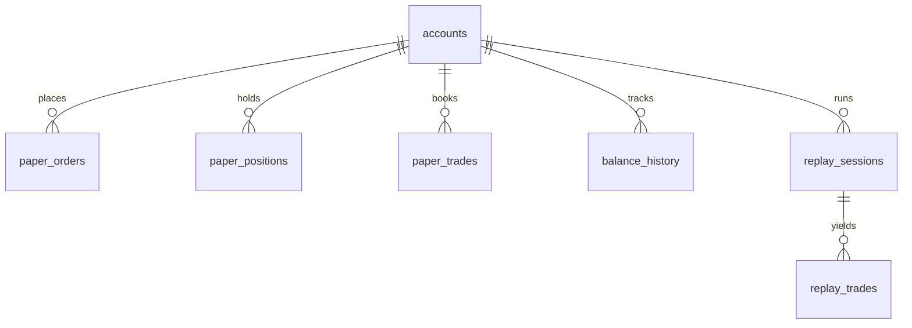

#### `accounts` 🟢 EXISTS (`account_state` singleton — one owner book today)
Separates identity from trading books; `mode` distinguishes paper/live. **Shared by Paper & Live modules.**

| Column | Type | Constraints | Notes |
|---|---|---|---|
| `id` | UUID | PK | |
| `tenant_id` | UUID | NOT NULL FK tenants ON DELETE CASCADE | |
| `mode` | TEXT | NOT NULL CHECK (mode IN ('paper','live')) | |
| `connection_id` | UUID | FK exchange_connections(id) ON DELETE RESTRICT | null for paper |
| `base_currency` | CHAR(3) | NOT NULL DEFAULT 'USD' | |
| `initial_capital` | NUMERIC(20,8) | NOT NULL | (was `account_state.initial_capital`) |
| `current_equity` | NUMERIC(20,8) | NOT NULL | |
| `available_balance` | NUMERIC(20,8) | NOT NULL | |
| `realized_pnl` | NUMERIC(20,8) | NOT NULL DEFAULT 0 | derived; ledger trades remain source of truth |
| `unrealized_pnl` | NUMERIC(20,8) | NOT NULL DEFAULT 0 | mark-to-market |
| `status` | TEXT | NOT NULL DEFAULT 'active' CHECK (status IN ('active','frozen','closed')) | |
| *(created_at, updated_at, created_by, updated_by)* | | | |

- **FK:** tenant, connection. **Indexes:** `(tenant_id, mode)`. **Unique:** `(tenant_id, mode, connection_id)` (one live book per connection). **RLS:** owner-only. **Retention:** permanent.

#### `paper_orders` 🔴 NEW (paper collapses order→fill today)
Intent records so paper mirrors the live order lifecycle: `id`, `tenant_id`, `account_id` FK, `symbol` TEXT, `side` order_side, `type` order_type ('market','limit','stop','stop_limit'), `qty` NUMERIC(20,8), `limit_price` NUMERIC(20,8), `stop_price` NUMERIC(20,8), `status` order_status ('new','partial','filled','cancelled','rejected'), `client_order_id` TEXT, `strategy_version_id` FK, `placed_at`, `filled_at`, [std]. **Unique** `(account_id, client_order_id)` — **idempotency**. **Index** `(account_id, status)`, `(account_id, symbol, placed_at DESC)`. RLS owner-only.

#### `paper_positions` 🟢 EXISTS (`positions`)
| Column | Type | Constraints | Notes |
|---|---|---|---|
| `id` | UUID | PK | |
| `tenant_id` | UUID | NOT NULL FK tenants | |
| `account_id` | UUID | NOT NULL FK accounts(id) ON DELETE CASCADE | |
| `symbol` | TEXT | NOT NULL | |
| `side` | order_side | NOT NULL | 'long'/'short' |
| `size` | NUMERIC(20,8) | NOT NULL | |
| `avg_entry` | NUMERIC(20,8) | NOT NULL | (was `entry`) |
| `stop` | NUMERIC(20,8) | | |
| `status` | TEXT | NOT NULL CHECK (status IN ('open','closed')) | |
| `unrealized_pnl` | NUMERIC(20,8) | NOT NULL DEFAULT 0 | |
| `opened_at` | TIMESTAMPTZ | NOT NULL | |
| `closed_at` | TIMESTAMPTZ | | |
| *(created_at, updated_at)* | | | |

- **Indexes:** `(account_id, status)` (open-position hot read), `(account_id, symbol)`. **Unique:** partial `(account_id, symbol) WHERE status='open'` (one open position per symbol per account). **RLS:** owner-only. **Retention:** permanent.

#### `paper_trades` 🟢 EXISTS (`paper_trades` — the trade record; `source` tags paper/backtest/live)
**The immutable booked-trade record.** Realized outcomes never mutate.

| Column | Type | Constraints | Notes |
|---|---|---|---|
| `id` | UUID | PK | |
| `tenant_id` | UUID | NOT NULL FK tenants | |
| `account_id` | UUID | NOT NULL FK accounts(id) ON DELETE CASCADE | |
| `position_id` | UUID | FK paper_positions(id) ON DELETE SET NULL | |
| `symbol` | TEXT | NOT NULL | |
| `side` | order_side | NOT NULL | |
| `size` | NUMERIC(20,8) | NOT NULL | |
| `entry` | NUMERIC(20,8) | NOT NULL | |
| `exit` | NUMERIC(20,8) | | null while open |
| `stop` | NUMERIC(20,8) | | |
| `pnl` | NUMERIC(20,8) | | realized on close |
| `rr` | NUMERIC(10,4) | | realized R multiple |
| `fees` | NUMERIC(20,8) | NOT NULL DEFAULT 0 | |
| `source` | TEXT | NOT NULL DEFAULT 'paper' CHECK (source IN ('paper','backtest','live','replay')) | |
| `status` | TEXT | NOT NULL CHECK (status IN ('open','closed')) | |
| `opened_at` | TIMESTAMPTZ | NOT NULL | |
| `closed_at` | TIMESTAMPTZ | | |
| *(created_at, updated_at)* | | | never soft-deleted |

- **FK:** account, position. **Indexes:** `(account_id, closed_at DESC)` (blotter), `(account_id, symbol)`, `(account_id, status)`, `(source)`. **RLS:** owner-only. **Retention:** **never pruned** (matches today); partition by `closed_at` year at scale; archive >2 y to cold partition.

#### `balance_history` 🔴 NEW (equity snapshots — today derived on the fly)
Time-series of account equity for the equity curve: `id`, `tenant_id`, `account_id` FK, `ts` TIMESTAMPTZ, `equity` NUMERIC(20,8), `available` NUMERIC(20,8), `realized_pnl` NUMERIC(20,8), `unrealized_pnl` NUMERIC(20,8). **No `updated_*`** (append-only). **Index** `(account_id, ts DESC)` + BRIN(ts). **Partition** monthly. **RLS** owner-only. **Retention** 2 y hot, then rollup to `equity_curve` daily.

*(`paper_trade_history` in the brief == the closed subset of `paper_trades` (`status='closed'`), exposed as the `v_paper_trade_history` view, not a separate table — 3NF.)*

#### `replay_sessions` 🟡 PARTIAL (today: `grid.json` snapshot + in-process replay)
Resumable/shareable historical replays: `id`, `tenant_id`, `account_id` FK, `symbol` TEXT, `timeframe` TEXT, `range_start` TIMESTAMPTZ, `range_end` TIMESTAMPTZ, `cursor_ts` TIMESTAMPTZ, `speed` NUMERIC(6,2), `state` CHECK IN ('running','paused','done'), `state_json` JSONB, [std]. **Index** `(account_id, created_at DESC)`. RLS owner-only. **Retention** soft-delete.

#### `replay_trades` 🟡 PARTIAL (today: `paper_trades.source='backtest'`)
Trades produced inside a replay (kept distinct from live paper book): same shape as `paper_trades` + `replay_session_id` FK ON DELETE CASCADE, `source` fixed `'replay'`. **Index** `(replay_session_id)`. RLS owner-only. **Retention** with parent session.

---

### 4.5 LIVE TRADING MODULE 🔴 NEW (paper-only today; full lifecycle by design)

Live needs the order lifecycle paper collapses. Shares `accounts` (mode='live') and `exchange_connections`.

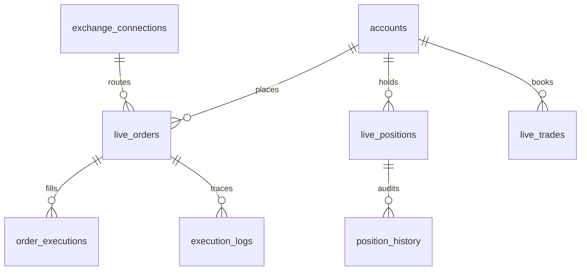

#### `live_orders`
| Column | Type | Constraints | Notes |
|---|---|---|---|
| `id` | UUID | PK | |
| `tenant_id` | UUID | NOT NULL FK tenants | |
| `account_id` | UUID | NOT NULL FK accounts(id) ON DELETE RESTRICT | live books not cascade-deleted |
| `connection_id` | UUID | NOT NULL FK exchange_connections(id) ON DELETE RESTRICT | |
| `symbol` | TEXT | NOT NULL | |
| `side` | order_side | NOT NULL | |
| `type` | order_type | NOT NULL | |
| `qty` | NUMERIC(20,8) | NOT NULL | |
| `filled_qty` | NUMERIC(20,8) | NOT NULL DEFAULT 0 | |
| `limit_price` | NUMERIC(20,8) | | |
| `stop_price` | NUMERIC(20,8) | | |
| `avg_fill_price` | NUMERIC(20,8) | | |
| `status` | order_status | NOT NULL DEFAULT 'new' | new→partial→filled/cancelled/rejected |
| `time_in_force` | TEXT | CHECK (time_in_force IN ('GTC','IOC','FOK')) | |
| `client_order_id` | TEXT | NOT NULL | idempotency key we generate |
| `exchange_order_id` | TEXT | | venue id |
| `strategy_version_id` | UUID | FK strategy_versions(id) ON DELETE SET NULL | attribution |
| `reject_reason` | TEXT | | |
| `placed_at` | TIMESTAMPTZ | | |
| `closed_at` | TIMESTAMPTZ | | terminal |
| *(created_at, updated_at, created_by)* | | | |

- **FK:** account, connection, version. **Indexes:** `(account_id, status)`, `(account_id, symbol, placed_at DESC)`, `(exchange_order_id)`. **Unique:** `(connection_id, client_order_id)` — **the idempotency guard against duplicate placement on retry**. **RLS:** owner-only. **Retention:** permanent (financial).

#### `order_executions` (fills — an order fills in N pieces)
`id`, `tenant_id`, `order_id` FK live_orders ON DELETE RESTRICT, `exec_id` TEXT (venue fill id), `price` NUMERIC(20,8) NOT NULL, `qty` NUMERIC(20,8) NOT NULL, `fee` NUMERIC(20,8) NOT NULL DEFAULT 0, `fee_currency` TEXT, `liquidity` CHECK IN ('maker','taker'), `executed_at` TIMESTAMPTZ NOT NULL, `created_at`. **Immutable.** **Unique** `(order_id, exec_id)`. **Index** `(order_id)`, `(executed_at)` BRIN. RLS owner-only. **Retention** permanent.

#### `live_positions` — same shape as `paper_positions` + `connection_id` FK, `leverage` NUMERIC(6,2), `liquidation_price` NUMERIC(20,8), `margin` NUMERIC(20,8). Partial-unique open position per `(account_id, symbol)`. RLS owner-only. Permanent.

#### `position_history` (immutable position-state audit — every size/stop change)
`id`, `tenant_id`, `position_id` FK live_positions ON DELETE RESTRICT, `ts` TIMESTAMPTZ, `event` CHECK IN ('open','increase','reduce','stop_move','close','liquidation'), `size_after` NUMERIC(20,8), `avg_entry_after` NUMERIC(20,8), `detail_json` JSONB. Append-only. **Index** `(position_id, ts)`. RLS owner-only. **Retention** permanent.

#### `live_trades` — same shape/indexes as `paper_trades`, `source='live'`, on `accounts(mode='live')`; `entry`/`exit`/`pnl`/`fees` are **realized from `order_executions`** (never estimated). RLS owner-only. **Never deleted.**

#### `execution_logs` (routing trace for support/forensics)
`id`, `tenant_id`, `order_id` FK, `ts`, `stage` CHECK IN ('signal','risk','sizing','route','ack','fill','error'), `level` CHECK IN ('info','warning','error'), `message`, `payload_json` JSONB. Append-only. **Index** `(order_id, ts)` + BRIN(ts). **Partition** monthly. **Retention** 180 d.

---

### 4.6 MARKET DATA MODULE

Reference/time-series data — **not tenant-scoped** (shared, deduplicated). Today: `candles` table (`market_data.db`) + `providers.json`.

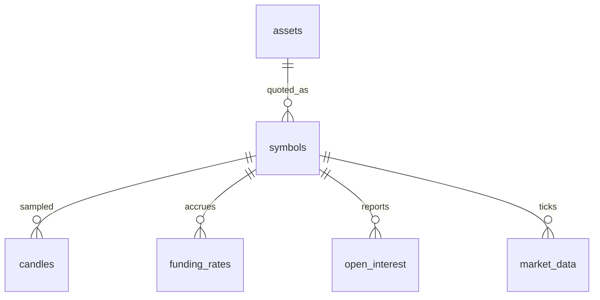

#### `assets` 🟡 PARTIAL (today: implicit in symbol strings) — the underlying instrument
`id`, `symbol` TEXT UNIQUE (e.g. 'BTC','AAPL'), `name`, `asset_class` CHECK IN ('crypto','equity','fx','commodity','index'), `decimals` INT, `metadata_json` JSONB, `created_at`, `updated_at`. Global reference. **Unique** symbol. World-readable, service-role write. Permanent.

#### `symbols` 🟡 PARTIAL — the tradeable pair/contract on a venue
`id`, `asset_id` FK assets ON DELETE RESTRICT, `exchange_id` FK supported_exchanges, `symbol` TEXT (e.g. 'BTCUSDT'), `quote_currency` TEXT, `contract_type` CHECK IN ('spot','perp','future'), `tick_size` NUMERIC(20,8), `lot_size` NUMERIC(20,8), `min_notional` NUMERIC(20,8), `active` BOOLEAN, `created_at`, `updated_at`. **Unique** `(exchange_id, symbol)`. **Index** `(asset_id)`. World-readable. Permanent.

#### `candles` 🟢 EXISTS (`candles(symbol,timeframe,open_time PK, ohlcv)`) — OHLCV, the hot path
| Column | Type | Constraints | Notes |
|---|---|---|---|
| `symbol_id` | UUID | NOT NULL FK symbols(id) | (was `symbol` TEXT) |
| `timeframe` | TEXT | NOT NULL | '1m','5m','1h','4h','1d' |
| `open_time` | TIMESTAMPTZ | NOT NULL | (was epoch INT) |
| `open` `high` `low` `close` | NUMERIC(20,8) | NOT NULL | |
| `volume` | NUMERIC(30,8) | NOT NULL | |
| *(no audit envelope — pure time-series)* | | | |

- **PK:** `(symbol_id, timeframe, open_time)` (matches today's composite PK). **Index:** BRIN(open_time) per partition. **Partition:** `RANGE (open_time)` monthly (TimescaleDB hypertable at scale). **RLS:** disabled (public reference). **Retention:** keep 1m for 90 d, 1h+ for 5 y; downsample via continuous aggregate. **This is the highest-volume table.**

#### `market_data` 🔴 NEW (last-tick/quote cache — today ephemeral in-process)
Latest ticker per symbol for dashboards: `symbol_id` PK FK, `last_price` NUMERIC(20,8), `bid` NUMERIC(20,8), `ask` NUMERIC(20,8), `volume_24h` NUMERIC(30,8), `change_24h_pct` NUMERIC(10,4), `updated_at`. **1 row/symbol** (upsert). Public read. **Retention** live-overwrite (no history — that's `candles`).

#### `funding_rates` 🔴 NEW (perp funding — provider `binance_funding` today, unpersisted)
`symbol_id` FK, `funding_time` TIMESTAMPTZ, `rate` NUMERIC(12,8), `interval_hours` INT. **PK** `(symbol_id, funding_time)`. BRIN(funding_time). Partition monthly. Public read. **Retention** 2 y.

#### `open_interest` 🔴 NEW (provider `binance_oi` today, unpersisted)
`symbol_id` FK, `ts` TIMESTAMPTZ, `oi` NUMERIC(30,8), `oi_value` NUMERIC(30,8). **PK** `(symbol_id, ts)`. BRIN(ts). Partition monthly. Public read. **Retention** 1 y.

#### `economic_events` 🟡 PARTIAL (today: `services/econ_guard.py` → `{"events":[…]}` JSON)
Macro calendar gating trades: `id`, `event_time` TIMESTAMPTZ, `title`, `country` CHAR(2), `impact` CHECK IN ('low','medium','high'), `actual`/`forecast`/`previous` TEXT, `source`, `created_at`, `updated_at`. **Index** `(event_time)`, `(impact, event_time)`. Public read. **Retention** 2 y.

#### `news_events` 🟡 PARTIAL (provider `news`/`twitter`/`reddit` today)
Sentiment/news feed: `id`, `published_at` TIMESTAMPTZ, `source`, `headline`, `url`, `symbols` TEXT[], `sentiment` NUMERIC(4,3), `raw_json` JSONB, `created_at`. **Index** `(published_at DESC)`, GIN(`symbols`). Public read. **Retention** 180 d.

---

### 4.7 BOT MODULE

Normalizes the decision path: today `bots` (config), `decisions.db`, `cycle_reports`, `skipped_trades`, `webhook_events`, `bot_logs`.

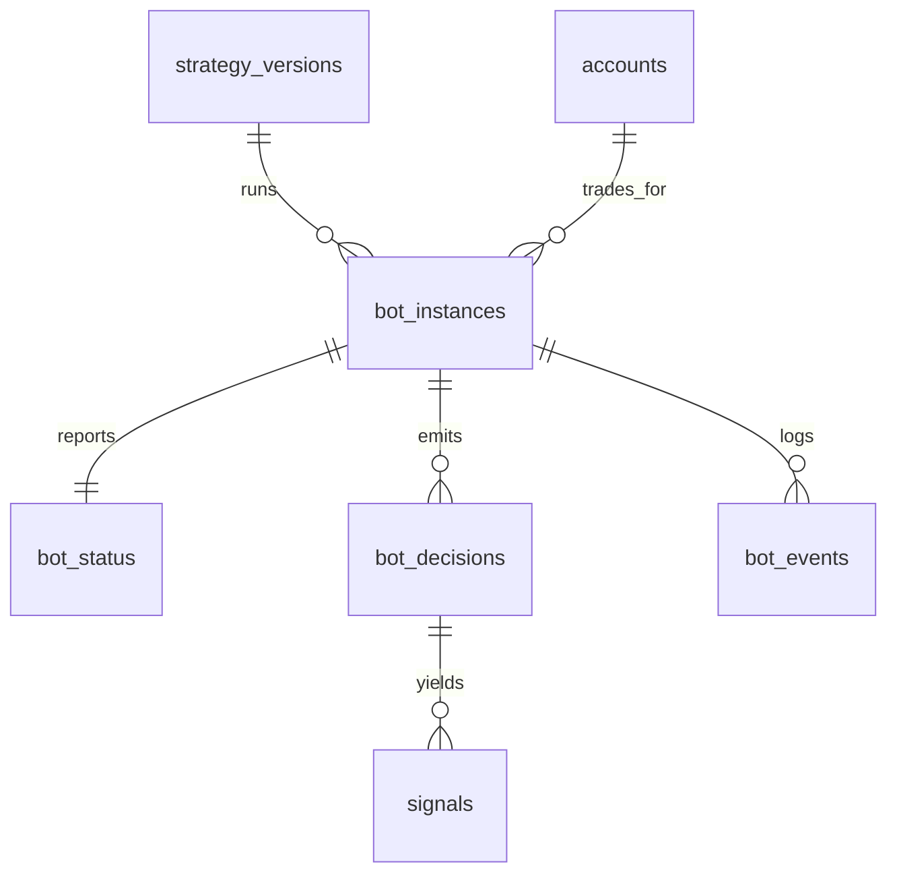

#### `bot_instances` 🟢 EXISTS (`bots(id,name,strategy,exchange,symbol,timeframe,mode,risk_json,starting_cash,state)`)
| Column | Type | Constraints | Notes |
|---|---|---|---|
| `id` | UUID | PK | |
| `tenant_id` | UUID | NOT NULL FK tenants | |
| `account_id` | UUID | NOT NULL FK accounts ON DELETE CASCADE | which book it trades |
| `strategy_version_id` | UUID | NOT NULL FK strategy_versions ON DELETE RESTRICT | pinned version |
| `name` | TEXT | NOT NULL | |
| `symbol` | TEXT | NOT NULL | |
| `timeframe` | TEXT | NOT NULL | |
| `mode` | TEXT | NOT NULL CHECK (mode IN ('paper','live','replay')) | |
| `risk_json` | JSONB | NOT NULL DEFAULT '{}' | risk overrides |
| `state` | TEXT | NOT NULL DEFAULT 'stopped' CHECK (state IN ('running','stopped','paused','error')) | |
| *(created_at, updated_at, created_by, updated_by, deleted_at)* | | | soft-delete |

- **Indexes:** `(tenant_id, state)`, `(account_id)`. **Unique:** `(account_id, symbol, strategy_version_id)`. **RLS:** owner-only. **Retention:** soft-delete.

#### `bot_status` 🟡 PARTIAL (today: in-memory engine state) — 1:1 live heartbeat
`id`, `tenant_id`, `bot_instance_id` UNIQUE FK ON DELETE CASCADE, `heartbeat_at` TIMESTAMPTZ, `last_cycle_at`, `open_positions` INT, `equity` NUMERIC(20,8), `pnl_today` NUMERIC(20,8), `health` CHECK IN ('ok','degraded','down'), `detail_json` JSONB, `updated_at`. **Unique** `(bot_instance_id)`. RLS owner-only. **Retention** live-overwrite.

#### `bot_decisions` 🟢 EXISTS (`decisions` + `cycle_reports`) — **the decision archive**
Every analysis cycle incl. WAIT/SKIP (today `cycle_reports` keeps 5000, `decisions` keeps 20000).

| Column | Type | Constraints | Notes |
|---|---|---|---|
| `id` | UUID | PK | |
| `tenant_id` | UUID | NOT NULL FK tenants | |
| `bot_instance_id` | UUID | FK bot_instances ON DELETE SET NULL | |
| `strategy_version_id` | UUID | FK strategy_versions ON DELETE SET NULL | attribution |
| `ts` | TIMESTAMPTZ | NOT NULL | |
| `symbol` | TEXT | NOT NULL | |
| `timeframe` | TEXT | | |
| `decision` | TEXT | NOT NULL CHECK (decision IN ('BUY','SELL','WAIT','SKIP')) | |
| `side` | order_side | | |
| `regime` | TEXT | | |
| `setup_quality_score` `volume_score` `rr_score` `confidence` | NUMERIC(8,4) | | brain component scores |
| `passed_json` `failed_json` `components_json` | JSONB | | gate detail |
| `report_json` | JSONB | | full cycle snapshot |
| `executed` | BOOLEAN | NOT NULL DEFAULT false | |
| *(created_at)* | | | append-only (no update) |

- **Indexes:** `(bot_instance_id, ts DESC)`, `(tenant_id, ts DESC)`, `(strategy_version_id)`, `(decision)`, GIN(`report_json`). **RLS:** owner-only. **Partition:** monthly by `ts`. **Retention:** hot 90 d, then rollup; archive full detail to cold storage (supersedes today's hard 5k/20k caps with time-based partitioning).

#### `signals` 🟡 PARTIAL (today: `webhook_events` accepted + `skipped_trades`/rejected + waiting in engine)
Unifies the brief's *Signal History / Rejected Signals / Waiting Signals* into one table discriminated by `status` (3NF — same shape, different lifecycle state).

| Column | Type | Constraints | Notes |
|---|---|---|---|
| `id` | UUID | PK | |
| `tenant_id` | UUID | NOT NULL FK tenants | |
| `bot_decision_id` | UUID | FK bot_decisions ON DELETE SET NULL | source cycle |
| `alert_id` | TEXT | | inbound TradingView alert id (was `webhook_events.alert_id`) |
| `symbol` | TEXT | NOT NULL | |
| `side` | order_side | | |
| `status` | TEXT | NOT NULL CHECK (status IN ('fired','waiting','rejected','duplicate','expired')) | the three brief-lists ⇒ this enum |
| `stage` | TEXT | | gate that produced the state (dedup/risk/sizing) |
| `reason` | TEXT | | why rejected/waiting |
| `entry` `stop` `target` | NUMERIC(20,8) | | |
| `payload_json` `snapshot_json` | JSONB | | inbound payload / rejection snapshot |
| `ts` | TIMESTAMPTZ | NOT NULL | |
| *(created_at)* | | | append-only |

- **Indexes:** `(tenant_id, ts DESC)`, `(status)`, `(alert_id)`, `(symbol, ts DESC)`. **RLS:** owner-only. **Partition:** monthly. **Retention:** 180 d (was 20k cap on `skipped_trades`).

*(Views `v_signal_history`/`v_rejected_signals`/`v_waiting_signals` filter this table by `status` for the UI — no separate physical tables.)*

#### `bot_events` 🟢 EXISTS (`bot_logs(ts,level,stage,symbol,message)`) — staged engine log
`id`, `tenant_id`, `bot_instance_id` FK ON DELETE SET NULL, `ts`, `level` CHECK IN ('info','warning','error'), `stage` CHECK IN ('webhook','dedup','risk','sizing','execution','engine'), `symbol`, `message`, `detail_json` JSONB. Append-only. **Index** `(bot_instance_id, ts DESC)` + BRIN(ts). **Partition** monthly. **RLS** owner-only. **Retention** 90 d (was 50k cap).

---

### 4.8 AI MODULE

Today: `memory_reviews` (nightly/weekly/monthly), `trade_memories` (+FTS5), `lessons.json`, `memory.json`, `upgrades.json`.

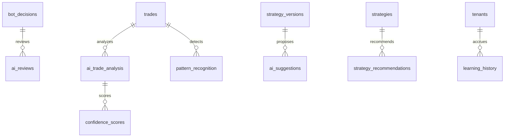

#### `ai_reviews` 🟢 EXISTS (`memory_reviews(period,period_key,report_json, UNIQUE)`)
Periodic AI performance reviews: `id`, `tenant_id`, `period` CHECK IN ('nightly','weekly','monthly','yearly'), `period_key` TEXT (`2026-07-12`/`2026-W28`/`2026-07`), `report_json` JSONB, `model` TEXT, `created_at`. **Unique** `(tenant_id, period, period_key)` (matches today). **Index** `(tenant_id, period, period_key DESC)`. RLS owner-only. **Retention** 2 y.

#### `trade_memories`/`ai_trade_analysis` 🟢 EXISTS (`trade_memories` + FTS5)
Per-trade AI post-mortem — the searchable long-term memory: `id`, `tenant_id`, `trade_id` UNIQUE FK trades ON DELETE CASCADE, `grade` TEXT, `result` CHECK IN ('win','loss','breakeven'), `regime` TEXT, `session` TEXT, `weekday` TEXT, `brain_score` NUMERIC(8,4), `sections_json` JSONB (narrative), `features_json` JSONB (ML features), `notes` TEXT, `search_tsv` TSVECTOR (replaces FTS5 with native Postgres FTS), [std]. **Unique** `(trade_id)`. **Index** `(tenant_id, result)`, `(session)`, GIN(`search_tsv`), GIN(`features_json`). RLS owner-only. **Retention** permanent.

#### `ai_suggestions` 🟡 PARTIAL (today: `upgrades.json` + AI apply-loop)
AI-proposed strategy changes with an approval gate: `id`, `tenant_id`, `strategy_version_id` FK, `kind` CHECK IN ('param_tune','rule_add','rule_remove','risk_adjust'), `diff_json` JSONB, `rationale` TEXT, `expected_gain_r` NUMERIC(10,4), `status` CHECK IN ('suggested','tested','approved','rejected','applied'), `decided_by` UUID FK users, `decided_at`, [std]. **Index** `(strategy_version_id, status)`, `(tenant_id, status)`. RLS owner-only. **Retention** 1 y.

#### `pattern_recognition` 🔴 NEW (chart-pattern/setup detections)
`id`, `tenant_id`, `symbol` TEXT, `timeframe` TEXT, `ts` TIMESTAMPTZ, `pattern` TEXT, `confidence` NUMERIC(6,4), `trade_id` FK trades ON DELETE SET NULL, `meta_json` JSONB, `created_at`. **Index** `(tenant_id, ts DESC)`, `(pattern)`. RLS owner-only. **Retention** 1 y.

#### `confidence_scores` 🟡 PARTIAL (today: inline in `decisions`/`report_json`)
Decomposed model confidence per decision/trade (kept separate for calibration analysis): `id`, `tenant_id`, `subject_type` CHECK IN ('decision','trade','pattern'), `subject_id` UUID, `component` TEXT (e.g. 'volume','structure','htf_bias'), `score` NUMERIC(6,4), `weight` NUMERIC(6,4), `created_at`. **Index** `(subject_type, subject_id)`. RLS owner-only. **Retention** 1 y. *(Polymorphic `subject_id` is validated in the service layer + a `CHECK` on `subject_type`; not an FK because it spans tables.)*

#### `strategy_recommendations` 🟡 PARTIAL (today: `research.json` verdicts + `lessons.json`)
Cross-strategy AI recommendations: `id`, `tenant_id`, `strategy_id` FK ON DELETE CASCADE, `recommendation` TEXT, `evidence_json` JSONB, `priority` CHECK IN ('low','medium','high'), `status` CHECK IN ('open','acted','dismissed'), [std]. **Index** `(tenant_id, status)`. RLS owner-only. **Retention** 1 y.

#### `learning_history` 🟡 PARTIAL (today: `learning.py` `{lessons,adjustments}` + `evolution_memory`)
Append-only log of what the system learned/changed: `id`, `tenant_id`, `ts` TIMESTAMPTZ, `kind` CHECK IN ('lesson','adjustment','gate_change','retune'), `setup_key` TEXT, `before_json` JSONB, `after_json` JSONB, `net_r_impact` NUMERIC(10,4), `created_at`. **Index** `(tenant_id, ts DESC)`, `(setup_key)`. RLS owner-only. **Retention** permanent (the audit trail of the learning loop).

---

### 4.9 PORTFOLIO MODULE

Today: `account_state` aggregate + `positions`; allocation/exposure computed on the fly (Allocation Planner, Fleet Manager, Correlation Matrix are Phase-4 UI features).

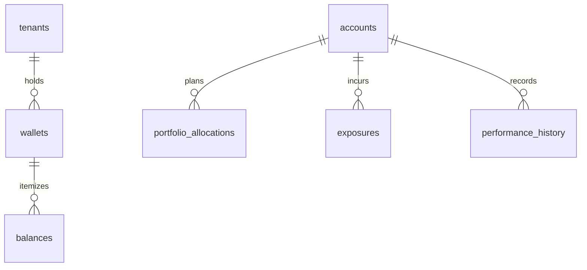

#### `wallets` 🔴 NEW · `balances` 🟡 PARTIAL (today: single `available_balance`)
- **`wallets`**: `id`, `tenant_id`, `account_id` FK ON DELETE CASCADE, `label`, `type` CHECK IN ('spot','margin','futures'), [std]. **Unique** `(account_id, type)`. RLS owner-only.
- **`balances`**: `id`, `tenant_id`, `wallet_id` FK ON DELETE CASCADE, `currency` TEXT, `free` NUMERIC(20,8), `locked` NUMERIC(20,8), `updated_at`, `created_at`. **Unique** `(wallet_id, currency)`. **Index** `(wallet_id)`. RLS owner-only. **Retention** live-overwrite (history → `balance_history`).

#### `portfolio_allocations` 🟡 PARTIAL (today: Allocation Planner UI, not persisted)
Strategy sleeves / target weights: `id`, `tenant_id`, `account_id` FK, `strategy_id` FK ON DELETE CASCADE, `target_weight_pct` NUMERIC(6,3), `min_weight_pct` NUMERIC(6,3), `max_weight_pct` NUMERIC(6,3), `active` BOOLEAN, [std]. **CHECK** sum-of-weights validated in service. **Unique** `(account_id, strategy_id)`. RLS owner-only.

#### `exposures` 🟡 PARTIAL (today: Risk Manager computes live)
Point-in-time exposure snapshots for the exposure heatmap: `id`, `tenant_id`, `account_id` FK, `ts` TIMESTAMPTZ, `dimension` CHECK IN ('symbol','asset_class','direction','strategy'), `key` TEXT, `gross_notional` NUMERIC(20,8), `net_notional` NUMERIC(20,8), `pct_of_equity` NUMERIC(8,4), `created_at`. Append-only. **Index** `(account_id, ts DESC)`, `(dimension, key)`. RLS owner-only. **Retention** 1 y.

#### `performance_history` 🟢 EXISTS-ish (derived from `paper_trades`) — per-account periodic performance
`id`, `tenant_id`, `account_id` FK, `period` CHECK IN ('daily','weekly','monthly'), `period_key` TEXT, `return_pct` NUMERIC(10,4), `pnl` NUMERIC(20,8), `sharpe` NUMERIC(10,4), `max_dd_pct` NUMERIC(8,4), `trades` INT, [std]. **Unique** `(account_id, period, period_key)`. RLS owner-only. **Retention** permanent (small).

---

### 4.10 ANALYTICS MODULE 🟡 PARTIAL — mostly **materialized views** over the ledger

The brief's eight analytics "tables" are, in 3NF, **derived** from `paper_trades`/`live_trades`/`balance_history`. They are implemented as **aggregation tables refreshed by `pg_cron`** (not hand-written rows), keeping analytics a projection of the immutable ledger — no double-write, no drift.

| Brief table | Implementation | Grain / refresh |
|---|---|---|
| `daily_statistics` | agg table `stats_daily` | `(account_id, day)` · nightly |
| `weekly_statistics` | agg table `stats_weekly` | `(account_id, iso_week)` · weekly |
| `monthly_statistics` | agg table `stats_monthly` | `(account_id, month)` · monthly |
| `risk_metrics` | matview `mv_risk_metrics` | `(account_id)` rolling · hourly |
| `win_rate_history` | matview `mv_win_rate` | `(account_id, day)` · nightly |
| `drawdown_history` | agg table `drawdown_daily` | `(account_id, day)` from `balance_history` · nightly |
| `equity_curve` | agg table `equity_curve` | `(account_id, day)` downsample of `balance_history` · nightly |
| `trade_distribution` | matview `mv_trade_distribution` | `(account_id, bucket)` R-multiple histogram · nightly |

**Common columns** for the agg tables (`stats_daily` shown; others analogous):

| Column | Type | Constraints | Notes |
|---|---|---|---|
| `id` | UUID | PK | |
| `tenant_id` | UUID | NOT NULL FK tenants | |
| `account_id` | UUID | NOT NULL FK accounts ON DELETE CASCADE | |
| `day` | DATE | NOT NULL | grain |
| `trades` `wins` `losses` | INT | NOT NULL DEFAULT 0 | |
| `gross_pnl` `net_pnl` `fees` | NUMERIC(20,8) | NOT NULL DEFAULT 0 | |
| `win_rate` | NUMERIC(6,4) | | |
| `avg_r` `expectancy` | NUMERIC(10,4) | | |
| `max_drawdown_pct` | NUMERIC(8,4) | | |
| `equity_close` | NUMERIC(20,8) | | |
| *(created_at, updated_at)* | | | upserted by the rollup job |

- **Unique:** `(account_id, day)`. **Index:** `(tenant_id, day DESC)`. **RLS:** owner-only (matviews wrapped in RLS-enforcing views). **Retention:** daily 3 y, weekly/monthly permanent. **Refresh:** `pg_cron` `REFRESH MATERIALIZED VIEW CONCURRENTLY` / incremental upsert.

---

### 4.11 JOURNAL MODULE

Today: `trade_decision_journal`, `trade_decision_events`, `evolution_memory` (`journal.db`).

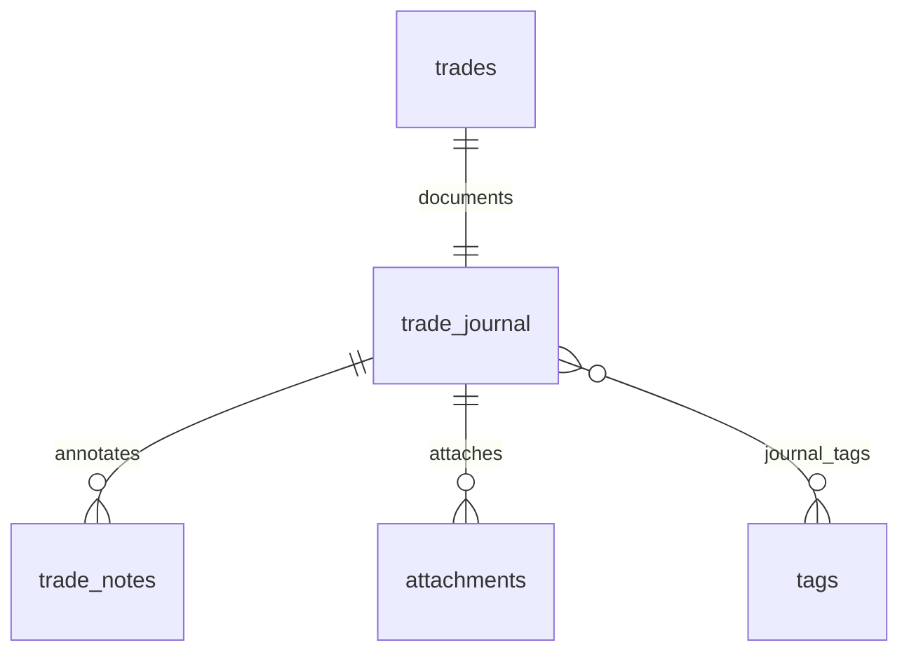

#### `trade_journal` 🟢 EXISTS (`trade_decision_journal(trade_id PK, sections_json, …)`)
| Column | Type | Constraints | Notes |
|---|---|---|---|
| `id` | UUID | PK | |
| `tenant_id` | UUID | NOT NULL FK tenants | |
| `trade_id` | UUID | UNIQUE FK trades(id) ON DELETE CASCADE | 1:1 with a trade (nullable for pre-trade plans) |
| `account_id` | UUID | NOT NULL FK accounts | |
| `symbol` `side` `strategy` `timeframe` `regime` `grade` `result` | TEXT | | denormalized snapshot for fast filtering |
| `planned_rr` `actual_rr` `pnl` `confidence` `brain_score` | NUMERIC | | |
| `sections_json` | JSONB | NOT NULL DEFAULT '{}' | structured journal sections |
| `status` | TEXT | CHECK (status IN ('draft','final')) | |
| *(created_at, updated_at, created_by, updated_by, deleted_at)* | | | soft-delete |

- **Unique:** `(trade_id)`. **Index:** `(tenant_id, created_at DESC)`, `(strategy)`, `(result)`. **RLS:** owner-only. **Retention:** soft-delete, keep for audit.

#### `trade_notes` 🟢 EXISTS (`trade_decision_events`)
Timestamped annotations/events on a journal: `id`, `tenant_id`, `journal_id` FK ON DELETE CASCADE, `ts`, `kind` CHECK IN ('note','event','emotion','mistake','lesson'), `body` TEXT, `detail_json` JSONB, `created_by` FK users, `created_at`. **Index** `(journal_id, ts)`. RLS owner-only. **Retention** with parent.

#### `tags` 🔴 NEW + `journal_tags` (M:N junction)
- **`tags`**: `id`, `tenant_id`, `name` CITEXT, `color` TEXT, `created_at`. **Unique** `(tenant_id, name)`. RLS owner-only.
- **`journal_tags`**: `journal_id` FK ON DELETE CASCADE, `tag_id` FK ON DELETE CASCADE, `PRIMARY KEY(journal_id, tag_id)`, `tenant_id`, `created_at`. RLS owner-only.

#### `attachments` 🔴 NEW (+ *screenshots* as a `kind`)
Files (chart screenshots, exports) in Supabase Storage: `id`, `tenant_id`, `journal_id` FK ON DELETE CASCADE, `kind` CHECK IN ('screenshot','file','export'), `storage_path` TEXT (bucket ref), `mime_type` TEXT, `bytes` BIGINT, `caption` TEXT, [std, soft-delete]. **Index** `(journal_id)`. RLS owner-only + Storage bucket policy mirrors it. **Retention** with parent; storage object lifecycle 1 y after delete.

*(The brief's separate `Screenshots` table == `attachments WHERE kind='screenshot'` — 3NF, one file table.)*

---

### 4.12 NOTIFICATION MODULE

Today: shared `alerts` feed (`ledger.db`). Target makes it per-user with delivery tracking.

#### `notifications` 🟢 EXISTS (`alerts(ts,severity,category,title,detail,read)`)
| Column | Type | Constraints | Notes |
|---|---|---|---|
| `id` | UUID | PK | |
| `tenant_id` | UUID | NOT NULL FK tenants | |
| `user_id` | UUID | NOT NULL FK users ON DELETE CASCADE | per-user (was shared feed) |
| `category` | TEXT | NOT NULL CHECK (category IN ('trade','risk','system','ai')) | |
| `severity` | TEXT | NOT NULL CHECK (severity IN ('info','warning','critical')) | |
| `title` | TEXT | NOT NULL | |
| `body` | TEXT | | (was `detail`) |
| `link` | TEXT | | deep link into the app |
| `read_at` | TIMESTAMPTZ | | null = unread (badge) |
| *(created_at)* | | | append-only |

- **Index:** `(user_id, read_at)` (unread badge — partial `WHERE read_at IS NULL`), `(user_id, created_at DESC)`. **RLS:** owner-only. **Retention:** 180 d (was 10k cap).

#### `notification_queue` 🔴 NEW (outbound delivery, multi-channel)
Pending deliveries to email/telegram/webhook: `id`, `tenant_id`, `notification_id` FK ON DELETE CASCADE, `channel` CHECK IN ('email','telegram','webhook','in_app'), `status` CHECK IN ('pending','sent','failed','retrying'), `attempts` INT DEFAULT 0, `next_attempt_at` TIMESTAMPTZ, `last_error` TEXT, [std]. **Index** `(status, next_attempt_at)` (worker poll). RLS owner-only + service role. **Retention** 30 d after terminal.

#### `notification_history` 🟡 PARTIAL — delivery audit
Immutable delivery outcomes: `id`, `tenant_id`, `notification_id` FK, `channel`, `status` CHECK IN ('sent','failed'), `provider_ref` TEXT, `delivered_at`, `created_at`. Append-only. **Index** `(notification_id)`. RLS owner-only. **Retention** 1 y.

---

### 4.13 RISK MANAGEMENT MODULE

Today: risk in `bots.risk_json` + code-enforced gates + `safety_state.json` kill-switch. Target makes limits first-class + auditable.

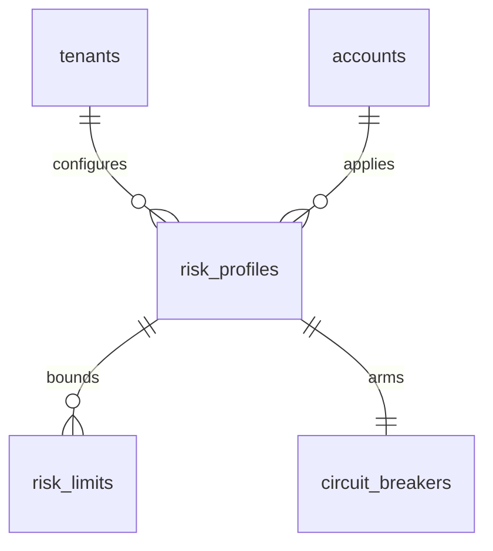

#### `risk_profiles` 🟡 PARTIAL (today: `risk_json` presets)
`id`, `tenant_id`, `account_id` FK ON DELETE CASCADE (nullable = tenant default), `name`, `risk_per_trade_pct` NUMERIC(6,3), `max_open_positions` INT, `max_leverage` NUMERIC(6,2), `is_active` BOOLEAN, [std]. **Unique** `(account_id, name)`. **Index** `(tenant_id)`. RLS owner-only.

#### `risk_limits` 🟡 PARTIAL — unifies *daily/weekly/monthly/drawdown/exposure limits*
The brief's five limit tables are one table discriminated by `scope` (3NF — identical shape):

| Column | Type | Constraints | Notes |
|---|---|---|---|
| `id` | UUID | PK | |
| `tenant_id` | UUID | NOT NULL FK tenants | |
| `risk_profile_id` | UUID | NOT NULL FK risk_profiles ON DELETE CASCADE | |
| `scope` | TEXT | NOT NULL CHECK (scope IN ('daily','weekly','monthly','drawdown','exposure')) | the five brief-lists |
| `metric` | TEXT | NOT NULL CHECK (metric IN ('loss_pct','loss_abs','trades','notional_pct','drawdown_pct')) | |
| `limit_value` | NUMERIC(20,8) | NOT NULL | |
| `action` | TEXT | NOT NULL CHECK (action IN ('block','pause','alert')) | breach behavior |
| `enabled` | BOOLEAN | NOT NULL DEFAULT true | |
| *(created_at, updated_at, created_by, updated_by)* | | | |

- **Unique:** `(risk_profile_id, scope, metric)`. **Index:** `(tenant_id)`. **RLS:** owner-only. **Retention:** permanent.

#### `circuit_breakers` 🟡 PARTIAL (today: `safety_state.json` kill-switch)
Armed protective halts (1:1 per profile): `id`, `tenant_id`, `risk_profile_id` UNIQUE FK ON DELETE CASCADE, `trigger` CHECK IN ('daily_loss','consecutive_losses','equity_floor','manual'), `threshold` NUMERIC(20,8), `state` CHECK IN ('armed','tripped','disabled'), `tripped_at`, `reset_at`, `detail_json` JSONB, [std]. **Unique** `(risk_profile_id)`. RLS owner-only. **Retention** permanent + trip history to `activity_logs`.

---

### 4.14 AUDIT MODULE

Today: `bot_logs` (engine) only. Target adds real security/access/change audit — **append-only, immutable, no soft-delete, restricted read**.

#### `activity_logs` 🟡 PARTIAL — user actions
`id`, `tenant_id`, `user_id` FK SET NULL, `ts`, `action` TEXT (e.g. 'strategy.update','bot.start','order.place'), `entity_type` TEXT, `entity_id` UUID, `ip` INET, `metadata_json` JSONB, `created_at`. **Index** `(tenant_id, ts DESC)`, `(entity_type, entity_id)`, `(user_id, ts DESC)`. **RLS:** owner reads own; admin reads tenant. **Partition** monthly. **Retention** 1 y hot, 7 y cold (compliance).

#### `system_logs` 🔴 NEW — application/infra events (no tenant)
`id`, `ts`, `level` CHECK IN ('debug','info','warning','error','critical'), `component` TEXT, `message`, `context_json` JSONB, `created_at`. **Index** `(ts DESC)`, `(level)`. Service-role read only. **Partition** monthly. **Retention** 90 d.

#### `api_logs` 🔴 NEW — request audit
`id`, `tenant_id`, `user_id` FK SET NULL, `ts`, `method` TEXT, `path` TEXT, `status_code` INT, `latency_ms` INT, `ip` INET, `user_agent`, `request_id` UUID. Append-only. **Index** `(ts DESC)`, `(status_code)`, `(user_id, ts DESC)`. **Partition** monthly. **Retention** 30 d (sampled) / 1 y for 4xx/5xx.

#### `authentication_logs` 🟡 PARTIAL (today: implicit) — every auth attempt
`id`, `tenant_id`, `user_id` FK SET NULL, `ts`, `event` CHECK IN ('login','logout','login_failed','mfa_challenge','password_reset','session_revoked'), `ip` INET, `user_agent`, `success` BOOLEAN, `detail` TEXT, `created_at`. **Index** `(user_id, ts DESC)`, `(event, ts DESC)`, `(ip)`. **RLS:** owner reads own; admin tenant. **Retention** 1 y (security).

#### `security_logs` 🔴 NEW — security-relevant anomalies
`id`, `tenant_id`, `ts`, `severity` CHECK IN ('low','medium','high','critical'), `category` CHECK IN ('rate_limit','rls_denied','secret_access','suspicious_ip','csrf'), `detail_json` JSONB, `resolved_at`, `created_at`. **Index** `(severity, ts DESC)`. Admin/service read. **Retention** 2 y.

#### `database_change_logs` 🔴 NEW — row-level change audit (trigger-driven)
Generic CDC for sensitive tables (orders, api_keys, risk_limits): `id`, `tenant_id`, `ts`, `table_name` TEXT, `row_id` UUID, `op` CHECK IN ('insert','update','delete'), `actor` UUID FK users SET NULL, `before_json` JSONB, `after_json` JSONB, `created_at`. Written by a generic `audit_row()` trigger. **Index** `(table_name, row_id)`, `(ts DESC)`. Admin/service read. **Partition** monthly. **Retention** 7 y (compliance).

---

### 4.15 SETTINGS MODULE

Today: `user_settings(username, namespace, data JSON)` (SQLite + Supabase mirror) + `runtime_settings.json` (whitelist). Target keeps the flexible namespace store but adds typed convenience tables where the UI benefits.

#### `user_settings` 🟢 EXISTS (`user_settings(username,namespace,data,updated_at)` PK `(username,namespace)`)
The flexible per-namespace blob store — **keep as-is, re-keyed to `user_id`**:

| Column | Type | Constraints | Notes |
|---|---|---|---|
| `id` | UUID | PK | |
| `tenant_id` | UUID | NOT NULL FK tenants | |
| `user_id` | UUID | NOT NULL FK users ON DELETE CASCADE | (was `username`) |
| `namespace` | TEXT | NOT NULL | 'ui','risk','runtime-overrides',… |
| `data` | JSONB | NOT NULL DEFAULT '{}' | the blob |
| *(created_at, updated_at)* | | | |

- **Unique:** `(user_id, namespace)` (matches today's composite PK). **Index:** GIN(`data`). **RLS:** owner-only. **Retention:** permanent. **Supabase mirror already exists** — this table *is* that mirror, promoted to source of truth.

#### Typed settings 🟡 PARTIAL — projections of `user_settings` for the UI
`application_settings`, `theme_settings`, `chart_preferences`, `trading_preferences`, `language_settings`, `workspace_layouts` are the brief's requested tables. Two valid implementations, engineer's choice:

1. **Namespace rows** in `user_settings` (`namespace IN ('app','theme','chart','trading','language','workspace')`) — zero new tables, matches today. **Recommended** for v1.
2. **Dedicated tables** where strong typing/constraints pay off — e.g. `workspace_layouts`(`id`,`tenant_id`,`user_id`,`name`,`layout_json`,`is_default`, [std]; **Unique** `(user_id,name)`) because layouts are first-class, shareable objects.

The DDS specifies **namespace rows for scalar prefs (theme/chart/trading/language/app)** and a **dedicated `workspace_layouts` table** for the one entity users name and manage. All RLS owner-only.

---

## 5. Relationships (consolidated)

**One-to-one (1:1):** `users`↔`profiles`; `bot_instances`↔`bot_status`; `risk_profiles`↔`circuit_breakers`; `trades`↔`trade_journal`; `exchange_connections`↔`exchange_settings`. *(Enforced by a `UNIQUE` FK on the child.)*

**One-to-many (1:N):** `tenants`→everything; `accounts`→`orders`/`positions`/`trades`/`balance_history`; `strategies`→`strategy_versions`→rule tables; `bot_instances`→`bot_decisions`→`signals`; `live_orders`→`order_executions`; `symbols`→`candles`/`funding_rates`/`open_interest`; `users`→`notifications`/`sessions`/`activity_logs`.

**Many-to-many (M:N) via junctions:**
- `users`↔`roles` — junction **`user_roles`**
- `roles`↔`permissions` — junction **`role_permissions`**
- `trade_journal`↔`tags` — junction **`journal_tags`**

**Cascade policy:**
- `ON DELETE CASCADE` — owned/dependent data (a tenant's or account's rows, a version's rules, a journal's notes/attachments).
- `ON DELETE RESTRICT` — financial ancestors (`accounts`, `live_orders`, `order_executions`, `supported_exchanges`) so books can't be deleted out from under trades.
- `ON DELETE SET NULL` — attribution links (`strategy_version_id` on decisions/trades) so history survives a version purge.
- **Soft delete** (`deleted_at`) on user-authored, restorable entities; **never** on immutable financial/audit rows.

---

## 6. Indexing Strategy

Design principle: **index the read path, in tenant-locality order.** Every RLS query filters by `tenant_id`, so composite indexes lead with it.

| Concern | Table | Index | Rationale |
|---|---|---|---|
| **Trade blotter** | trades/paper_trades/live_trades | `(account_id, closed_at DESC)` | primary history scroll |
| **Trade analytics** | trades | `(account_id, symbol)`, `(source)` | per-symbol/per-source rollups |
| **Idempotent orders** | live_orders/paper_orders | **UNIQUE `(connection_id, client_order_id)`** | dedupe placement retries — critical for live |
| **Open orders** | orders | `(account_id, status)` | working-order reads |
| **Open positions** | positions | `(account_id, status)`, partial UNIQUE `(account_id, symbol) WHERE status='open'` | one open per symbol + hot read |
| **Fills** | order_executions | `(order_id)`, BRIN(`executed_at`) | fill reconciliation |
| **Market data (hot)** | candles | PK `(symbol_id, timeframe, open_time)` + BRIN(`open_time`) per partition | the firehose; time-range scans |
| **Funding/OI** | funding_rates, open_interest | PK `(symbol_id, ts)` + BRIN(ts) | time-series reads |
| **Bot decisions** | bot_decisions | `(bot_instance_id, ts DESC)`, `(strategy_version_id)`, GIN(`report_json`) | decision archive + attribution + JSON search |
| **Signals** | signals | `(tenant_id, ts DESC)`, `(status)`, `(alert_id)` | history/rejected/waiting views |
| **Replay** | replay_sessions, replay_trades | `(account_id, created_at DESC)`, `(replay_session_id)` | session list + trades |
| **AI memory search** | trade_memories | GIN(`search_tsv`), GIN(`features_json`) | full-text + feature queries (replaces FTS5) |
| **Notifications badge** | notifications | partial `(user_id) WHERE read_at IS NULL` | unread count |
| **Analytics** | stats_daily/weekly/monthly | UNIQUE `(account_id, day)` | rollup upserts + dashboard reads |
| **Audit** | activity_logs, api_logs, database_change_logs | `(tenant_id, ts DESC)`, `(entity_type, entity_id)` | forensics |
| **Journal** | trade_journal | `(tenant_id, created_at DESC)`, `(strategy)`, `(result)` | journal filtering |
| **RLS locality** | *every tenant table* | leading `tenant_id` in the composite | RLS predicate + partition pruning |

**Index types:** B-tree default; **BRIN** on append-only time columns (tiny, ideal for time-ordered inserts); **GIN** on `JSONB`/`TSVECTOR`/array columns; **partial** indexes for hot subsets (`WHERE read_at IS NULL`, `WHERE status='open'`). **Avoid** over-indexing high-write ledger tables — each index taxes inserts; keep the trade/candle write paths to the indexes above.

---

## 7. Query Optimization Recommendations

1. **Partition the firehose.** `candles`, `funding_rates`, `open_interest`, `bot_decisions`, `signals`, `bot_events`, `balance_history`, and the audit/log tables are `RANGE`-partitioned by time (monthly). Adopt **TimescaleDB hypertables** for `candles` to get automatic chunk management + continuous aggregates. Partition pruning turns "last 7 days" into a single-chunk scan.
2. **Materialize analytics; never compute on the fly.** All §4.10 dashboards read aggregation tables/matviews refreshed by `pg_cron`, not live `GROUP BY` over millions of trades. `REFRESH MATERIALIZED VIEW CONCURRENTLY` avoids read locks.
3. **Downsample candles.** Continuous aggregates roll 1m→1h→1d; the UI reads the coarsest timeframe that fits the zoom. Keep 1m hot for 90 d only.
4. **Keep the ledger lean, project for reads.** `paper_trades`/`live_trades` carry denormalized `symbol`/`strategy` snapshots so the blotter needs no joins; heavy narrative lives in `sections_json`/`report_json` (JSONB, GIN-indexed) fetched only on drill-down.
5. **Cursor pagination, not OFFSET.** Blotters/decision archives paginate on `(closed_at, id)` keyset — O(1) deep pages vs. O(n) OFFSET.
6. **Idempotency at the DB.** `UNIQUE(connection_id, client_order_id)` + `INSERT … ON CONFLICT DO NOTHING` makes duplicate order submits a no-op — correctness *and* speed (no read-then-write race).
7. **`EXPLAIN (ANALYZE, BUFFERS)` in CI** for the top-20 queries; alert on plan regressions. `pg_stat_statements` surfaces the real hot queries in prod.
8. **Connection pooling.** Backend through PgBouncer transaction mode; cap the `asyncpg` pool; the browser hits PostgREST (already pooled). Avoids connection storms from the poller-heavy frontend.
9. **JSONB discipline.** Query hot fields via expression indexes (`(report_json->>'decision')`) only where a column isn't warranted; otherwise promote to a real column (as the rule tables do).
10. **Caching layer (app).** The existing `useLive` shared poller + short-TTL server caches (market snapshot, catalog) stay in front of the DB; the DB is the source of truth, not the per-request hot path.

---

## 8. Security Design

### 8.1 Row-Level Security (the core control)
**Every tenant table has RLS `ENABLE` + `FORCE`**, with a policy keyed on `tenant_id`:

```sql
ALTER TABLE trades ENABLE ROW LEVEL SECURITY;
ALTER TABLE trades FORCE ROW LEVEL SECURITY;

CREATE POLICY tenant_isolation ON trades
  USING     (tenant_id = auth.tenant_id())     -- read
  WITH CHECK (tenant_id = auth.tenant_id());    -- write

-- auth.tenant_id(): STABLE SQL, reads the tenant from the JWT claim / GUC
-- (backend sets `SET LOCAL app.tenant_id = …` per request; PostgREST reads the JWT).
```

- **Owner-only** for personal data; **admin-tenant** read policies where an admin oversees a tenant (`OR auth.role() = 'admin' AND tenant_id = auth.tenant_id()`).
- **Reference tables** (`supported_exchanges`, `assets`, `symbols`, `candles`, `funding_rates`, `economic_events`, `news_events`) are RLS-exempt/world-readable, service-role write.
- **A query bug cannot cross tenants** — the DB enforces isolation even if the app forgets a `WHERE`. This is the requirement the SAD flags as mandatory before `HUB_MULTI_USER=1`.

### 8.2 Role & access model
- **Postgres roles:** `anon` (unauthenticated — near-zero grants), `authenticated` (the app user, all access via RLS), `service_role` (backend, bypasses RLS for system writes — never exposed to the browser).
- **Application RBAC:** `roles`/`permissions`/`user_roles` (§4.1) for feature gates (`trade.execute`, `strategy.write`), checked in the app **and** mirrored into RLS policies for sensitive writes.
- **Grants:** `authenticated` gets `SELECT/INSERT/UPDATE` only on tables it owns via RLS; **no `DELETE`** on financial/audit tables (revoke at grant level, not just policy).

### 8.3 Sensitive-data protection
- **API secrets** (`exchange_api_keys`) stored as `BYTEA` ciphertext via **pgcrypto `pgp_sym_encrypt`** with a key from **Supabase Vault** (or app KMS) — never the DB itself. `SELECT` on the ciphertext columns is **revoked from `authenticated`**; decryption happens only inside a `SECURITY DEFINER` function callable by `service_role`. The client ever sees only `key_fingerprint`.
- **Passwords** delegated to Supabase Auth (bcrypt/scrypt) in target; the legacy PBKDF2-200k path stays until identity is unified.
- **PII** (`profiles`, `authentication_logs.ip`) minimized, access-logged, and covered by retention/erasure (§9).
- **Column encryption** for `oauth_accounts` tokens (pgcrypto).

### 8.4 Encrypted-key data flow
`client → backend (service_role) → SECURITY DEFINER fn → pgp_sym_encrypt(secret, vault_key) → exchange_api_keys.api_secret_enc`. Reverse only inside the trading worker at order time; secrets never traverse PostgREST or reach the browser.

### 8.5 Identity unification (SAD §10 / Phase B)
Target uses **Supabase `auth.users` as the single identity**; `public.users.id == auth.users.id`. The backend validates the Supabase JWT (or keeps its HMAC cookie as a thin session over the same id). This closes today's split between landing (Supabase Auth) and backend (local `users` + HMAC cookie).

### 8.6 Other controls
Rate limiting (already in app: `RateLimiter` on `/login`/`/signup`/`/webhook`) feeds `security_logs`; boot refuses default secrets (already enforced); `database_change_logs` triggers on `orders`/`api_keys`/`risk_limits`; all writes carry `created_by`/`updated_by` for attribution.

---

## 9. Backup & Recovery Plan

| Aspect | Strategy |
|---|---|
| **Automated backups** | Supabase daily full backups (Pro plan) + **PITR via WAL** (point-in-time recovery to any second within retention). Self-hosted fallback: `pg_dump` nightly + continuous WAL archiving to object storage. |
| **RPO / RTO** | **RPO ≤ 5 min** (WAL streaming) for the ledger; **RTO ≤ 1 h** (restore from latest base + WAL replay). |
| **Logical exports** | Nightly `pg_dump --format=custom` of `public` schema to encrypted object storage (cross-region), 30-day rotation — protects against logical corruption a physical backup would faithfully copy. |
| **Restore drills** | Quarterly restore-to-staging test; verify row counts + a checksum on `trades`/`order_executions`. A backup is only real once restored. |
| **Disaster recovery** | Cross-region read replica (Supabase or streaming replica); promote on region failure. Config/secrets in Vault, reprovisionable via IaC. DR runbook in `docs/` (extends SAD §14). |
| **Archiving** | Cold partitions (candles >90 d at 1m, trades >2 y, logs past retention) detached and moved to cheap object storage as compressed Parquet/`pg_dump` — queryable on demand, out of the hot path. |
| **Data retention** | Per-table (see each §4 spec): financial/audit = years (compliance); telemetry/logs = 30–180 d; derived analytics daily 3 y. `pg_cron` jobs prune/rollup nightly. Matches today's cap discipline, generalized to time-based partition drop. |
| **Erasure (GDPR-style)** | Per-user erasure = cascade-delete tenant-owned soft-deleted rows past grace + anonymize `authentication_logs`/`activity_logs` (`user_id → NULL`, keep aggregate). Immutable financial records retained per legal hold, PII stripped. |

---

## 10. Migration Strategy

**Non-negotiable: incremental, behavior-preserving, reversible** — the same discipline as the live Phase-C work (`docs/PHASE_C_TENANCY.md`). No big-bang rewrite.

### 10.1 Version control & tooling
- **Forward-only numbered migrations** (already the pattern: `database/migrations/0001…`). Adopt a migration runner that records applied versions (today's `_migrations(version, applied_at)` generalizes) — or Supabase CLI migrations (`supabase/migrations/*.sql`, which the repo does **not** yet have — creating it is step 0).
- Every migration ships with an **explicit rollback** (`down`) and is tested against a restored staging snapshot before prod.
- Schema changes are **expand → migrate → contract**: add new nullable/defaulted structures, backfill, cut over reads, then drop the old — never a blocking `ALTER` on a hot table.

### 10.2 The path from today's stores to this schema
Ordered, each step independently shippable and reversible:

1. **Stand up Postgres as the ledger source of truth.** `SupabaseLedger` already writes `webhook_events/positions/paper_trades/bot_logs/alerts` with identical columns — promote Supabase from mirror to primary; keep SQLite as a local cache/fallback. *(Zero schema change; already coded.)*
2. **Add the identity spine.** Create `tenants`, normalize `users`→UUID, seed the single owner as `tenant '__owner__'` (the seam already returns `OWNER_TENANT`). Unify with Supabase `auth.users` (§8.5).
3. **Roll `tenant_id` across flat tables** using the existing `ensure_tenant_column` primitive (already built, currently only wired into `watchlist`/`custom_store`) — expand-migrate `paper_trades`, `positions`, `decisions`, `cycle_reports`, `skipped_trades`, `trade_memories`, journal tables, defaulting to owner, backfilling. *(This is the not-yet-done step the inventory flagged; the primitive is ready.)*
4. **Introduce `accounts`** and re-key the singleton `account_state` + ledger to `account_id` (owner gets one paper account). Enables multiple books.
5. **Normalize strategies.** Project `custom_strategies.json` `spec_json` into the rule tables (§4.3) via a parser; JSON blob stays the write source, rule tables the read model, so nothing breaks.
6. **Split the other JSON stores** into tables (`lessons`,`upgrades`,`strategy_versions`,`research`,`providers`,`memory`) — lowest risk last, one at a time.
7. **Add live-trading tables** (`exchange_connections`,`*_api_keys`,`live_orders`,`order_executions`,…) — greenfield, no migration of existing data.
8. **Enable RLS + `FORCE`** on every tenant table; run the isolation test suite (user A cannot read/write user B). **Only then** flip `HUB_MULTI_USER=1` (SAD flip criteria).
9. **Partition + rollup** the firehose tables and cut analytics onto matviews.

### 10.3 Schema evolution rules
Backward-compatible by default (add, don't rename in place — add new + backfill + deprecate); enum growth via `ALTER TYPE … ADD VALUE` or CHECK relaxation; JSONB absorbs experimental fields before they earn a column; every destructive change gated behind a completed expand/contract cycle.

---

## 11. Scalability Assessment

| Dimension | Today | This design | Headroom |
|---|---|---|---|
| **Tenancy** | Single-owner, no isolation | `tenant_id` + RLS everywhere | thousands of tenants on one DB |
| **Storage engine** | ~11 SQLite files + JSON, one node | One Postgres, schema-separated, partitioned | vertical to 100s GB; TimescaleDB for TS |
| **Write hot path** | Serialized SQLite writes | Postgres MVCC, per-partition inserts, idempotent orders | 1000s writes/s with partitioning |
| **Market data** | `candles` table, single file | Partitioned/hypertable + continuous aggregates + downsampling | billions of rows, time-pruned scans |
| **Analytics** | Computed live in Python | Matviews/agg tables, `pg_cron` | dashboards O(1) regardless of ledger size |
| **Read scaling** | One process | Read replicas for analytics/landing | horizontal reads |
| **Connections** | Per-process | PgBouncer + asyncpg pool + PostgREST | poller-heavy frontend absorbed |
| **Multi-engine** | One in-process engine loop | Per-tenant/per-account workers (SAD §11) write to shared DB | the real multi-user blocker — DB is ready before the engine is |

**Bottleneck order as you grow:** (1) the single in-process engine loop (architectural, not DB — SAD §11); (2) `candles` volume → partition/hypertable first; (3) analytics `GROUP BY` → matviews; (4) connection count → PgBouncer. The DB design removes (2)–(4); (1) is the engine-extraction work the SAD owns.

**Sharding path (far future):** partition by `tenant_id` (hash) across nodes via Citus if a single Postgres saturates — the leading-`tenant_id` convention makes this a config change, not a redesign.

---

## 12. Database Health Checklist

**Schema integrity**
- [ ] Every table has the standard audit envelope (`id`,`created_at`,`updated_at`,`created_by`,`updated_by` + `deleted_at` where applicable).
- [ ] Every FK has an explicit `ON DELETE` rule (CASCADE/RESTRICT/SET NULL) matching §5.
- [ ] Every money/price/size column is `NUMERIC(20,8)`, never `float`.
- [ ] Every enum is a native type or `CHECK` — no free-text status columns.
- [ ] Every tenant table has RLS `ENABLE` **and** `FORCE`, policy verified by the isolation test.
- [ ] No orphan rows (FK validation passes); no duplicate on the idempotency uniques.

**Performance**
- [ ] Every index in §6 exists; `pg_stat_user_indexes` shows no unused index on a hot-write table.
- [ ] Firehose tables partitioned; oldest partitions dropped/archived per retention.
- [ ] Matviews refresh on schedule; refresh duration trending flat.
- [ ] `pg_stat_statements` top-20 reviewed; no seq-scan on a large hot table.
- [ ] Table/index bloat < 20% (`pgstattuple`); autovacuum keeping up on ledger tables.

**Security**
- [ ] `authenticated` has no `DELETE` on financial/audit tables; no `SELECT` on `*_api_keys` ciphertext.
- [ ] Secrets encrypted; Vault key rotation tested.
- [ ] Audit triggers active on `orders`/`api_keys`/`risk_limits`.
- [ ] RLS isolation test suite green (A≠B) in CI.

**Operations**
- [ ] Daily backup + PITR verified by a quarterly restore drill.
- [ ] Retention/rollup `pg_cron` jobs succeeding; no unbounded table.
- [ ] Replica lag within SLO; DR runbook current.
- [ ] Migration runner state consistent across environments.

---

## 13. Future Database Expansion Plan

| Horizon | Addition | Why |
|---|---|---|
| **Near** | Finish `tenant_id` rollout + RLS on all flat tables (step 3 above) | unblock multi-user isolation |
| **Near** | Live-trading tables + encrypted keys | the PRD's live scope |
| **Near** | TimescaleDB on `candles`/funding/OI + continuous aggregates | market-data scale |
| **Mid** | Read replica for analytics/landing | offload dashboards |
| **Mid** | `pg_partman` automation for time partitions | ops toil |
| **Mid** | Vector column (`pgvector`) on `trade_memories.features` | semantic "find similar setups" for the AI memory |
| **Mid** | `billing`/`subscriptions`/`usage_metering` tables | plan tiers on `tenants.plan` |
| **Far** | Citus/sharding by `tenant_id` | beyond a single Postgres node |
| **Far** | Event-sourcing/CDC stream (`wal2json` → Kafka) for real-time analytics + external integrations | decouple read models |
| **Far** | Data warehouse export (Parquet → warehouse) for cross-tenant research | product analytics without touching prod |

---

## 14. Database Readiness Score

Scoring the **current implementation** against this target (the design itself is complete and implementable).

| Dimension | Score | Notes |
|---|---:|---|
| **Domain coverage** | 8/10 | Nearly every module has a real store today; the model is rich and battle-used. |
| **Normalization (3NF)** | 3/10 | Heavy JSON blobs (`spec_json`,`report_json`,`sections_json`); no rule/junction tables yet. |
| **Referential integrity** | 2/10 | **No foreign keys** anywhere (SQLite FKs off; JSON stores none). |
| **Keys & types** | 4/10 | Text/singleton/autoincrement PKs, not UUID; **money is `float`** (fine for sim, not live). |
| **Multi-tenancy** | 3/10 | Seam built; only 2 of ~20 stores carry `tenant_id`; `ensure_tenant_column` not yet wired to flat tables. |
| **Security / RLS** | 2/10 | No RLS; secrets not yet in scope (paper-only); split identity; but strong app-layer auth + rate limiting + secret-boot guard already exist. |
| **Indexing** | 6/10 | Sensible indexes on the SQLite tables (status/ts/symbol); no partitioning. |
| **Retention/ops** | 7/10 | Honest, explicit caps (5k/20k/50k) + Supabase mirror durability + persistent-disk discipline. |
| **Scalability** | 3/10 | Single-file SQLite + single-process engine; Postgres path exists but not primary. |
| **Backup/DR** | 5/10 | Supabase mirror + persistent disk; no PITR/restore drills documented yet. |
| **Migrations** | 6/10 | Forward-only numbered migrations + a tracking table already in place. |

### **Overall: 4.5 / 10** — *"Rich, honest, single-owner data layer; production database not yet assembled."*

The domain modeling and operational honesty are genuinely strong (8 and 7). The gap is structural: no FKs, no RLS, blob-heavy, float money, single-owner — exactly the deltas this DDS closes. Crucially, **the hard parts are already de-risked**: Postgres is a wired option (`SupabaseLedger`), the tenant seam exists, migrations are numbered, and retention is disciplined. Executing §10 lifts this to **8.5+/10** without a rewrite.

---

## Appendix A — Enum type catalog

```sql
CREATE TYPE order_side    AS ENUM ('long','short','buy','sell');
CREATE TYPE order_type    AS ENUM ('market','limit','stop','stop_limit','trailing_stop');
CREATE TYPE order_status  AS ENUM ('new','partial','filled','cancelled','rejected','expired');
CREATE TYPE account_mode  AS ENUM ('paper','live','replay');
CREATE TYPE trade_source  AS ENUM ('paper','backtest','live','replay');
CREATE TYPE trade_result  AS ENUM ('win','loss','breakeven');
CREATE TYPE decision_kind AS ENUM ('BUY','SELL','WAIT','SKIP');
CREATE TYPE severity_t    AS ENUM ('info','warning','critical');
-- (others declared inline as CHECK where the domain is still evolving)
```

## Appendix B — As-built → target quick map

| As-built store (file) | Target table(s) | Tag |
|---|---|---|
| `hub.db:users` | `users`,`profiles`,`roles`,`permissions`,`user_roles`,`role_permissions` | 🟢🔴 |
| `hub.db:bots` | `bot_instances`,`bot_status` | 🟢🟡 |
| `hub.db:user_settings` (+Supabase) | `user_settings`,`workspace_layouts` | 🟢 |
| `ledger.db:webhook_events` | `signals` | 🟢 |
| `ledger.db:positions` | `paper_positions`,`live_positions`,`position_history` | 🟢🔴 |
| `ledger.db:paper_trades` | `paper_trades`,`live_trades`,`order_executions` | 🟢🔴 |
| `ledger.db:bot_logs` | `bot_events`,`connection_logs`,`execution_logs` | 🟢🔴 |
| `ledger.db:alerts` | `notifications`,`notification_queue`,`notification_history` | 🟢🔴 |
| `account.db:account_state` | `accounts`,`wallets`,`balances`,`balance_history` | 🟢🔴 |
| `cycles.db:cycle_reports` | `bot_decisions` | 🟢 |
| `decisions.db:decisions` | `bot_decisions`,`confidence_scores` | 🟢🟡 |
| `skipped.db:skipped_trades` | `signals` (status='rejected') | 🟢 |
| `trade_memory.db:trade_memories`(+FTS5) | `trade_memories`/`ai_trade_analysis` | 🟢 |
| `trade_memory.db:memory_reviews` | `ai_reviews` | 🟢 |
| `journal.db:trade_decision_journal` | `trade_journal` | 🟢 |
| `journal.db:trade_decision_events` | `trade_notes` | 🟢 |
| `journal.db:evolution_memory` | `learning_history`,`strategy_performance` | 🟢🟡 |
| `watchlists.db:market_prefs` (tenant_id ✅) | `user_settings` (namespace='watchlist') | 🟢 |
| `market_data.db:candles` | `candles`,`assets`,`symbols`,`market_data` | 🟢🟡 |
| `custom_strategies.json` (tenant_id ✅) | `strategies`,`strategy_versions`,rule tables | 🟢🟡 |
| `strategy_versions.json`/`upgrades.json` | `strategy_versions`,`ai_suggestions` | 🟡 |
| `lessons.json`/`memory.json`/`learning.py` | `learning_history`,`strategy_recommendations` | 🟡 |
| `research.json` | `strategy_recommendations` | 🟡 |
| `providers.json` | *(config → `user_settings` namespace='providers')* + `exchange_api_keys` for broker keys | 🟡🔴 |
| `runtime_settings.json`/`grid.json` (Supabase mirror) | `user_settings` (namespaces) + `replay_sessions` | 🟢🟡 |
| `safety_state.json` | `circuit_breakers`,`risk_limits`,`risk_profiles` | 🟡 |
| *(none — new)* | `tenants`,`exchange_*`,`live_*`,`funding_rates`,`open_interest`,`api_logs`,`security_logs`,`database_change_logs`,`tags`,`attachments` | 🔴 |

---

*End of Database Design Specification v1.0. Implement in the order of §10.2; gate `HUB_MULTI_USER=1` on the §12 security checklist. This document supersedes SAD §5 in depth and stays consistent with it in intent.*
