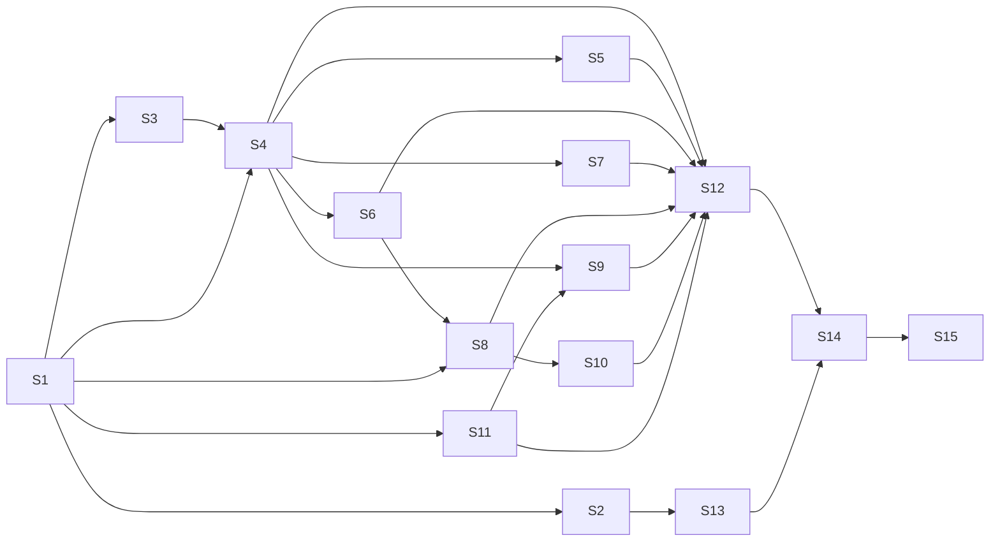

# TradeLogX Nexus — Development Sprint Planning (DSP)

*The detailed, Agile, 15-sprint execution plan from current state to a production-ready Version 1.0. Canonical planning document — refines and extends `SPRINT_PLAN.md` into the 15-sprint structure with full project-management artifacts. Governs against the ten-document blueprint set.*

> **Version 1.0 · 2026-07-22 · 15 sprints · 2-week cadence · ~4–6 engineers**

---

## Read first — brownfield reality (this changes every sprint's scope)

**The platform substantially already exists.** The blueprint set was an *audit of a running system*, not a wishlist. So this plan is **finish + converge + harden**, not build-from-zero. Every feature is tagged: ✅ **DONE** · 🟡 **PARTIAL** · 🔴 **TO-BUILD**. Ignoring this would waste the team on rebuilding working code.

**Verified baseline (from the QA report):** 966 tests green (870 backend + 96 root), both front-ends build clean, **zero fake data in the app**, ~253 REST endpoints, a real autonomous engine + AI + terminal. The current product is a **production-ready single-owner paper-trading platform (QA 8.0/10)**; V1.0 as a *multi-tenant live SaaS* (~4/10) is what these sprints deliver.

**The one non-negotiable insight:** the highest-value, highest-risk work is **Sprint 4 (TradeCore unification)** — today paper/replay/backtest/live are 4–5 separate engines (TES §9), so "consistent across modes" is asserted, not proven. **Protect Sprint 4; it is the critical path.**

---

## 1. Executive Summary

TradeLogX Nexus needs **convergence and productionization**, not reinvention. Fifteen 2-week sprints take it from a polished single-owner paper MVP to a multi-tenant, live-capable SaaS. The sequence: **foundation** (Postgres/RLS, `/api/v1`, JWT — S1) → **experience shell** (dashboard/portfolio/nav on the design system — S2) → **strategy + engine** (S3–S4, the linchpin) → **paper/replay/backtest** on one core (S5–S6) → **AI + analytics** completion (S7–S8) → **live trading** (S9, gated) → **hardening** (optimize/security/testing/polish — S10–S13) → **RC + launch** (S14–S15). Because ~60% of features already exist, most sprints are **harden/complete** (lower risk) except **S4 (XL)**. Every feature carries description, priority, dependencies, complexity, time, acceptance criteria, DoD, risks, and a testing checklist; every sprint carries a QA checklist and DoD. Total: **~30 weeks (~7 months)** to a gated V1.0, with a **shippable paper MVP available from day one**.

---

## 2. Complete Sprint Roadmap

```mermaid
gantt
  title TradeLogX Nexus — 15-sprint roadmap
  dateFormat X
  axisFormat S%s
  section Foundation
  S1 Project Foundation        :0,1
  S2 Dashboard & Workspace     :1,2
  section Strategy & Engine
  S3 Strategy Studio           :2,3
  S4 Trading Engine Core ★     :3,5
  S5 Paper & Terminal          :5,6
  S6 Backtesting               :6,7
  section Intelligence
  S7 AI Decision Engine        :7,8
  S8 Analytics                 :8,9
  section Live & Hardening
  S9 Live Trading (gated)      :9,11
  S10 Optimization             :11,12
  S11 Security                 :12,13
  S12 Testing & QA             :13,14
  S13 UI Polish                :14,15
  section Release
  S14 Release Candidate        :15,16
  S15 Production Release        :16,17
```

★ = critical path. **Milestones:** M1 Foundation (end S2) · M2 Engine unified (end S4) · M3 Feature-complete paper (end S8) · M4 Live-ready (end S9) · M5 Hardened (end S13) · M6 **V1.0 GA** (end S15).

---

## 3. Sprint-by-Sprint Breakdown

*Per-sprint: Goal · Duration · Priority · Dependencies · Features (tagged) · Backend/Frontend/DB/API/Engine/AI/Testing tasks · QA checklist · DoD · Risks · Complexity. Feature-level fields (priority/deps/complexity/time/acceptance/DoD/risks/tests) are captured compactly in the tables; the Priority Matrix (§4) rolls them up.*

### Sprint 1 — Project Foundation  ·  P0 · 2wk · deps: none · **XL**
**Goal:** Production data + identity foundation on Postgres with `/api/v1` + JWT, without breaking the running app.
**Features:** Authentication ✅→🟡(JWT), User Management 🟡, Supabase setup ✅(mirror)→🟡(source), DB migration 🔴, API foundation 🟡(/api/v1), Env config ✅, Logging ✅→🟡(structured), Config mgmt ✅, Error handling ✅→🟡(envelope).
- **Backend:** promote Supabase→source of truth; issue JWT alongside HMAC cookie; response-envelope middleware; one exception handler → error envelope; structured logs → `system_logs`/`api_logs`.
- **Frontend:** move to `Authorization: Bearer` (cookie fallback); profile page.
- **Database:** `tenants`/`users`/`profiles`/`sessions`/`user_settings` (UUID, FKs, RLS `ENABLE+FORCE`); Supabase-CLI `migrations/` dir; `ensure_tenant_column` (✅ built) applied.
- **API:** mount routers under `/api/v1` (legacy aliased); `/auth/*`, `/users/me/*`.
- **Testing:** RLS isolation (A≠B); auth lifecycle (register→verify→login→refresh-rotation→logout); settings-survive-restart (✅).
- **QA checklist:** [ ] settings persist across logout/refresh/device on PG · [ ] JWT issued + cookie still works · [ ] RLS blocks cross-tenant · [ ] `/api/v1` + legacy both respond · [ ] 966 tests still green.
- **DoD:** Postgres is source of truth; RLS isolation test green; `/api/v1` live; no regression.
- **Risks:** data migration correctness (mitigate: dual-write + verify); JWT/cookie dual-path confusion (feature-flag).

### Sprint 2 — Dashboard & Workspace  ·  P1 · 2wk · deps: S1 · **M**
**Goal:** The app shell + dashboard/portfolio/profile on the canonical design system.
**Features:** Dashboard ✅, Portfolio ✅, Profile 🟡, Navigation ✅, Sidebar ✅, Theme ✅(dark; light 🔴 optional), Notifications ✅(`/ledger/alerts`), Workspace settings ✅.
- **Frontend:** adopt token package (fix two-golds, `--purple`→gold, self-host fonts, `tabular-nums` — DESIGN_SYSTEM §22); begin shadcn/Radix migration (Button/Input/Card); breadcrumbs.
- **Backend/API:** `/users/me/preferences/{ns}`, `/notifications/*`, `/portfolio/*` under v1.
- **Testing:** visual-regression baseline; a11y axe on shell; notification unread-count.
- **QA:** [ ] tokens only, no raw hex · [ ] fonts load · [ ] nav/breadcrumb/deep-links work · [ ] dark renders correct · [ ] axe clean on shell.
- **DoD:** dashboard/portfolio/profile render from tokens + components; notifications real; visual-regression baselined.
- **Risks:** design-system migration churn (migrate family-by-family, alias old classes).

### Sprint 3 — Strategy Studio  ·  P1 · 2wk · deps: S1 · **M**
**Goal:** Strategy builder + versioning + rule storage on Postgres.
**Features:** Strategy builder ✅, Indicators ✅(EMA/RSI/ATR; +SMA/VWAP/MACD 🟡), Risk/Entry/Exit rules ✅(in spec_json)→🟡(normalized), Version control ✅(history/restore), Strategy storage ✅(tenant-scoped C-2).
- **Backend/DB:** normalize `spec_json` → `strategy_versions` + rule tables (DDS §4.3); attach `strategy_version_id`.
- **Frontend:** builder on shadcn; rule tables surfaced.
- **Testing:** rule round-trip (spec→tables→spec); version restore; tenant isolation (✅).
- **QA:** [ ] create/edit/version/restore/duplicate work · [ ] rules normalized · [ ] chart shows only real indicators (no fake annotations).
- **DoD:** strategies + versions + rules on PG; chart annotations strategy-driven.
- **Risks:** spec→rule parser fidelity (golden fixtures).

### Sprint 4 — Trading Engine Core ★  ·  P0 · 4wk · deps: S1,S3 · **XL** (critical path)
**Goal:** One deterministic `TradeCore` + `ExecutionAdapter`; strategy behaves identically across modes.
**Features:** Market data ✅(persist 🟡), Signal engine ✅(~18 gates), Risk engine ✅, Position sizing ✅, Leverage 🟡(analytical), Trade lifecycle ✅.
- **Engine:** define `TradeCore`/`ExecutionAdapter`/`DataSource` around the existing pipeline; extract `SimulatedFill`; re-point replay + backtest-lab onto the core (TES §20).
- **Database:** persist candles (partitioned); `NUMERIC` money begins.
- **Testing:** **cross-mode equivalence suite** (identical bars+seed+config → identical trades/PnL across paper/replay/backtest) — the sprint's DoD.
- **QA:** [ ] equivalence suite passes for sim modes · [ ] no behaviour regression (966+ green) · [ ] determinism (same seed → same result).
- **DoD:** paper/replay/backtest run through one `TradeCore`; equivalence test green.
- **Risks:** refactoring live tested code (mitigate: keep old engines behind a flag until equivalence passes; incremental cutover). **Highest-risk sprint — do not compress.**

### Sprint 5 — Paper Trading & Bot Observation Terminal  ·  P1 · 2wk · deps: S4 · **M**
**Features:** Paper trading ✅, Replay ✅→🟡(onto core), Bot Terminal ✅, TradingView chart ✅(ECharts), Timeline ✅, Developer mode ✅, Trade visualization ✅.
- **Backend:** re-key `account_state`→`accounts(mode=paper)`; multi-account; `NUMERIC` money.
- **Frontend:** terminal on design system; account switcher; WS-ready.
- **Engine:** replay via `ReplayFill` (retire private loop).
- **Testing:** PnL vs ledger; replay determinism (play/pause/step); partial-close.
- **QA:** [ ] every terminal figure traces to real backend · [ ] replay decisions match live logic · [ ] SL/TP/entry/exit markers real.
- **DoD:** paper = `TradeCore`+`SimulatedFill`; terminal fully wired; multi-account.
- **Risks:** replay parity regressions (covered by equivalence suite).

### Sprint 6 — Backtesting  ·  P1 · 2wk · deps: S4 · **M**
**Features:** Historical simulation ✅, Performance metrics ✅, Equity curve ✅, Trade review ✅, Optimization engine ✅(labs).
- **Engine:** fold root backtester + hub lab into `HistoricalFill` over `TradeCore` (TES §20 step 5).
- **Testing:** determinism (same seed → same equity); walk-forward/MC/OOS reproduce; equivalence covers backtest.
- **QA:** [ ] backtest uses identical risk/sizing/execution as paper · [ ] results deterministic.
- **DoD:** one backtest engine over `TradeCore`; labs are harnesses.
- **Risks:** result drift when unifying (snapshot regression tests).

### Sprint 7 — AI Decision Engine  ·  P2 · 2wk · deps: S4 · **M**
**Features:** Trade explanation ✅, Confidence engine ✅(2 models), Pattern recognition ✅(mining), AI reports ✅(reviews), AI recommendations ✅(human-gated), Learning memory ✅(bounded/expiring).
- **AI:** unify 5-tier `SignalQuality` label; per-version attribution; (optional) constrained LLM narrator (ADES §12.2).
- **DB:** `ai_reviews`/`ai_suggestions`/`confidence_scores`/`learning_history`.
- **Testing:** anti-hallucination (every narrated number in evidence); calibration honesty; scorer property tests.
- **QA:** [ ] every trade/reject explained from real fields · [ ] no fabricated numbers · [ ] AI never places orders.
- **DoD:** unified signal-quality + attribution; (if built) narrator provably additive-free.
- **Risks:** LLM narrator scope creep (keep it a rephrase-only skin, off the hot path).

### Sprint 8 — Analytics  ·  P2 · 2wk · deps: S1,S6 · **M**
**Features:** Performance dashboard ✅, Risk dashboard ✅, PnL calendar 🔴, Heatmaps 🔴, Trade distribution 🟡, Portfolio analytics 🟡 (ANALYTICS_MODULE spec).
- **Backend/DB:** `stats_daily/weekly/monthly` matviews + `pg_cron`; new `/analytics/pnl-calendar|heatmap|time|symbols|kpis|bot`; add Calmar/recovery/current-DD.
- **Frontend:** 8-tab analytics (ECharts) + calendar + heatmap; accessible-chart fallbacks.
- **Testing:** KPI formulas vs golden sets; calendar/heatmap reconcile with trades; no-fake-data guard.
- **QA:** [ ] every metric real or honest empty state · [ ] filters/export work · [ ] charts a11y fallbacks.
- **DoD:** analytics from matviews; calendar/heatmap live; PDF/XLSX export.
- **Risks:** rollup correctness (reconciliation tests).

### Sprint 9 — Live Trading (GATED)  ·  P1 · 4wk · deps: S4,S11 · **XL**
**Goal:** Real live-execution adapter behind the same core — enabled only when flip-criteria pass.
**Features:** Exchange connections 🔴, Order execution 🔴(stub today), Position management 🟡→🔴(live), Emergency stop ✅, Risk protection ✅.
- **Backend:** `BrokerFill` adapter (ccxt) + reconciliation + `execution/safety` (retry/circuit); `exchange_connections`/`exchange_api_keys` (encrypted).
- **Frontend:** exchange-connection UI + key vault; live blotter.
- **Testing:** dry-run vs testnet; idempotent retries book once; reconciliation on reconnect; kill-switch.
- **QA:** [ ] duplicate order = no-op · [ ] emergency stop halts + closes · [ ] no live order without valid encrypted key.
- **DoD:** live adapter works on testnet; **`HUB_MULTI_USER` stays off** until DDS/SAD flip-criteria all green.
- **Risks:** **real money** — highest consequence; gate hard, require the equivalence suite + isolation tests + manual sign-off before any mainnet.

### Sprint 10 — Optimization  ·  P2 · 2wk · deps: S8 · **L**
**Features:** perf improvements, caching, lazy loading, DB optimization, WebSocket optimization, memory optimization.
- **Backend:** WS gateway (replace 2.5s poll); Redis cache; PgBouncer; incremental O(1) indicators; partition pruning verified (no seq-scan on hot tables).
- **Frontend:** route lazy-load + `manualChunks` (QA-4); virtualize tables; WS client.
- **Testing:** k6 load (p95 budgets); WS fan-out < 250ms; bundle-size gate.
- **QA:** [ ] no seq-scan on hot tables · [ ] WS reconnect/resume · [ ] table virtualization.
- **DoD:** WS live; caches + pooling in; latency budgets met.
- **Risks:** cache invalidation correctness.

### Sprint 11 — Security  ·  P0 · 2wk · deps: S1 · **L**
**Features:** JWT ✅(S1), OAuth 🟡→unify, Permissions 🔴(RBAC), Encryption 🔴(keys), Rate limiting 🟡→per-module, API security 🟡, Security audit 🔴.
- **Backend:** RBAC (admin/operator/viewer) + DB RLS; encrypt exchange keys (pgcrypto/Vault); per-module Redis rate limits; HSTS/nosniff/CSP + CSRF for cookie path; unify Supabase OAuth ↔ backend identity.
- **Testing:** RBAC matrix (403s); pen-test + dependency/secret scan in CI; rate-limit-under-load.
- **QA:** [ ] no `authenticated` DELETE on financial/audit · [ ] keys encrypted · [ ] axe/secret scan clean.
- **DoD:** security checklist (DDS §12) green; pen-test passed.
- **Risks:** auth-model migration breakage (staged, feature-flagged).

### Sprint 12 — Testing & QA  ·  P0 · 2wk · deps: S4–S11 · **L**
**Features:** unit, integration, engine validation, API, DB, replay validation, performance.
- **Testing:** make cross-mode equivalence + RLS isolation + OpenAPI-contract (schemathesis) + axe + visual-regression **required CI gates**; Playwright E2E of the full trade lifecycle; stress (1k positions, feed-outage + exception injection); migration up/down.
- **QA:** [ ] all gates required on PRs · [ ] stress suite nightly · [ ] coverage non-regressing.
- **DoD:** the gate suite is green and required; E2E + stress pass.
- **Risks:** flaky E2E (retry + determinism).

### Sprint 13 — UI Polish  ·  P2 · 2wk · deps: S2 · **M**
**Features:** animations, accessibility, responsive design, micro-interactions, design consistency, final UX.
- **Frontend:** framer-motion app-wide + global reduced-motion; WCAG 2.2 AA (focus-trap, SR live regions, accessible charts); intermediate breakpoints (1024/1280/1440/1600/2560); command palette (⌘K), tooltips, bulk actions, undo.
- **Testing:** axe AA pass; responsive at all tiers; visual-regression.
- **QA:** [ ] DESIGN_SYSTEM §21 consistency + §22 implementation checklists pass on every page.
- **DoD:** WCAG 2.2 AA; one design system across both apps; a new page is indistinguishable.
- **Risks:** none material (polish).

### Sprint 14 — Release Candidate  ·  P0 · 2wk · deps: S1–S13 · **M**
**Features:** bug fixes, regression testing, documentation, deployment prep, production checklist.
- **Tasks:** triage + fix the bug list (QA-1…12); full regression; finalize runbook/onboarding; migration-on-deploy; feature flags; RC tag.
- **QA:** [ ] zero open Critical/High · [ ] regression green · [ ] production checklist (MVP_COMPLETION §7) complete.
- **DoD:** RC tagged; production checklist green; go/no-go review passed.
- **Risks:** late-surfacing High bugs (buffer built into S12/S14).

### Sprint 15 — Production Release  ·  P0 · 2wk · deps: S14 · **M**
**Features:** deploy backend, deploy frontend, DB migration, monitoring, logging, analytics, **V1.0 launch**.
- **Tasks:** staged Render deploy at the release SHA; Vercel frontend; run migrations; monitoring dashboard + synthetic health check (login→paper bot→decision); post-deploy smoke; enable observability/alerts.
- **QA:** [ ] `/health`+`/version` green · [ ] smoke path passes · [ ] rollback one-click ready.
- **DoD:** **V1.0 GA** live, monitored, documented; rollback rehearsed.
- **Risks:** deploy-time migration failure (tested on staging snapshot first; rollback plan).

---

## 4. Feature Priority Matrix

| Priority | Definition | Features |
|---|---|---|
| **P0 (must-have, blocks GA)** | correctness/security/foundation | Postgres/RLS (S1), TradeCore + equivalence (S4), Security/RBAC/encryption (S11), Test gates (S12), RC + Launch (S14–15) |
| **P1 (core product)** | primary user value | `/api/v1`+JWT (S1), Dashboard/Nav (S2), Strategy Studio (S3), Paper/Terminal (S5), Backtesting (S6), Live adapter (S9, gated) |
| **P2 (high-value)** | differentiation/polish | AI completion (S7), Analytics new views (S8), Optimization (S10), UI polish (S13) |
| **P3 (deferred → v1.1)** | nice-to-have | light theme, drawing tools, Team seats, SMS, mobile app |

Impact × Effort: **high-impact/low-effort first** — S1 envelope+JWT, S2 tokens, S7 AI polish (mostly exists). **High-impact/high-effort** — S4 (do carefully), S9 (gate). **Low-impact** deferred.

---

## 5. Dependency Map

**Hard dependencies:** everything needs S1 (data/auth); S5/S6/S7 need S4 (core); S9 needs S4 **and** S11 (security before live money); S12 needs the feature sprints; S14/S15 need everything.

## 6. Milestone Timeline

| Milestone | Sprint | Deliverable |
|---|---|---|
| **M1 — Foundation** | end S2 | Postgres/RLS/JWT + design-system shell |
| **M2 — Engine unified** | end S4 | one `TradeCore`, equivalence suite green *(critical)* |
| **M3 — Feature-complete paper** | end S8 | paper/replay/backtest/AI/analytics done |
| **M4 — Live-ready (testnet)** | end S9 | `BrokerFill` on testnet, flip-criteria pending |
| **M5 — Hardened** | end S13 | optimized, secure, tested, WCAG AA |
| **M6 — V1.0 GA** | end S15 | production launch, monitored |

## 7. Engineering Resource Plan

| Role | Count | Primary sprints |
|---|---|---|
| Backend (Python/FastAPI) | 2 | S1, S4, S9, S11 (heaviest) |
| Frontend (React/TS) | 2 | S2, S5, S8, S13 |
| Data/Infra (Postgres/Supabase/Render) | 1 | S1, S8, S10, S15 |
| QA/SDET | 1 (shared) | S12 lead; embedded all sprints |
| Eng lead / architect | 0.5 | S4 + S9 oversight (critical path) |

**Load:** ~20–26 pts/sprint. S4 and S9 (XL) get the senior backend pair + lead; parallelize S3 (frontend-light) with S1 tail. QA embedded every sprint, not just S12.

## 8. QA Plan

Every sprint includes: **Unit** (calc/risk/strategy), **Integration** (API/DB/WS/engine), **Manual QA** (checklist per sprint above), **Regression** (snapshot key strategies/explanations), **Performance validation** (budgets), **Security validation** (authz/rate-limit/scan). **Required CI gates by S12:** cross-mode equivalence · RLS isolation · OpenAPI contract · axe a11y · visual-regression · no-fake-data guard. Nightly: stress + E2E. Coverage tracked, non-regressing.

## 9. Release Strategy

- **Continuous paper MVP:** the single-owner paper product is shippable *now* and stays shippable each sprint (docs-and-hardening don't break it).
- **Trunk-based + PRs:** every change gated on CI; squash-merge; Vercel auto + Render manual (as today).
- **Feature flags** for risky rollouts (JWT dual-path, live adapter, `HUB_MULTI_USER`).
- **Staged GA:** RC (S14) → canary on staging snapshot → production (S15) → monitored soak → announce.
- **Rollback:** previous SHA one-click in Render; migrations reversible (up/down tested).
- **The gate:** `HUB_MULTI_USER=1` / real capital only after DDS/SAD flip-criteria + manual sign-off.

## 10. Production Readiness Checklist

- [ ] Postgres source-of-truth + UUID + FKs + `NUMERIC` money.
- [ ] RLS `ENABLE+FORCE` on every tenant table + isolation tests green.
- [ ] One `TradeCore`; cross-mode equivalence suite green.
- [ ] Live `BrokerFill` + reconciliation + safety (testnet-verified).
- [ ] JWT/RBAC + per-module Redis rate limits + encrypted exchange keys + CSRF/headers.
- [ ] Observability (metrics/logs/alerts) + PITR backups + one restore drill.
- [ ] WS gateway; latency budgets met; no seq-scan on hot tables.
- [ ] WCAG 2.2 AA; design-system checklists pass on every page.
- [ ] Zero open Critical/High bugs; regression + E2E + stress green.
- [ ] Runbook + onboarding + monitoring dashboard live; rollback rehearsed.

## 11. Risk Assessment (register)

| ID | Risk | Prob | Impact | Mitigation | Owner |
|---|---|---|---|---|---|
| R1 | S4 engine refactor regresses behaviour | Med | High | flag old engines until equivalence passes; incremental cutover | Eng lead |
| R2 | Live money loss / order bugs | Low | **Critical** | S9 gated; testnet-only until flip-criteria + sign-off; idempotency | Backend |
| R3 | Data migration corruption (SQLite→PG) | Med | High | dual-write + row-count/checksum verify; staging first | Data |
| R4 | RLS misconfig leaks tenant data | Low | High | isolation test suite as CI gate | Backend |
| R5 | Float→NUMERIC money rounding | Med | Med | migrate + reconcile vs ledger | Backend |
| R6 | Scope creep (LLM narrator, extra features) | Med | Med | P3-defer; narrator = rephrase-only | Lead |
| R7 | Single-process scale ceiling | Med | Med | per-tenant workers + PgBouncer/Redis (S10) | Data |
| R8 | Design-system migration churn | Med | Low | family-by-family, alias old classes | Frontend |
| R9 | Late High bugs at RC | Med | Med | QA embedded; S12 buffer | QA |

## 12. Development Timeline

| Phase | Sprints | Weeks | Cumulative |
|---|---|---|---|
| Foundation | S1–S2 | 4 | 4 |
| Strategy & Engine | S3–S6 | 8 (S4=4) | 12 |
| Intelligence | S7–S8 | 4 | 16 |
| Live & Hardening | S9–S13 | 12 (S9=4) | 28 |
| Release | S14–S15 | 4 | **~32 weeks (~7.5 mo)** |

*Paper MVP shippable throughout; live-SaaS GA at week ~32. Compress by parallelizing frontend sprints (S2/S13) with backend-heavy ones and deferring P3.*

## 13. Version 1.0 Roadmap (scope)

**In:** multi-tenant Postgres/RLS · `/api/v1`+JWT/RBAC · unified `TradeCore` (paper/replay/backtest proven-consistent) · complete AI + analytics · **live trading on supported exchanges** (post-flip) · WS realtime · full security + observability · WCAG 2.2 AA. **Out (→ post-launch):** light theme, drawing tools, Team/seats, SMS, native mobile, advanced order types beyond the core set.

## 14. Post-Launch Roadmap

**v1.1 (weeks 33–40):** light theme + command palette + drawing tools; Team seats + SMS; per-strategy-version analytics; more exchanges; mobile-responsive polish; social/leaderboard.
**v2.0 (quarter+):** native mobile app; marketplace of strategies; multi-region/HA (read replicas, Citus if needed); event-sourced analytics (CDC → warehouse); vector similarity (`pgvector`) for AI memory; institutional features (sub-accounts, allocation, compliance exports); optional LLM-narrated reports at scale.

## 15. Sprint Planning Readiness Score

| Dimension | Score | Notes |
|---|---:|---|
| Scope clarity | 9/10 | Grounded in 10 specs + real code. |
| Sequencing / critical path | 9/10 | Dependencies explicit; S4 protected. |
| Estimation realism | 8/10 | T-shirt + points; XL flagged. |
| Risk coverage | 8/10 | Register with owners + mitigations. |
| Testing rigor | 9/10 | Gate suite defined; QA embedded. |
| Brownfield honesty | 10/10 | DONE/PARTIAL/TO-BUILD per feature. |
| Resource plan | 7/10 | Sized for ~5 eng; adjust to team. |
| Release safety | 9/10 | Flags, staged GA, rollback, gates. |

### **Overall: 8.6 / 10** — *"An executable, honestly-scoped, risk-managed roadmap: finish and converge a working system into a live SaaS, with a paper MVP shippable throughout and Sprint 4 as the guarded critical path."*

The plan's strength is that it builds on what exists rather than rebuilding it, sequences the one true heavy lift (TradeCore) early and protected, and gates the one true danger (live money) hard. Execute S1→S4 to unlock the SaaS; ship the paper MVP any time before that.

---

*End of Development Sprint Planning v1.0. Canonical 15-sprint plan; refines `SPRINT_PLAN.md`. Every sprint cites its governing spec + as-built state. Protect Sprint 4; gate Sprint 9.*
