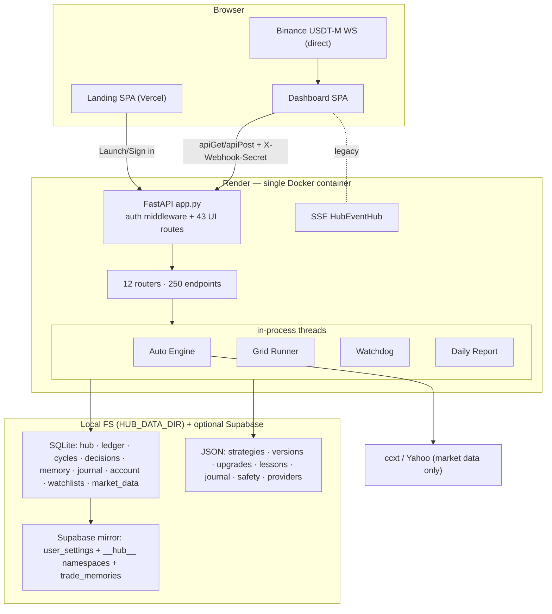
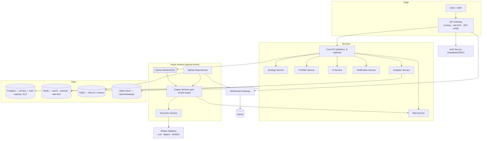
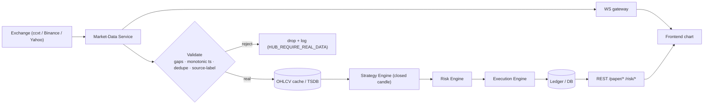
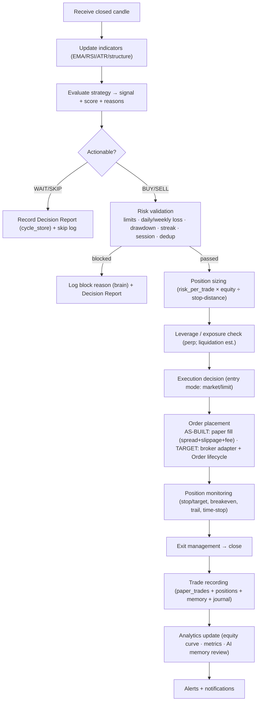

# TradeLogX Nexus — System Architecture Document (SAD)

*The engineering blueprint. Companion to the PRD, App-Flow Audit, and TRD (`docs/TRD.md`). This document describes both the **as-built** system (verified against source) and the **target** architecture required to reach the scalable, multi-exchange, live-trading, multi-tenant platform in the brief. Every "AS-BUILT" statement is fact; every "TARGET" statement is design.*

**Version:** 1.0 · **Audited:** 2026-07 · **Author role:** Principal Architect

---

## Reading guide — as-built vs. target

The brief asks for an architecture that supports **live trading, multi-exchange, 100k users, and separate services (API Gateway, Auth Service, Execution Engine…)**. Most of that is **target design, not current reality.** To keep this document usable rather than aspirational, every section is split:

- 🟢 **AS-BUILT** — what exists today, verified in code.
- 🎯 **TARGET** — the design to reach the brief's scope, with a migration path.

**One-line truth:** today TradeLogX Nexus is a **single-process FastAPI monolith, single-owner, paper-trading-only**, with two React SPAs. It is excellent at that scope. The brief describes a **multi-tenant, live-trading, horizontally-scaled SaaS** — a different system that this one can evolve into along the path in §11 and §19.

---

## 1. Executive summary

| | AS-BUILT (today) | TARGET (v2.0 blueprint) |
|---|---|---|
| Topology | Single FastAPI process; engines are in-process threads | Decomposed services behind an API gateway |
| Tenancy | Single owner (one account) | Multi-tenant, per-user isolation |
| Trading | Paper only (fills modeled) | Paper + live order routing, multi-exchange |
| Data store | SQLite + JSON files + optional Supabase mirror | Postgres (Supabase) primary + Redis + object store + TSDB |
| Real-time | Browser→Binance WS + legacy SSE | Unified WS gateway (fan-out from a market-data service) |
| Scale ceiling | ~1 operator, 1 engine loop | 100k users via workers + queue + read replicas |
| Auth | HMAC cookie session + shared secret | JWT/OAuth (Supabase) + RBAC + per-tenant keys |

**Architecture score: 7 / 10** as a single-tenant paper platform (clean, tested, honest); **4 / 10** measured against the multi-tenant live-trading brief (missing tenancy, live execution, service decomposition, horizontal scale). The gap is well-understood and sequenced (§17, §19).

**Design principles (already honored, keep them):**
1. **Honesty over illusion** — never fabricate data; label every simulation. (Verified: zero unlabeled fakes.)
2. **Fail-closed on money** — live paths stay locked until every safety gate passes.
3. **Explainability** — every decision (incl. WAIT/SKIP) is recorded and inspectable.
4. **Boring, testable core** — stdlib-heavy engine, 851 tests, deterministic where possible.

---

## 2. Complete system architecture

### 🟢 AS-BUILT



**Reality checks:** the "engines" are Python modules called on threads inside one process; there is **no gateway, no separate auth service, no message queue, no live execution**. `ccxt`/Yahoo provide **market data**, not order routing.

### 🎯 TARGET (v2.0)



The mapping from as-built to target is **extract, don't rewrite**: today's `services/*` modules become tomorrow's services; the in-process engine loop becomes queue-driven per-tenant workers; SQLite/JSON become Postgres tables.

---

## 3. Frontend architecture

### 🟢 AS-BUILT
Two independent Vite/React/TS SPAs; **not** a shared component library (deliberate — different jobs).

| | Dashboard (`automation-hub-dashboard`) | Landing (`tradexa-landing`) |
|---|---|---|
| Build | Vite 5, TS `strict`, `build:check` typechecks | Vite 5, `tsc -b && vite build` (typecheck gates build) |
| Routing | **Custom hash router** (`app-context.ts` `parseHash`, `NAV_GROUPS`, `LEGACY_SLUGS`, deep-link `#/decision/<id>` `#/trade/<id>`) | `react-router-dom` v6 (`/`, `/auth/*`, `/settings/*`) |
| State | React Context (`AppContext`: `go/viewBot/toast`) + `useLive` cache + localStorage | `SettingsProvider` + `ToastProvider` |
| Styling | Hand-CSS + tokens (`index.css`, `theme.ts`) | Tailwind 3.4 |
| Charts | ECharts 5 + SVG (`FanChart`, `Sparkline`, `CandleChart`) | framer-motion previews |
| Code-split | **All ~31 pages `React.lazy`** under one `<Suspense>` | Landing eager; auth/settings lazy |

**Folder structure (dashboard):**
```
src/
  app-context.ts        # router + nav model (single source of truth for pages)
  App.tsx               # shell: sidebar + topbar + <Suspense> switch
  lib/api.ts            # useLive shared poller + apiGet/apiPost + typed interfaces
  lib/{format,progress,prefs}.ts
  pages/*.tsx (31)      # one file per page, lazy-loaded
  components/
    common/  (ui, Card, Modal, Toasts, OfflineBanner, Icon, Logo, ProgressBar)
    chart/   (ECharts + SVG wrappers)
    layout/  (Sidebar, TopHeader, HeaderControls, TickerBar, NotificationBell)
    cards/ bots/ strategy/ risk/ control/ replay/
  index.css             # tokens + components + 13 responsive breakpoints
```

**Cross-cutting:**
- **State management** — Context + a shared polling layer, no Redux (right-sized). `useLive(path, ms)` dedupes identical paths into one poller, guards in-flight, backs off on error, and pauses on `document.hidden`.
- **API communication** — `apiGet/apiPost/apiPostJson` send `X-Webhook-Secret`; base URL from `window.__HUB_CONFIG__` (backend-injected) or `VITE_API_BASE`.
- **WebSocket** — `BotTerminal` connects browser→`fstream.binance.com` (USDT-M klines), coalesces to ≤1 render/250ms, reconnects 1s→30s backoff.
- **Theme** — dark-first token system (`--gold`, `--ink`, semantic pos/neg); the auth pages honor `prefers-color-scheme`/`data-theme`.
- **Error boundaries** — ⚠ **none** (no React `ErrorBoundary`); a render throw currently white-screens the page.
- **Lazy loading / code-splitting** — ✅ all pages; charts load with their page.
- **Caching** — `useLive` in-memory per-path cache; localStorage for grid run, allocation sleeves, alert-seen ts, timeframe pref.
- **Offline handling** — `useLive.error` + `OfflineBanner` (⚠ only 2 pages adopt it).

### 🎯 TARGET
1. Add **React error boundaries** per route (isolate a crashing page from the shell).
2. Adopt `OfflineBanner`/`EmptyState` uniformly (safety: outage ≠ empty account).
3. Replace polling with **subscriptions** from the WS gateway where latency matters (positions, balance, alerts).
4. Extract a **shared design-system package** if the two SPAs converge; otherwise keep separate.
5. First **accessibility pass** — aria on `BotTerminal` controls, focus-trap in modals/drawer, skip-link, chart text alternatives.
6. Add **vitest** unit tests (0 today) + landing E2E (0 today).

---

## 4. Backend architecture

### 🟢 AS-BUILT — modular monolith
One FastAPI process. `app.py` mounts `webhook_api.router`, which aggregates 12 feature routers. Business logic lives in `services/*` and `data/*` modules; shared singletons (`engine, pipeline, paper, ledger, controls, bot_os`) are instantiated once in `webhook_api.py`.

| Concern | Module(s) | Role |
|---|---|---|
| API layer | `app.py`, `routers/*.py` | HTTP surface, auth middleware, cookie sessions |
| Trading Engine | `services/auto_engine.py` | poll→decide→execute loop on a thread |
| Strategy Engine | `strategies/*`, `services/strategy_presets.py`, `services/brain*`, `custom_adapter.py` | signal generation, MTF gate, custom-spec compiler |
| Risk Engine | `services/pipeline.py`, `risk_engine.py`, `recovery.py` | sizing, limits, drawdown, streak, circuit breakers |
| Execution | `services/paper*`, fill model | paper fills w/ spread/slippage/fee; **no live routing** |
| Grid | `services/grid_engine.py` (`GridBot`, `GridRunner`) | 24/7 paper grid on a thread |
| Portfolio | `routers/paper.py`, `data/account_store.py` | account, positions, equity curve |
| Analytics | `services/backtest_lab.py`, `metrics`, `replay.py` | walk-forward, MC, OOS, sliced, replay |
| AI | `services/ai_intelligence.py`, `coach.py`, `memory_insights.py` | analysis, coach, grounded recommendations |
| Notification | `notifications/*`, `services/alerts.py` | ledger alerts + Telegram/email |
| Logging | `data/ledger.py` (`bot_logs`), decision journal, boot logs | staged, queryable |
| Scheduler / workers | threads: `watchdog`, `daily_report`, `auto_engine`, `grid_runner` | each: stop-Event + bounded `wait()` + logged `except` |

**Thread model (verified sound):** every background loop uses `threading.Event` + `_stop.wait(interval)` (never a bare `while True: sleep`), guards double-start, is `daemon=True`, and wraps its body in a logged `except`. No hot-spin, no leak, no event-loop blocking (sync data endpoints run in the anyio threadpool).

### 🎯 TARGET — extract services + workers
1. **API stays stateless** (N replicas behind the gateway); move all singletons' state to Postgres/Redis.
2. **Engine → queue-driven workers**: one loop per tenant/bot, scheduled off a queue, so users don't share one in-process engine (today's hard ceiling).
3. **Execution Service** with pluggable **broker adapters** (ccxt/Alpaca/OANDA deps already declared) behind the safety gate.
4. **Market-Data Service** as the single upstream (one exchange connection fan-out to many tenants) → WS gateway + TSDB.
5. Keep the module boundaries — they already map 1:1 to the target services (extract, don't rewrite).

---

## 5. Database architecture

### 🟢 AS-BUILT — logical tables (SQLite/JSON + Supabase mirror)
Verified store-by-store. Physical files under `HUB_DATA_DIR`; **no `user_id` column anywhere** (single-owner).

| Logical table | Store (physical) | Key fields | Why it exists |
|---|---|---|---|
| `users` | `hub.db` | username PK, password_hash, salt, role | operator accounts (PBKDF2) |
| `user_settings` | `hub.db` + **Supabase** | (username, namespace) PK, data JSON, updated_at | per-namespace workspace blobs; Supabase-mirrored for redeploy durability |
| `bots` | `hub.db` | id PK, name, strategy, symbol, timeframe, mode, risk_json, starting_cash, state | saved bot configs |
| `webhook_events` | `ledger.db` | id PK, alert_id, symbol, side, entry, stop, status, reason | inbound TradingView alerts + accept/reject audit |
| `positions` | `ledger.db` | id PK, symbol, side, size, entry, stop, status, pnl | open/closed position state |
| `paper_trades` | `ledger.db` | id PK, symbol, side, size, entry, exit, pnl, rr, source, status, opened_at, closed_at | **the trade record** (paper/backtest/live source tag); never pruned |
| `bot_logs` | `ledger.db` | id PK, ts, level, stage, symbol, message | staged decision/execution log |
| `alerts` | `ledger.db` | id PK, ts, severity, category, title, detail, read | operator alerts feed |
| `memory_reviews` | `ledger.db` | id PK, period, period_key, report JSON, UNIQUE(period,period_key) | nightly/weekly/monthly AI reviews |
| `cycle_reports` | `cycles.db` | id PK, ts, symbol, tf, price, decision, score, report_json | **every** analysis cycle (incl. WAIT/SKIP); keep 5000 |
| `decisions` | `decisions.db` | id PK, ts, symbol, strategy, side, scores, confidence, decision, reason, executed | brain decision detail; keep 20000 |
| `trade_memories` | `trade_memory.db` (+FTS5) + **Supabase** | trade_id PK, full trade + grade + regime + sections_json + features_json | AI long-term memory, searchable |
| `trade_decision_journal` | `journal.db` | trade_id PK, sections_json; + `trade_decision_events`; + `evolution_memory(setup_key)` | human-reviewable journal + evolution stats |
| `skipped_trades` | `skipped.db` | id PK, ts, symbol, stage, reason, snapshot_json | why a setup was rejected/deduped |
| `account_state` | `account.db` | id=1 singleton, initial/current/available/realized/unrealized | paper account (ledger trades remain source of truth for realized) |
| `market_prefs` | `watchlists.db` | id=1 singleton, JSON {favorites, pinned, watchlists[]} | market UI prefs |
| OHLCV cache | `market_data.db` | cached real candles | avoid re-fetching real data |
| `custom_strategies` | JSON | {sid: {definition, versions[30], favorite, tags, folder}} | user strategies + version history |
| `strategy_versions` | JSON | {vid: {params, stats, gates{backtest,sim,paper,live}}} | evolution/version gating |
| `upgrades`, `lessons`, `providers`, `safety_state` | JSON | lifecycle/config blobs | AI upgrade approvals, mined lessons, data providers, safety-gate state |

**Constraints/retention today:** PKs on every table; a few `UNIQUE`s (memory_reviews); check-like `status` enums enforced in code; retention caps (logs 50k / alerts 10k / events 20k / cycles 5k / decisions 20k); `paper_trades` never pruned. **No foreign keys** (SQLite FKs off; JSON stores have none).

### 🎯 TARGET — normalized multi-tenant Postgres schema
Every table gains `tenant_id`/`user_id`, real FKs, and **Row-Level Security** (Postgres/Supabase). New tables for the brief's live-trading + exchange scope.

```mermaid
erDiagram
  users ||--o{ accounts : owns
  users ||--o{ exchange_connections : links
  users ||--o{ strategies : authors
  strategies ||--o{ strategy_versions : has
  accounts ||--o{ orders : places
  accounts ||--o{ positions : holds
  accounts ||--o{ trades : books
  exchange_connections ||--o{ orders : routes
  strategy_versions ||--o{ bot_decisions : produces
  accounts ||--o{ journal_entries : records
  users ||--o{ notifications : receives
  users ||--o{ risk_rules : configures
  accounts ||--o{ replay_sessions : runs

  users { uuid id PK "email UK, role, created_at, mfa" }
  accounts { uuid id PK "user_id FK, mode(paper|live), base_ccy, equity" }
  exchange_connections { uuid id PK "user_id FK, exchange, api_key_enc, api_secret_enc, scopes, status" }
  strategies { uuid id PK "user_id FK, name, kind, archived" }
  strategy_versions { uuid id PK "strategy_id FK, spec_json, stats_json, gates_json, created_at" }
  orders { uuid id PK "account_id FK, exchange_conn FK, symbol, side, type, qty, price, status, client_id UK, ext_id" }
  positions { uuid id PK "account_id FK, symbol, side, qty, avg_entry, stop, status" }
  trades { uuid id PK "account_id FK, symbol, side, qty, entry, exit, pnl, rr, source, opened_at, closed_at" }
  bot_decisions { uuid id PK "version_id FK, account_id FK, ts, symbol, decision, score, report_json" }
  journal_entries { uuid id PK "account_id FK, trade_id FK, sections_json, human_notes" }
  notifications { uuid id PK "user_id FK, kind, title, body, read_at, channel" }
  risk_rules { uuid id PK "user_id FK, risk_per_trade, max_dd, max_positions, circuit_json" }
  replay_sessions { uuid id PK "account_id FK, symbol, tf, cursor, state_json" }
  market_data { bigint id PK "exchange, symbol, tf, ts, ohlcv — hypertable/TSDB" }
```



**Indexes (target):**
- `trades(account_id, closed_at DESC)`, `trades(account_id, symbol)` — blotter + analytics.
- `orders(account_id, status)`, `orders(client_id UNIQUE)` — **idempotent order placement** (dedupe retries).
- `positions(account_id, status)` — open-position reads.
- `bot_decisions(account_id, ts DESC)`, `bot_decisions(version_id)` — decision archive + strategy attribution.
- `market_data(exchange, symbol, tf, ts)` — the hot path; TSDB/hypertable partitioned by time.
- `notifications(user_id, read_at)` — unread badge.
- Every tenant table: leading `tenant_id`/`user_id` for RLS + locality.

**Constraints (target):** FKs with `ON DELETE CASCADE` for owned data; `CHECK` on enums (`mode`, `side`, `status`, `source`); `UNIQUE(client_id)` on orders; `NOT NULL` on money columns with `NUMERIC(20,8)` (never float for money — today paper P&L is float, acceptable for sim, **must be decimal for live**).

**Why each new table:** `accounts` separates identity from trading books (a user can hold paper + live); `exchange_connections` stores **encrypted** broker keys per user (KMS/pgcrypto); `orders` is distinct from `trades` because live needs the full order lifecycle (new→partial→filled→cancelled) that paper collapses; `replay_sessions` persists replay cursor for resumable/shareable sessions; `notifications` becomes a real per-user table (today it's the shared `alerts` feed).

**Migration path:** introduce Postgres as the ledger+settings source of truth (already supported via `SupabaseLedger`), add `tenant_id` columns defaulting to the single owner, enable RLS, then split JSON stores into tables. Non-breaking, incremental.

---

## 6. API architecture

### 🟢 AS-BUILT — 250 REST endpoints, 12 routers
Auth tiers: **public** (~15) · **session-or-secret** (~178) · **secret-write** (71) · **webhook-secret** (1). Secret via `X-Webhook-Secret`. Errors: `401 {"error":"Sign in required"}` (wall) / `401 "Invalid or missing credential"` (write-gate).

| Group | Router | Examples | Auth |
|---|---|---|---|
| Authentication | `app.py` | `POST /login /signup /logout`, `GET /auth/status` | public → sets cookie |
| Users | `app.py` | `GET/POST/DELETE /user/settings`, `POST /auth/change-password` | session |
| Strategies | `analytics.py` | `GET/POST /strategy/custom`, `/{id}/{history,restore,deploy,duplicate}`, `/simulate`, `/ai-review` | secret-write for mutations |
| Paper Trading | `paper.py` | `/paper/{account,positions,trades,equity-curve,close,initial-capital}` | reads session; close/capital secret |
| Live Trading | `engine.py`, `bots.py` | `/engine/{start,stop,mode,timeframe}`, `/controls/*`, `/brokers`, `/webhook/tradingview` | secret-write; webhook-secret |
| Portfolio | `paper.py`, `risk.py` | `/paper/account`, `/risk/portfolio` | session |
| Analytics | `analytics.py` | `/strategy/performance`, `/lab/{walk-forward,monte-carlo,out-of-sample,sliced}`, `/control/auto-tune` | session (compute) |
| Journal | `journal.py` | `/journal/trades`, `PATCH/DELETE /journal/{id}`, `/trade-memory/*` | edit secret-write |
| Replay | `analytics.py` | `/replay/run`, `/replay/*` | session |
| Bot Decisions | `engine.py` | `/engine/cycles`, `/engine/cycles/{id}` | session |
| Settings | `settings.py` | `GET/POST /settings`, `/execution/fill-model`, `/notifications`, `/data/sync` | write secret |
| Notifications | `paper.py`, `settings.py` | `/ledger/alerts`, `/alerts/channels`, `/notifications/test` | session/secret |
| Risk | `risk.py`, `engine.py` | `/risk/{summary,portfolio,correlation,recovery,position-size,presets,preset}` | preset/settings secret |
| AI | `ai.py` | `/ai/{analyze,insights,profile,coach,recommendations,confidence-accuracy,alerts}` | session |
| Grid | `grid.py` | `/grid/{start,stop,status}` | start/stop secret |
| Health/Audit | `health.py`, `analytics.py` | `/health`, `/version`, `/audit/export`, `/production/readiness` | public health; audit session |

**Per-endpoint contract (as-built):** request via Pydantic models where bodies are typed (`SettingsUpdate`, `WebhookPayload`) or `dict = Body(...)`; validation is in-handler (range checks in `POST /settings`, spec checks in strategy save); responses are plain dicts typed on the client side.

### 🎯 TARGET
1. **Gateway** owns rate-limiting, JWT verification, request IDs — routers stop re-implementing auth.
2. **`response_model` on every route** → generated OpenAPI + typed SDK for the frontend (replaces hand-kept `api.ts` interfaces).
3. **Idempotency keys** on order/mutation POSTs (`Idempotency-Key` header → `orders.client_id`).
4. **Versioned prefix** `/api/v1/*`; deprecate the flat namespace over time.
5. **Per-tenant API keys** (scoped) replacing the single shared `X-Webhook-Secret`.

---

## 7. WebSocket / real-time architecture

### 🟢 AS-BUILT
- **Chart data:** browser connects **directly** to `wss://fstream.binance.com` (USDT-M klines). No server hop. Throttled to ≤1 render/250ms; reconnect 1s→30s backoff. Perp-only (USDT/USDC/BUSD quote); others fall back to 2-min REST.
- **Server events (SSE):** `HubEventHub` (stdlib `queue`+`threading`, `deque(maxlen=2000)`, slow-client drop-oldest) exposed at `GET /events/stream` + `/events/state`. **Consumed only by the legacy server-rendered overview** — the React SPA does **not** use `EventSource`; it relies on `useLive` polling + the direct Binance WS.
- **Polling intervals:** 2–8s on hot data (`/engine/status`, `/paper/*`, `/risk/*`), 30s on AI, 120s chart refresh.

### 🎯 TARGET — unified WebSocket gateway
A single authenticated WS per client, multiplexing topic subscriptions; the **Market-Data Service** holds one upstream exchange connection and fans out to all tenants (today every browser opens its own Binance socket).

| Event | Payload | Source |
|---|---|---|
| `market.tick` / `market.candle` | symbol, tf, ohlcv | Market-Data Service |
| `bot.status` | engine running/mode/strategy | Engine worker |
| `trade.opened` / `trade.closed` | trade record | Execution Service |
| `position.updated` | qty, avg, uPnL | Execution Service |
| `balance.updated` | equity, available | Portfolio Service |
| `notification` | severity, title, body | Notification Service |
| `replay.progress` | cursor, pct | Replay worker |
| `chart.update` | overlay/markers | Strategy Service |

Transport: WS over the gateway, Redis pub/sub as the internal bus; SSE kept as a fallback. Replaces most hot polling → lower latency + far less load.

---

## 8. Market-data flow



**AS-BUILT specifics:** `data/market_data.py` returns an honest `source` label (`live (yahoo)`, `local store (real)`, `bundled sample`, `synthetic`); **non-crypto is never synthesized**; `HUB_REQUIRE_REAL_DATA=1` forbids fallbacks; the engine acts only on **closed** candles. **TARGET:** the Market-Data Service becomes the single upstream (one connection → many tenants) writing to a TSDB, pushing ticks to the WS gateway.

---

## 9. Bot decision flow (full trade lifecycle)



**Every step is real today** except order placement (paper-modeled). Each cycle — **including WAIT and SKIP** — writes a Decision Report, which is why the Decision Archive can explain "why nothing happened." Risk is a hard gate before sizing; sizing is `risk_per_trade_pct × equity ÷ stop distance`; leverage only scales the perp exposure/liquidation estimate (paper). **TARGET** replaces the single "paper fill" node with the Execution Service's order state machine (new→partially_filled→filled→closed) against a broker adapter, with idempotent `client_id`.

---

## 10. Security architecture

| Control | 🟢 AS-BUILT | 🎯 TARGET |
|---|---|---|
| Session auth | HMAC-SHA256 signed cookie (`secret_key`, 7-day exp, constant-time verify); **not** signed with the webhook secret (CR-1) | JWT (Supabase) at the gateway; short-lived access + refresh |
| OAuth | Supabase Google/GitHub on landing (demo unless configured) | First-class via Auth Service; backend trusts the JWT |
| Password | PBKDF2 + per-user salt | keep; add breach-check + strength policy |
| API keys / secrets | single shared `X-Webhook-Secret`; `HUB_API_KEY`+`HUB_SCOPE_WEBHOOK` can decouple control from webhook | per-tenant scoped keys; secrets in a manager (not env) |
| Exchange keys | n/a (paper) | **encrypted at rest** (pgcrypto/KMS), never returned to client, scoped no-withdraw |
| Boot hardening | refuses dev `secret_key` on cloud; warns on `admin` password (M-7) | enforce non-default + first-run owner as a hard gate |
| Rate limiting | ⚠ **none** | per-IP + per-user on `/login`, `/signup`, `/webhook`, order POSTs |
| Input validation | Pydantic + in-handler range/spec checks | `response_model` + schema on every route |
| SQL injection | parameterized SQLite; no string-built SQL | keep; Postgres prepared statements |
| XSS | React escapes by default; server-rendered auth pages escape (`w.esc`) | CSP `script-src`; keep |
| CSRF | cookie `SameSite=Lax` (default); mutations also require the secret header | `SameSite` + CSRF token on cookie-auth mutations |
| Clickjacking | optional CSP `frame-ancestors` (`HUB_FRAME_ANCESTORS`) | enforce by default |
| CORS | ⚠ `allow_origins=["*"]` (credentials off) | **restrict to known origins** |
| RBAC | roles exist (`owner`/`operator`/`admin`) but single-owner in practice | real RBAC + per-tenant isolation (RLS) |
| Audit logging | decision journal + `bot_logs` + audit-export (SHA-256) | immutable audit table per tenant; export retained |

**Top security actions (order):** ① restrict CORS ② rate-limit auth + webhook ③ enforce non-default secrets ④ per-tenant isolation (RLS) before any second user ⑤ encrypt exchange keys before live.

---

## 11. Scalability plan

Bottleneck today: **one process, one engine loop, SQLite single-writer, one Binance socket per browser.** Fine for one operator; breaks with tenants.

| Scale | Load shape | Architecture | Key moves |
|---|---|---|---|
| **100 users** | ~light; mostly paper | Current monolith + **Postgres** + persistent disk | Move ledger/settings to Postgres (already supported); 1–2 API replicas; keep engine single but multi-account-aware |
| **1,000** | concurrent dashboards, polling load | **Stateless API (N replicas)** + **Redis cache** + **WS gateway** (replace hot polling) | Extract Market-Data Service (1 upstream → fan-out); Redis for `useLive`-equivalent server cache; read replica |
| **10,000** | many concurrent bots/decisions | **Queue-driven engine workers** (per-tenant loops) + Execution Service | Move engine off the API process; horizontal worker pool; Postgres partitioning; TSDB for OHLCV |
| **100,000** | global, live trading | **Sharded/partitioned data, regional deploys, autoscaling workers** | Tenant sharding by `tenant_id`; per-exchange connection pool; CDN + edge; backpressure + circuit breakers on brokers |

**Scaling rules:** the API must become **stateless** (no in-process engine/singletons) so it can replicate; all shared state to Postgres/Redis; the engine must be **per-tenant and queue-scheduled**, not one global loop; the market-data upstream must be **shared** (one connection per exchange, not per user).

---

## 12. Monitoring plan

| Signal | 🟢 AS-BUILT | 🎯 TARGET |
|---|---|---|
| Liveness | `/health`, `/version`; Render health check | `/healthz` + `/readyz` per service; uptime monitor |
| Trading-engine health | Watchdog thread (feed stall / thread death → alert), `/engine/diagnostics`, `/bot-os` | Prometheus: loop lag, decisions/min, blocked ratio |
| Exchange connectivity | data-source label + feed_error surfaced | per-exchange up/down, latency, error-rate; page on outage |
| WS health | `wsOk` client flag; reconnect counter | server-side connection count, drop rate |
| DB performance | none (SQLite) | Postgres slow-query log, connection-pool saturation |
| API latency / error rate | none structured | RED metrics (Rate/Errors/Duration) per route at the gateway |
| CPU / memory | Render dashboard only | container metrics → Prometheus + Grafana; alerts |
| Logs | ledger `bot_logs` + boot logs (stdout) | structured JSON logs → Loki/ELK; trace IDs |

**Golden signals to alert on first:** engine loop lag, decisions-going-to-zero (silent engine), broker error-rate, drawdown breach, 5xx rate, DB pool saturation.

---

## 13. Deployment architecture

### 🟢 AS-BUILT
- **Docker** image (`Dockerfile`) builds both SPAs + serves them from the FastAPI backend single-origin; deployed on **Render** (free plan, `/health` check). SPAs also on **Vercel**.
- **Config** via env (`HUB_*`, `SUPABASE_*`, `VITE_*`); `render.yaml` documents the service.
- **CI:** GitHub → Vercel preview deploys per PR; backend tested via `pytest` (851) locally/CI; frontend `tsc`+`vite build`+Playwright.
- **Release flow (this project):** feature branch → PR → 2 Vercel checks green → squash-merge to `main` → Vercel auto-deploys SPAs; **Render is manual** ("Choose Commit to Deploy").
- **Rollback:** redeploy a previous commit (Render commit picker / Vercel instant rollback).

### 🎯 TARGET
| Env | Purpose | Config |
|---|---|---|
| Development | local | SQLite, dev secrets, `HUB_AUTO_ENGINE=0` optional |
| Testing/CI | automated gates | ephemeral Postgres, `pytest` + `vitest` + Playwright, typecheck |
| Staging | prod-like rehearsal | Supabase staging project, real secrets vault, smoke tests |
| Production | live | Postgres primary+replica, Redis, workers, secrets manager, autoscaling |

- **CI/CD:** build → test (unit+E2E) → image scan → push → deploy staging → smoke → promote to prod; **Render auto-deploy ON** (remove the manual step) with health-gated rollout.
- **Secrets:** move from env to a manager (Render secret files / Vault / Doppler); rotate on schedule.
- **Rollback:** blue-green or health-gated rolling; DB migrations forward-only + reversible; keep N-1 image warm.

---

## 14. Disaster recovery plan

| Scenario | 🟢 AS-BUILT exposure | 🎯 TARGET recovery |
|---|---|---|
| Instance restart / redeploy | **Free-tier disk is ephemeral** → local SQLite/JSON wiped unless Supabase-mirrored (only settings/grid/memory are) | Postgres = source of truth; nothing lives only on the instance |
| DB loss | SQLite = single file, `/ops/backup` drill exists | Postgres PITR + automated daily backups to object store; tested restore |
| Exchange outage | data-source fallback + honest labels | multi-provider failover; queue + retry; halt live on sustained outage |
| Broker/order failure | n/a (paper) | idempotent orders (`client_id`), reconciliation job, fail-closed |
| Region outage | single region | multi-region standby (RPO/RTO targets: RPO ≤ 5 min, RTO ≤ 30 min) |
| Data corruption | retention pruning + never-prune trades | append-only trade/audit tables; immutable ledger |

**RPO/RTO targets (target):** paper data RPO ≤ 1h / RTO ≤ 1h; live-trading data RPO ≤ 1 min / RTO ≤ 15 min (money data is stricter). **Immediate action today:** set `SUPABASE_URL/KEY` on the backend so nothing is lost on redeploy (the #1 current DR gap).

---

## 15. Performance recommendations

1. **Kill hot polling** where it matters → WS gateway push (positions/balance/alerts). Biggest perceived-latency + load win.
2. **Postgres** for write concurrency (SQLite single-writer will contend once the engine + many requests write together).
3. **Code-split ECharts** (~1MB chunk) and lazy-load charts; use lightweight SVG for sparklines (already partly done).
4. **Server cache** (Redis) for expensive reads (`/replay/run`, `/strategy/performance`, correlation) with short TTL.
5. **Shared market-data upstream** — one exchange socket fanned out, not one per browser.
6. **NUMERIC money** columns for live (float is fine for paper sim only).
7. **Batch/paginate** large reads (decisions 150-cap, logs 300/2.5s) — move to cursor pagination + push deltas.

---

## 16. Technical debt assessment

| Debt | Severity | Cost of ignoring | Fix |
|---|---|---|---|
| Two disjoint auth systems (Supabase vs cookie) | High | user confusion; blocks real multi-user | unify (Phase B done for UX; Phase C for identity) |
| No per-tenant isolation (`user_id` absent) | High | cannot onboard a 2nd user safely | add tenant columns + RLS before multi-user |
| SQLite/JSON + ephemeral disk | High | data loss on redeploy | Postgres/Supabase source of truth |
| CORS `*`, no rate limiting | High (prod) | abuse / brute force | restrict + throttle |
| In-process engine singleton | High (scale) | can't scale past 1 operator | queue-driven workers |
| No React error boundaries | Med | one bad render white-screens a page | per-route boundary |
| No frontend unit tests; landing 0 tests | Med | regressions slip past typecheck | vitest + landing E2E |
| `response_model` largely unused | Med | client/server drift | schema on every route |
| A11y unaudited (thin aria, no focus-trap) | Med | excludes users; compliance risk | a11y pass |
| Float money in paper P&L | Low (paper) / High (live) | rounding errors live | NUMERIC before live |
| SSE path legacy/unused by SPA | Low | dead code confusion | replace with WS gateway or remove |

---

## 17. Architecture score

| Axis | As single-tenant paper OS | Against the multi-tenant live brief |
|---|---:|---:|
| Modularity / boundaries | 8 | 7 (clean modules, not yet services) |
| Correctness / testing | 8.5 | 8 |
| Data architecture | 7 | 4 (no tenancy, ephemeral, no FKs) |
| Security | 7 | 5 (CORS/rate-limit/isolation gaps) |
| Scalability | 8 | 3 (single process/engine) |
| Real-time | 8.5 | 6 (per-browser sockets, no gateway) |
| Observability | 5 | 3 (no metrics/tracing) |
| Deploy / DR | 7 | 5 (ephemeral, manual, single region) |
| **Overall** | **7.6** | **4.5** |

**Verdict:** an **excellent single-tenant paper platform** with clean bones that map directly onto the target services. The distance to the brief is real but **evolutionary, not a rewrite** — the module boundaries, honest data discipline, and test coverage are exactly the foundation you want before decomposing.

---

## 18. Risks & mitigation

| Risk | Likelihood | Impact | Mitigation |
|---|---|---|---|
| Data loss on redeploy (ephemeral disk) | High now | High | **Set Supabase env today**; Postgres SoT |
| Second user added before isolation exists | Med | Critical | Do not onboard user #2 until RLS + tenant columns land |
| Live trading shipped before order safety/idempotency | Med | Critical (real money) | Keep live locked until Execution Service + reconciliation + idempotent orders + decimal money |
| Public abuse (no rate limit, CORS `*`) | Med | High | Rate-limit + CORS lockdown (Phase A) |
| Engine can't scale (single loop) | High at scale | High | Queue-driven per-tenant workers before growth |
| Exchange/broker outage cascades | Med | High | Multi-provider failover, circuit breakers, fail-closed |
| Secret leakage (shared key in every authed page) | Low-Med | High | Per-tenant scoped keys; secrets manager; rotate |
| Frontend regressions (no unit tests) | Med | Med | vitest + expand E2E |

---

## 19. Future architecture — Version 2.0

**Target state:** a multi-tenant, multi-exchange, live-capable SaaS, reached by **extracting** today's clean modules — not rewriting.

1. **Identity & tenancy** — Supabase/OIDC as the IdP; JWT verified at the gateway; `tenant_id` + RLS on every table; real RBAC. *(Unblocks user #2.)*
2. **Data platform** — Postgres primary + read replicas (RLS), Redis (cache/pub-sub/rate-limit), a TSDB for OHLCV/metrics, object store for reports/backups.
3. **Service extraction** — pull `services/*` into Strategy, Risk, Portfolio, Analytics, AI, Notification services behind an API gateway; API becomes stateless.
4. **Engine as workers** — per-tenant engine loops scheduled off a queue; the Execution Service owns the order state machine + broker adapters (ccxt/Alpaca/OANDA) behind the safety gate.
5. **Real-time gateway** — one authenticated WS per client multiplexing topics; Market-Data Service holds shared upstream connections; Redis pub/sub bus.
6. **Live trading** — encrypted exchange keys, idempotent orders, reconciliation, decimal money, per-venue execution telemetry — all fail-closed.
7. **Observability & DR** — Prometheus/Grafana + tracing + structured logs; PITR backups, multi-region standby, tested restores.
8. **AI evolution** — the AI Service abstracts model providers (rules today → LLM/ML tomorrow) behind a stable interface; the grounded, no-fabrication contract is preserved.

**Sequencing:** Phase A (hardening: CORS, rate-limit, secrets, Postgres SoT) → Phase B (auth unify — *done for UX*) → Phase C (tenancy + RLS) → Phase D (live execution) → Phase E (service extraction + scale). Each phase ships independently and keeps the product deployable throughout.

---

*End of SAD. As-built statements verified against the codebase on the audit date; target statements are design recommendations. No feature was built in producing this document. Read alongside `docs/TRD.md` and `docs/APP_FLOW_AUDIT.md`.*
