# TradeLogX Nexus — Development Sprint Planning & Execution Specification

*The execution layer over the nine-part blueprint set (`PRD` · `APP_FLOW_AUDIT` · `TRD` · `SAD` · `DDS` · `API_SPEC` · `TES` · `ADES` · `UDS`). Those documents say **what** to build; this one says **in what order, by whom, and when it's done**.*

> **Version 1.0 · 2026-07-22 · 13 sprints (0–12) · 2-week cadence assumed**

---

## Read this first — this is a BROWNFIELD plan, not greenfield

**The platform substantially already exists.** The nine specifications above were *audits of a running system*, not wishlists. A sprint plan that says "build user auth / build the trading engine / build paper trading" from zero would be dishonest and waste the team. So every sprint below is framed against the **as-built reality** with three states:

- ✅ **DONE** — already real and tested in the codebase.
- 🟡 **PARTIAL** — exists but needs hardening, convergence, or completion.
- 🔴 **TO BUILD** — genuinely new.

**What already exists (verified across the nine specs):** an HMAC-cookie auth system + per-user settings that survive logout/restart; a multi-asset market-data ladder + Binance WS feed; a real 24/7 autonomous trading engine with an ~18-gate risk pipeline; a paper-trading account/ledger with realistic fills + fees; a deterministic backtester + replay; real EMA/RSI + SMC (BOS/CHoCH/FVG/sweep) strategies with chart annotations driven by the strategy (no fake decorations); a deterministic, non-hallucinating AI decision/explanation layer; a professional ECharts trading terminal; a trading journal + trade memory + weekly/nightly reviews; rate limiting, CORS, secret-boot guards; and ~253 REST endpoints. **870 backend + 96 root tests are green.**

**The real work, therefore, is convergence and productionization**, exactly what the specs' readiness scores point to:

| Spec | As-built readiness | The gap this plan closes |
|---|---:|---|
| DDS | 4.5/10 | SQLite/JSON → Postgres + RLS + FKs + `NUMERIC` money |
| API | 4.2/10 | flat unversioned → `/api/v1` + envelope + JWT/RBAC |
| TES | 5.5/10 | 4–5 divergent engines → one `TradeCore` + adapters; live execution |
| ADES | 7.0/10 | (strong) fluent narration + per-version attribution |
| UDS | 6.5/10 | two front-ends → one token/component system |

### Stack reconciliation (a Sprint-0 decision, not a rewrite)
The brief lists **Next.js / Node / PostgreSQL / Redis**. The real stack is **FastAPI (Python) · React + Vite · SQLite + JSON (optional Supabase Postgres) · no Redis**. Recommendation, carried through this plan:

- **Keep FastAPI.** It is proven, tested, and already emits OpenAPI 3.1. A Node rewrite would discard a working, 870-test backend for zero user value. *(Node microservices can be added later only if a specific need appears.)*
- **Adopt PostgreSQL (Supabase).** Already wired via `SupabaseLedger`; promote it from mirror to source of truth (DDS §10). This is the single highest-leverage change.
- **Keep React; stay on Vite** for the app (Next.js is optional for the marketing/landing surface only — a decision, not a requirement; the app is a dashboard SPA, not content/SEO-driven).
- **Add Redis** when (and only when) horizontal scale or distributed rate-limiting/caching is needed (multi-instance) — deferred to Sprint 10, not day one.

**Team assumption:** ~4–6 engineers (2 backend, 2 frontend, 1 data/infra, shared QA). Complexity is **T-shirt (S/M/L/XL)** + rough points; because much exists, many "build" sprints are **harden/converge**, which is derisked but not free.

---

## Roadmap at a glance

```mermaid
gantt
  title TradeLogX Nexus — 13-sprint roadmap (2-wk cadence)
  dateFormat  X
  axisFormat %s
  section Foundation
  S0 Foundation & Setup        :0, 1
  S1 DB & User System (Postgres/RLS) :1, 2
  section Data & Engine
  S2 Market Data Infra         :2, 3
  S3 Trading Engine Core (TradeCore) :3, 5
  S4 Paper Trading System      :5, 6
  S5 Backtesting Engine        :6, 7
  section Intelligence & UI
  S6 Strategy Intelligence     :7, 8
  S7 AI Decision Engine        :8, 9
  S8 Trading Terminal UI       :9, 11
  S9 Analytics & Journal       :11, 12
  section Hardening
  S10 Security & Prod Readiness :12, 13
  S11 Testing & QA             :13, 14
  S12 Deployment & Launch      :14, 15
```

*Overall theme: `S0–S1` lay the production data foundation; `S2–S5` converge the engine onto one core; `S6–S9` complete intelligence + UX; `S10–S12` productionize. Live-money trading and multi-tenant flip remain gated behind the SAD/DDS flip-criteria and are explicitly out of scope until then.*

---

## Sprint field legend
Each sprint documents all 15 required fields: **Objective · Business Value · Technical Goals · Features · Backend · Frontend · Database · API · Testing · Security · Performance · Definition of Done · Dependencies · Complexity**. The **governing spec** and the **as-built state** are called out so nothing already built is rebuilt.

---

## Sprint 0 — Foundation & Project Setup
**Governing:** SAD · **State:** 🟡 (CI + repo exist; Postgres/observability partial)

1. **Objective:** Lock the production architecture and toolchain so every later sprint ships on rails.
2. **Business value:** De-risks all future work; a stable foundation is the cheapest sprint to get right and the most expensive to skip.
3. **Technical goals:** One documented monorepo layout; reproducible env; green CI/CD on every push; Postgres reachable; auth + API framework confirmed.
4. **Features:** Dev-onboarding runbook; environment matrix; quality gates.
5. **Backend:** Confirm FastAPI app boot + fail-closed secret guard (✅); pin Python 3.10–3.12 matrix (✅ CI exists); add `ruff`/`black`/`mypy` gate; `.env.example` completeness.
6. **Frontend:** Confirm Vite build + typecheck in CI; add ESLint/Prettier gate; adopt the UDS `cn()` + token package scaffold.
7. **Database:** Provision Supabase Postgres; run `ledger_schema.sql`; add a Supabase-CLI `supabase/migrations/` dir (doesn't exist yet — DDS §10 step 0).
8. **API:** Confirm `/openapi.json` + `/docs`; register the `/api/v1` router prefix scaffold (aliased alongside legacy, API §10).
9. **Testing:** CI runs backend (`pytest`, 870) + root (96) + frontend build on every PR (✅ pattern exists); add coverage reporting.
10. **Security:** Secret-boot guard (✅); dependency scan (Dependabot/pip-audit); branch protection + required checks.
11. **Performance:** Baseline p95 latency + build-time budgets recorded.
12. **Definition of Done:** Fresh clone → `make dev` runs app + tests; CI green on a trivial PR; Postgres reachable from the backend; onboarding doc merged.
13. **Dependencies:** none.
14. **Complexity:** **M** (~13 pts) — mostly wiring what exists into a documented, enforced baseline.

---

## Sprint 1 — Core Database & User System
**Governing:** DDS (4.5/10) + API §3 · **State:** ✅ auth/settings exist; 🔴 Postgres/UUID/RLS

1. **Objective:** Move identity + settings onto Postgres with UUID keys, real FKs, and RLS — the isolation-ready foundation.
2. **Business value:** Durable, multi-user-ready accounts; settings that survive logout/refresh/device (an explicit requirement — **already true today** via the Supabase settings mirror, now made first-class).
3. **Technical goals:** `tenants`/`users`/`profiles`/`sessions`/`user_settings` on Postgres; RLS `ENABLE + FORCE`; keep the HMAC cookie working during migration.
4. **Features:** Register/login/logout (✅), profile, preferences, trading preferences, strategy-config storage, persistent settings (✅ survives restart).
5. **Backend:** Promote `SupabaseLedger`/settings-store from mirror to source of truth (DDS §10.2 step 1); add `tenants` seed (`__owner__`, ✅ seam exists); JWT issuance alongside the cookie (API §3).
6. **Frontend:** Settings UI already persists via `/user/settings` (✅); add profile page; move token handling to `Authorization: Bearer` with cookie fallback.
7. **Database:** Create the User-module tables (DDS §4.1) — UUID PKs, `ensure_tenant_column` primitive already built (Phase C, ✅); RLS policies keyed on `tenant_id`.
8. **API:** `/api/v1/auth/*`, `/api/v1/users/me`, `/users/me/preferences/{namespace}` (map from real `/user/settings`, API §2.1–2.2).
9. **Testing:** RLS isolation test (user A ≠ user B); settings-survive-restart test (✅ exists); auth lifecycle test.
10. **Security:** RLS enforced at DB; Argon2/PBKDF2 (✅ PBKDF2-200k); refresh-token rotation + reuse detection (API §3).
11. **Performance:** Settings read < 100 ms; connection pooling via PgBouncer.
12. **Definition of Done:** A user's settings persist across logout/refresh/device on Postgres; RLS isolation test green; `/api/v1/auth` issues JWTs; legacy cookie still works.
13. **Dependencies:** S0 (Postgres).
14. **Complexity:** **L** (~21 pts) — the auth *logic* exists; the *substrate migration* + RLS is the work.

---

## Sprint 2 — Market Data Infrastructure
**Governing:** TES §4 + DDS §4.6 · **State:** 🟡 (real ladder + WS feed exist; persistence/derivatives partial)

1. **Objective:** A reliable, validated market-data pipeline across crypto + stocks, persisted and fail-closed.
2. **Business value:** Everything downstream (engine, backtest, AI) is only as good as the data; honest data is the platform's credibility.
3. **Technical goals:** OHLCV WS + REST backfill; gap/staleness detection; candles persisted + partitioned; funding/OI/econ persisted.
4. **Features:** Exchange connectors (✅ ccxt/ccxt.pro), historical downloader (✅ `historical.py`), real-time WS (✅ `ws_feed.py`), OHLCV pipeline (✅), symbol management (✅ `/symbols`), timeframe management (✅).
5. **Backend:** Persist `candles` to Postgres (DDS `candles`, partition by month/Timescale); wire funding/OI/econ persistence (🔴 today providers exist, not stored); harden the `MarketQualityGate` fail-closed path (✅).
6. **Frontend:** Symbol Explorer + search (✅); data-coverage/integrity views (✅ `/data/*`).
7. **Database:** `assets`, `symbols`, `candles` (partitioned), `funding_rates`, `open_interest`, `economic_events`, `news_events` (DDS §4.6).
8. **API:** `/api/v1/market-data/*` (candles, ticker, funding, OI, calendar, symbols) — map from real `/symbols`, `/market/funding`, `/data/*`.
9. **Testing:** Gap-detection test; staleness fail-closed test; backfill correctness; real-vs-synthetic honesty (`HUB_REQUIRE_REAL_DATA`, ✅).
10. **Security:** Exchange keys read-only + encrypted (for private data); provider keys never returned (✅).
11. **Performance:** Candle reads via partition pruning + BRIN (DDS §7); WS 250 ms throttle (✅); downsample 1m→1h→1d.
12. **Definition of Done:** Candles persist to Postgres and survive restart; a data gap → data-quality reject (not interpolation); funding/OI queryable; multi-asset (crypto + stocks) confirmed.
13. **Dependencies:** S1 (Postgres).
14. **Complexity:** **L** (~21 pts) — feeds exist; persistence + partitioning + derivatives are new.

---

## Sprint 3 — Trading Engine Core (the `TradeCore` convergence)
**Governing:** TES (5.5/10) · **State:** ✅ real engine exists; 🔴 unify 4–5 engines behind one core

1. **Objective:** Extract a single deterministic `TradeCore` + `ExecutionAdapter` so strategy behaviour is identical across paper/replay/backtest/live. **The single most important engineering sprint.**
2. **Business value:** Guarantees that a backtested edge behaves the same in paper and live — the property that makes the whole platform trustworthy.
3. **Technical goals:** One pipeline (data→indicators→structure→strategy→signal→risk→sizing→execution→position→record); `ExecutionAdapter` seam; deterministic.
4. **Features:** Strategy execution framework (✅ `AutoStrategyEngine`), signal processing (✅ ~18-gate `SignalPipeline`), entry/exit (✅), position tracking (✅), order simulation (✅ fill model), trade lifecycle (✅) — **the engine generates real decisions, not UI-faked signals (✅ verified)**.
5. **Backend:** Define `TradeCore`/`ExecutionAdapter`/`DataSource` interfaces around the existing pipeline (TES §20 step 1); extract `SimulatedFill` (✅ close); begin retiring the replay/backtest private loops.
6. **Frontend:** No user-facing change; Developer View surfaces `TradeCore` state (✅ BotTerminal dev panel).
7. **Database:** Decisions/cycles/skipped already durable (✅ Phase C tenant-ready); attach `strategy_version_id` (DDS).
8. **API:** `/api/v1/bots/*`, `/engine/*`, `/controls/*`, `/bots/decisions` (map from real, API §2.7).
9. **Testing:** **The cross-mode equivalence suite** (TES §19) — identical bars+seed+config → identical decisions across sim modes. This is the sprint's definition of done.
10. **Security:** Engine exception isolation (✅ "must never block trading"); kill-switch/halts (✅).
11. **Performance:** Incremental indicators on the hot path; lock-serialized pipeline (✅).
12. **Definition of Done:** Paper, replay, and backtest run through **one** `TradeCore`; the cross-mode equivalence test passes for sim modes; no behaviour regression (870 tests green).
13. **Dependencies:** S2 (data).
14. **Complexity:** **XL** (~34 pts) — refactoring live, tested code without regression is the hardest, highest-value work.

---

## Sprint 4 — Paper Trading System
**Governing:** TES §12 + DDS §4.4 · **State:** ✅ largely built; 🟡 accounts/precision

1. **Objective:** Paper trading = `TradeCore` + `SimulatedFill`, per-account, money-accurate.
2. **Business value:** The flagship product surface — a risk-free, fully-real simulation that proves the system before real capital.
3. **Technical goals:** Per-account paper books; `NUMERIC(20,8)` money; realistic fills + fees (✅).
4. **Features:** Virtual account (✅ `account_state`), starting capital (✅), simulated orders (✅), real-time PnL (✅), position sizing (✅ risk%/ATR), leverage simulation (🟡 analytical only — TES §8), trade history (✅). **Terminal shows actual bot decision, entry reason, strategy, risk calc, SL, TP (✅ all real).**
5. **Backend:** Re-key the singleton `account_state`→`accounts(mode='paper')` (DDS §4.4); move paper P&L float→`NUMERIC`; per-account isolation.
6. **Frontend:** Bot Terminal already shows decision/reason/strategy/risk/SL/TP (✅); add multi-account switcher.
7. **Database:** `accounts`, `paper_orders`, `paper_positions`, `paper_trades`, `balance_history` (DDS §4.4).
8. **API:** `/api/v1/paper/*` (map from `/paper/*`, `/ledger/*`).
9. **Testing:** PnL correctness vs ledger; fee accounting; partial-close; restart-adopts-open-positions (✅).
10. **Security:** Per-account RLS; no cross-account reads.
11. **Performance:** Open-position reads via `(account_id,status)` index (DDS §6).
12. **Definition of Done:** A tenant holds ≥1 paper account with `NUMERIC` money; every terminal figure traces to real backend logic; no fabricated values (honesty rule, ✅).
13. **Dependencies:** S3 (`TradeCore`).
14. **Complexity:** **M** (~13 pts) — mostly re-keying + precision; behaviour exists.

---

## Sprint 5 — Backtesting Engine
**Governing:** TES §14 · **State:** ✅ deterministic backtester exists; 🔴 fold onto `TradeCore`

1. **Objective:** Backtesting = `TradeCore` + `HistoricalFill`, fully deterministic, over multi-strategy/asset/timeframe.
2. **Business value:** Trustworthy historical validation is what converts a hunch into a deployable strategy.
3. **Technical goals:** One backtest engine (retire the second); deterministic (seeded); walk-forward/MC as harnesses over the core.
4. **Features:** Historical testing (✅ `Backtester`), metrics (✅ `metrics.py`), equity curve (✅), drawdown (✅), win rate (✅), R:R (✅), trade replay (✅ `/replay/run`) — multi-strategy/asset/timeframe (✅ `multi_backtester`, `walkforward`).
5. **Backend:** Make `bot/backtester.py` a `HistoricalFill` adapter over `TradeCore` (TES §20 step 5); unify with the hub backtest-lab.
6. **Frontend:** Backtesting page + Optimization Lab + Monte-Carlo fan + monthly returns (✅ all exist).
7. **Database:** Results/metrics reproducible from `paper_trades(source='backtest')`; `strategy_performance` (DDS §4.3).
8. **API:** `/api/v1/strategies/{id}:simulate|optimize`, `/analytics/labs/*` (✅ map).
9. **Testing:** Determinism (same seed → same equity curve, ✅); cross-mode equivalence includes backtest (TES §19).
10. **Security:** n/a (read-only compute).
11. **Performance:** Vectorized indicators; partition-pruned candle reads.
12. **Definition of Done:** Backtest uses the identical risk/sizing/execution as paper; same seed → bit-for-bit results; equivalence test covers backtest.
13. **Dependencies:** S3.
14. **Complexity:** **L** (~21 pts) — unifying two working backtesters without changing results.

---

## Sprint 6 — Strategy Intelligence Layer
**Governing:** TES §5/§8 + UDS §8 · **State:** ✅ strategies + real annotations exist; 🟡 OB/premium-discount

1. **Objective:** A plugin strategy manager whose chart shows **only the real indicators the strategy uses** — never decorative fakes.
2. **Business value:** Explainable, honest strategy visualization is the platform's differentiator vs. black-box bots.
3. **Technical goals:** Hot-swappable strategies; strategy-driven chart annotations (✅ backend `meta.viz` drives `CandleChart`).
4. **Features:** Strategy manager (✅ registry), EMA (✅), price-action (✅), SMC (✅ BOS/CHoCH/FVG/sweep), supply/demand (✅ zones), market structure (✅). **If EMA used → show EMA; if SMC used → show BOS/CHoCH/liquidity/FVG/S&D — never fake annotations (✅ enforced: chart is driven by the strategy's real viz spec).**
5. **Backend:** Add the missing SMC detectors — **order blocks + premium/discount zones** (🔴, TES §8 gap); normalize strategy rule tables (DDS §4.3).
6. **Frontend:** `CandleChart` already renders real overlays/markers from `meta.viz` (✅); add OB/premium-discount rendering.
7. **Database:** `strategies`, `strategy_versions`, `entry/exit/risk/position/leverage_rules`, `strategy_indicators` (DDS §4.3).
8. **API:** `/api/v1/strategies/*` (✅ map from `/strategy/custom/*`).
9. **Testing:** Detector golden-fixture tests (BOS/CHoCH/FVG/sweep ✅; OB/zones new); "no annotation without a real detector" test.
10. **Security:** Strategy specs tenant-scoped (✅ Phase C-2).
11. **Performance:** Incremental structure detection.
12. **Definition of Done:** Every chart annotation maps to a real computed value; OB + premium/discount detectors ship with tests; a strategy with no SMC shows no SMC marks.
13. **Dependencies:** S3.
14. **Complexity:** **M** (~13 pts) — strategies exist; new detectors + rule normalization are the delta.

---

## Sprint 7 — AI Decision Engine
**Governing:** ADES (7.0/10) · **State:** ✅ strong, honest, deterministic; 🟡 narration/attribution

1. **Objective:** Complete the observe/explain/score/recommend layer — deterministic, non-hallucinating, order-free.
2. **Business value:** Turns a bot into a teacher: every trade and rejection is explained from real data, building user trust and skill.
3. **Technical goals:** Unified signal-quality label; per-strategy-version attribution; optional constrained LLM narration skin.
4. **Features:** Market analysis (✅ trend/range/volatility), trade reasoning (✅), risk evaluation (✅), strategy explanation (✅), confidence scoring (✅ two published models). **AI output includes market condition, direction/entry/SL/TP/reasoning, position size/risk%/invalidations (✅ all real).**
5. **Backend:** Unify the 5-tier `SignalQuality` label (ADES §4.4); attach `strategy_version_id`; (optional 🔴) add the LLM narrator constrained to the evidence bundle (ADES §12.2).
6. **Frontend:** AI Intelligence page + confidence tones + `/ai/*` panels (✅); Observation Terminal AI commentary (✅).
7. **Database:** `ai_reviews`, `ai_suggestions`, `trade_memories`, `confidence_scores`, `learning_history` (DDS §4.8).
8. **API:** `/api/v1/ai/*` (✅ map from `/ai/*`).
9. **Testing:** Anti-hallucination suite (every narrated number present in the evidence, ADES §13); calibration honesty; scorer property tests.
10. **Security:** AI is **order-free** (✅ verified); the one learning→risk feedback path stays bounded/expiring/counterfactually-audited (ADES §12.1).
11. **Performance:** Short-TTL caches (✅ 20–30 s); async reviews (✅); narrator async + content-hash cached.
12. **Definition of Done:** Every trade/reject explained from real fields; no fabricated numbers; (if built) the narrator provably adds no claim beyond the evidence.
13. **Dependencies:** S3, S6.
14. **Complexity:** **M** (~13 pts) — the engine is the strongest asset; this is polish + optional narration.

---

## Sprint 8 — Professional Trading Terminal UI
**Governing:** UDS (6.5/10) §9 · **State:** ✅ terminal exists; 🔴 design-system convergence

1. **Objective:** The institutional terminal on **one** design system (tokens + shadcn/Radix), every element wired to real backend data.
2. **Business value:** The terminal is the product's face; premium, consistent, real-data-only UX is the retention driver.
3. **Technical goals:** Adopt the UDS token package; migrate to shadcn/Radix; resolve the five cross-app inconsistencies (UDS §20).
4. **Features:** Main layout — chart, order panel, bot status, open positions, trade history, AI reasoning (✅ all present in `BotTerminal.tsx`). **Chart shows real market data, real indicators, real bot actions — no fake decorations (✅).**
5. **Backend:** Promote SSE → WebSocket gateway (API §5) so the terminal pushes instead of polling at 2.5 s.
6. **Frontend:** Ship the token package (fix two-golds, `--purple`→gold, self-host fonts, `tabular-nums` app-wide — UDS §20); migrate Button/Input/Dialog/Table to shadcn/Radix; wire the WS gateway.
7. **Database:** n/a.
8. **API:** `/api/v1/stream` WS channels (bot.status, decisions, trades, positions — API §5.4).
9. **Testing:** Visual-regression (per UDS §17); WS reconnect/resume; a11y (axe + keyboard, WCAG 2.2 AA).
10. **Security:** WS auth on connect (JWT), RLS-scoped events (API §5.1).
11. **Performance:** `animation:false` on candles (✅); virtualized blotter; WS fan-out < 250 ms.
12. **Definition of Done:** Terminal renders from the token system + component library; live data via WS (not polling); passes UDS §17/§18 + WCAG AA; no fabricated UI.
13. **Dependencies:** S1 (JWT), S3 (engine), UDS token package.
14. **Complexity:** **L** (~21 pts) — the terminal works; the design-system migration + WS are the effort.

---

## Sprint 9 — Analytics & Trading Journal
**Governing:** ADES §7/§10 + DDS §4.10/§4.11 · **State:** ✅ largely built

1. **Objective:** Complete the analytics + journal surfaces on Postgres, with AI review and periodic reports.
2. **Business value:** Turns activity into insight and improvement — the retention + differentiation layer.
3. **Technical goals:** Analytics as materialized views over the ledger (DDS §4.10); journal + attachments + tags on Postgres.
4. **Features:** Trade journal (✅ `journal`), AI trade review (✅ `coach`), performance stats (✅), psychology/mistake tracking (✅ `memory_insights` mistake library), weekly reports (✅ nightly→yearly reviews).
5. **Backend:** `pg_cron` rollups for daily/weekly/monthly stats (DDS §4.10); attach `trade_journal`→`trades` FK.
6. **Frontend:** Journal, Decision Archive, Memory, Analytics pages (✅); add attachments/screenshots UI (🔴).
7. **Database:** `trade_journal`, `trade_notes`, `tags`, `attachments`, `stats_daily/weekly/monthly`, `equity_curve`, `drawdown_daily` (DDS §4.10–4.11).
8. **API:** `/api/v1/journal/*`, `/analytics/*` (✅ map).
9. **Testing:** Rollup determinism (figures reconcile with ledger); journal CRUD + RLS.
10. **Security:** Journals/attachments tenant-scoped; audit export SHA-256 self-verifying (✅).
11. **Performance:** Dashboards read matviews, never live `GROUP BY` (DDS §7).
12. **Definition of Done:** Analytics served from refreshed matviews; journal persists on Postgres with attachments; weekly report generates from real reviews.
13. **Dependencies:** S1, S4.
14. **Complexity:** **M** (~13 pts) — surfaces exist; matviews + attachments are the delta.

---

## Sprint 10 — Security & Production Readiness
**Governing:** SAD §10 + API §8/§9 + DDS §8/§9 · **State:** 🟡 (real basics; RBAC/observability/DR gaps)

1. **Objective:** Make the platform production-hard: RBAC, distributed rate limits, observability, backups, DB optimization.
2. **Business value:** The difference between a demo and a service people trust with their strategies.
3. **Technical goals:** RBAC + per-module rate limits (Redis); structured logging + metrics + alerts; PITR + restore drills.
4. **Features:** API security (✅ CORS/secret-boot/rate-limit basics), rate limiting (🟡 auth+webhook only → per-module), error handling (✅ envelope target), logging (✅ staged), monitoring (🔴), DB optimization (indexes/partitions — DDS §6/§7), backup (🔴 PITR).
5. **Backend:** RBAC (`admin/operator/viewer`) enforced per-op + RLS (DDS §8.2); Redis-backed token buckets (API §9); structured logs → `system_logs`/`api_logs`/`security_logs`/`database_change_logs` (DDS §4.14).
6. **Frontend:** Admin surfaces (health, users, feature flags, maintenance — API §2.15).
7. **Database:** All indexes/partitions live (DDS §6/§7); audit triggers on `orders`/`api_keys`/`risk_limits`; retention `pg_cron`.
8. **API:** `/api/v1/admin/*`, `/system/*`; rate-limit headers on every response (API §9).
9. **Testing:** RBAC matrix (403s); rate-limit-under-load; restore-drill; RLS isolation suite (DDS §12).
10. **Security:** Encrypted exchange keys (pgcrypto/Vault, DDS §8.3); HSTS + nosniff + CSP headers; CSRF for cookie path; secret-scanning.
11. **Performance:** `pg_stat_statements` top-20 reviewed; no seq-scan on hot tables; PgBouncer pooling.
12. **Definition of Done:** RBAC + per-module limits live; observability dashboard up; nightly backup + one successful restore drill; security checklist (DDS §12) green.
13. **Dependencies:** S1–S9.
14. **Complexity:** **L** (~21 pts).

---

## Sprint 11 — Testing & Quality Assurance
**Governing:** all specs' testing sections · **State:** ✅ strong base (966 tests); 🔴 cross-mode + stress

1. **Objective:** Comprehensive, gated test coverage across calculations, integration, and long-running simulation.
2. **Business value:** Confidence to ship changes fast without breaking money-critical logic.
3. **Technical goals:** Unit + integration + simulation suites as CI merge gates; contract + a11y + visual-regression gates.
4. **Features:**
   - **Unit:** trading calcs, risk calcs, strategy logic (✅ ATR sizing, risk limits, indicators, trade mgmt).
   - **Integration:** API, DB, WebSocket, trading engine (🟡 → full lifecycle).
   - **Simulation:** long-running bot sessions + volatility scenarios (🔴 new).
5. **Backend:** Cross-mode equivalence suite (TES §19); anti-hallucination suite (ADES §13); RLS isolation (DDS §12); schemathesis contract tests over `/openapi.json` (API §13).
6. **Frontend:** Visual-regression (UDS §17); axe a11y (WCAG 2.2 AA); Playwright E2E of the trade lifecycle (Chromium preinstalled).
7. **Database:** Migration up/down tests on a restored snapshot.
8. **API:** Contract snapshot diffed in CI; breaking change fails the build (API §10).
9. **Testing:** Stress — 1k concurrent positions, feed-outage + exception injection (must never crash the loop, TES §17).
10. **Security:** Auth/RBAC/rate-limit tests; dependency + secret scans in CI.
11. **Performance:** k6 load tests vs the §latency budgets (API §13).
12. **Definition of Done:** Cross-mode equivalence + RLS isolation + contract + a11y suites are required CI checks; stress suite runs nightly; coverage reported and non-regressing.
13. **Dependencies:** S3–S10.
14. **Complexity:** **L** (~21 pts) — strong base exists; the equivalence/stress/contract gates are the new work.

---

## Sprint 12 — Deployment & Launch
**Governing:** SAD §13/§14 · **State:** 🟡 (Vercel auto + Render manual today; DR/onboarding partial)

1. **Objective:** A repeatable production deploy with migrations, monitoring, onboarding, and docs.
2. **Business value:** Ship it — safely, observably, reversibly.
3. **Technical goals:** One-command deploy; automated DB migrations; monitoring dashboard; DR runbook; user onboarding.
4. **Features:** Production deployment (🟡 Vercel auto + Render manual), env vars (✅ documented), DB migration (🔴 Supabase-CLI), monitoring dashboard (🔴), user onboarding (🔴), documentation (✅ nine specs + this plan).
5. **Backend:** Release checklist; blue/green or staged Render deploy; migration-on-deploy; feature flags for risky rollouts.
6. **Frontend:** Onboarding flow (empty-state → first paper bot); status page.
7. **Database:** Forward-only migrations applied on deploy; cross-region backup verified.
8. **API:** `/api/v1` is the published contract; `/system/health` + `/version` for probes (✅).
9. **Testing:** Smoke suite post-deploy; synthetic monitor on the critical path (login → start paper bot → see a decision).
10. **Security:** Prod secrets in Vault/env (✅ fail-closed); CORS locked to real origins (✅ configurable); no default secrets.
11. **Performance:** CDN for the SPA; DB warm; alert thresholds set.
12. **Definition of Done:** A tagged release deploys backend + frontend with migrations, monitoring live, a green post-deploy smoke run, and onboarding that gets a new user to a real bot decision.
13. **Dependencies:** S0–S11.
14. **Complexity:** **M** (~13 pts).

---

## Cross-cutting execution rules

### The prime directive (every sprint enforces it)
> **Every displayed action must connect to real backend logic and real calculations.** No UI-generated fake signals, no decorative chart annotations, no fabricated numbers. This is already the codebase's honesty rule (`"Not checked"`/`"not captured"` markers, strategy-driven `meta.viz`, order-free AI) — the plan's DoD checks preserve it, and the anti-hallucination + "no annotation without a real detector" tests make it a CI gate.

### Sequencing & dependencies
`S0 → S1` are the foundation (Postgres/auth). `S2` feeds `S3` (the `TradeCore` linchpin), which unblocks `S4/S5` (paper/backtest share the core). `S6/S7` complete strategy + AI over the core. `S8` (UI/WS) needs S1+S3. `S9` needs S1+S4. `S10–S12` harden and ship. **The critical path runs through Sprint 3** — protect it.

### What is explicitly OUT of scope (gated, per SAD/DDS flip-criteria)
- **Live-money trading** — the live execution adapter (TES §15) can be built, but enabling real capital requires the per-tenant engine, Postgres+RLS, reconciliation, and isolation tests all green first.
- **Multi-tenant flip (`HUB_MULTI_USER=1`)** — stays off until every store is tenant-scoped + RLS-enforced + isolation-tested (DDS §12; Phase C ✅ has the foundation).
- **A backend rewrite to Node** — rejected; FastAPI stays.

### Velocity & estimation notes
Points are indicative (Fibonacci-ish); a ~4–6-engineer team at ~20–26 pts/sprint fits the sizes above. Because ~60% of the "features" already exist, most sprints are **harden/converge** (lower risk) except **S3 (XL)**, the one true heavy lift. Re-estimate at each sprint planning with the team; treat this as the roadmap, not a contract.

### Definition of Done — global (applies on top of each sprint's DoD)
Code reviewed · tests green (backend + root + frontend + the new gates) · CI checks required · docs updated · no new secret/lint/contract regressions · the prime directive holds (nothing fake shipped).

---

*End of Sprint Planning & Execution Specification v1.0. This is the execution layer over the nine-part blueprint set; each sprint cites its governing spec and its as-built readiness so the team builds on what exists rather than rebuilding it. Protect Sprint 3.*
