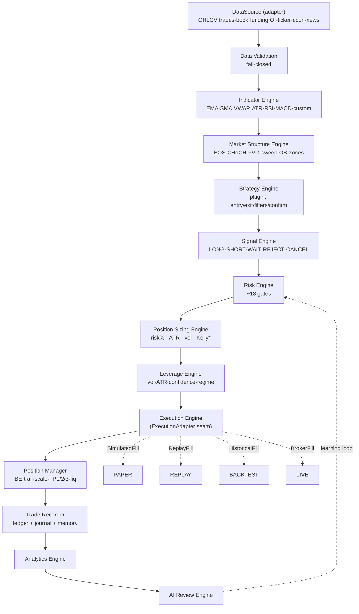

# TradeLogX Nexus — Trading Engine Specification (TES)

*Seventh and final blueprint in the series: `PRD` → `APP_FLOW_AUDIT` → `TRD` → `SAD` → `DDS` → `API_SPEC` → **TES**. This is the official blueprint for the engine that powers Paper Trading, Replay, Backtesting, and Live Trading. It must be modular, deterministic, event-driven, and production-ready — with **one shared core** and only the execution adapter differing per mode.*

> **Version 1.0 · 2026-07-22 · Target: single `TradeCore` + pluggable execution adapters**

---

## Reading guide — as-built vs. target (read first)

Consistent with the SAD/DDS/API spec, every component is tagged: 🟢 **EXISTS** · 🟡 **PARTIAL** · 🔴 **NEW/TARGET**.

**The single most important finding, stated plainly:** *Today there is **no single shared core engine.*** The system runs **four-to-five independent bar loops** that share only low-level primitives (the `Bar`/`Signal` types, the `bot/data/indicators.py` module, `RiskConfig` sizing math, and the `Strategy.on_bar→generate` contract):

| Mode | As-built entry point | Its own loop? | Its own fills/exits? |
|---|---|---|---|
| **Paper (flagship)** | `services/auto_engine.py :: AutoStrategyEngine` | yes | `SignalPipeline` + `PaperExecutionEngine` + fill model + `TradeManager` |
| **Replay** | `services/replay.py :: build_replay` | yes | **own** TP1/BE/TP2, **own** indicators |
| **Backtest (root/CLI)** | `bot/backtester.py :: Backtester` | yes | `PaperBroker` + `RiskManager`, T3/T4 mgmt |
| **Backtest (hub lab)** | `automation-hub/backtest.py :: run` | yes | own metrics/accounting |
| **Live (Bots)** | `bots/live_runner.py :: LiveBotRunner` | reuses root `Backtester.step()` | root broker for decisions + `RealOrderRouter` (dry-run) |

The **signal-generation brain is largely shared**; the **bar-processing / fill / exit logic is duplicated 4–5×**. That duplication is the root risk this spec exists to eliminate: *strategy behaviour cannot be guaranteed identical across modes when each mode re-implements the loop.* The target (§2, §9, §20) is a **single `TradeCore`** consumed by all four modes through one **`ExecutionAdapter`** seam — the only thing that differs between simulation and live. This document specifies that core, and honestly marks how far each piece already exists.

Other grounded truths that shape the design: **live-exchange order placement is a stub** (`execution/live_execution.py` raises `NotImplementedError`; `ExecutionEngine` defaults to `dry_run`); **leverage/margin/liquidation are analytical only** (never executed); **SMC has BOS/CHoCH/FVG/sweeps but no order-blocks or premium/discount**; **the shared indicator module has only ATR/EMA/RSI** (SMA/VWAP/MACD/Bollinger/Supertrend live only inside `replay.py`); and everything is **single-owner, single-process** today (SAD §11 / DDS).

---

## 1. Executive Summary

The engine's job is to turn a stream of market bars into recorded, explained trades — identically across four modes. The design rests on five pillars:

1. **One core, four adapters.** A single deterministic `TradeCore` runs the full pipeline (data → indicators → structure → strategy → signal → risk → sizing → leverage → execution → position management → recording → analytics → AI review). Modes differ **only** in the injected `ExecutionAdapter` (`SimulatedFill` for paper, `ReplayFill` for replay, `HistoricalFill` for backtest, `BrokerFill` for live) and the `DataSource`. This is the contract that makes paper == replay == backtest == live in strategy behaviour.
2. **Deterministic by construction.** Same inputs (bars + seed + config) → bit-for-bit same decisions. The only entropy (realistic-fill jitter) is explicitly seeded; the default fill is exact.
3. **Event-driven, explainable.** Every bar produces a Decision Report; every gate that fires is recorded with its reason; every trade carries the full "why" (entry, rejection, sizing, stop/TP moves, exit) into durable stores. A quiet engine is never a black box.
4. **Fail-closed safety.** Data-quality, kill-switch, drawdown, loss-cap, correlation, exposure, event-risk, and duplicate-order guards sit in front of every entry; exits are never blocked; exceptions in any subsystem can never crash the loop or trade on stale data.
5. **Modular & hot-swappable.** Strategies are plugins conforming to one interface; indicators and structure detectors are reusable pure functions; the execution adapter, data source, and fill model are injected, not hard-wired.

**Maturity today:** the flagship paper engine, the ~18-gate risk pipeline, deterministic backtesting, replay with controls, decision recording, and rule-based AI review are **real and battle-used**. The gaps are **architectural convergence** (unify the 4–5 engines behind one core), **live execution** (currently a stub), and **leverage/derivatives** (analytical only). **Engine readiness score: 5.5 / 10** (§19) — a strong, honest, deterministic simulation core whose main debt is duplication, not correctness.

---

## 2. Trading Engine Architecture

### 2.1 The shared core (target)


**The seam is `ExecutionAdapter`.** Everything above `EX` is mode-agnostic and runs identically; everything below is a thin adapter. This is the architectural commitment that satisfies "strategy logic behaves identically across all modes."

### 2.2 Component catalog
| Stage | Responsibility | As-built module | Tag |
|---|---|---|---|
| **DataSource** | Deliver validated bars/derivatives per symbol·tf | `data/market_data.py::get_bars`, `data/ws_feed.py`, `data/historical.py` | 🟢/🟡 |
| **Data Validation** | Reject stale/gapped/bad data, fail-closed | `services/market_quality.py::MarketQualityGate` | 🟢 |
| **Indicator Engine** | Pure, reusable indicator functions | `bot/data/indicators.py` (ATR/EMA/RSI) + dup in `services/replay.py` | 🟡 |
| **Market Structure** | SMC detectors | `strategies/smc_strategy.py` | 🟡 |
| **Strategy Engine** | Plugin strategies → signals | `strategies/*` (`base_strategy`, `brain`, `smc`, `custom`) | 🟢 |
| **Signal Engine** | Normalize signal + context + confidence | `strategies/brain.py`, `services/decision_gate.py` | 🟢 |
| **Risk Engine** | ~18 pre-trade gates | `services/signal_pipeline.py::SignalPipeline` | 🟢 |
| **Position Sizing** | risk% / ATR / vol / notional caps | `risk/position_sizing.py`, `services/risk_engine.py` | 🟢 |
| **Leverage Engine** | Dynamic leverage (analytical today) | `services/risk_engine.py` (reporting only) | 🟡 |
| **Execution Engine** | Place/fill orders (the adapter) | `execution/paper_engine.py` + `services/fill_model.py`; live = stub | 🟡 |
| **Position Manager** | Manage open→close lifecycle | `services/trade_manager.py`, `auto_engine._check_exit` | 🟡 |
| **Trade Recorder** | Durable trade + decision trail | `data/{ledger,cycle,decision,skipped}_store`, `journal`, `trade_memory` | 🟢 |
| **Analytics Engine** | Metrics, equity, distributions | `services/performance.py`, `bot/metrics.py` | 🟢 |
| **AI Review Engine** | Post-trade review + learning | `services/{coach,learning,counterfactual}.py`, `trade_memory` | 🟢 |
| **Orchestrator** | The 24/7 loop | `services/auto_engine.py::AutoStrategyEngine` | 🟢 |

---

## 3. Complete Trade Lifecycle

```mermaid
sequenceDiagram
  participant L as Orchestrator (loop)
  participant I as Indicators+Structure
  participant S as Strategy
  participant R as Risk (18 gates)
  participant Z as Sizing+Leverage
  participant X as ExecutionAdapter
  participant P as Position Manager
  participant D as Recorder/Analytics/AI

  L->>L: receive closed candle (per symbol·tf)
  L->>I: update indicators + market structure
  L->>S: strategy.on_bar(bar) → Signal(LONG/SHORT/WAIT)
  alt open position exists
    L->>P: check exits (stop/target/trail/time/TP ladder)
    P-->>X: reduce/close order → fill
    X-->>D: record exit + re-learn
  end
  S->>R: candidate signal
  R->>R: controls→data-quality→dedup→exposure→correlation→loss caps→session→…
  alt any gate fails
    R-->>D: reject() → skipped_store + decision_store + counterfactual grade
  else all pass
    R->>Z: size = f(risk%, ATR, stop, multipliers); leverage = f(vol,conf,regime)
    Z->>X: submit order (market/limit/stop, Idempotency-Key)
    X-->>P: FillResult(price, size, fees)
    P->>D: record entry (ledger + journal + memory), mark decision executed
  end
  L->>D: build cycle report (EVERY bar, incl. WAIT/SKIP) → cycle_store
  D->>D: analytics rollup → AI review (nightly/weekly) → learning feeds back to R
```

**As-built cycle order** (`auto_engine._process_bar`, verified): shadow-candidate → counterfactual resolve → approvals expire → pending resting-limit fills → exit checks → `strategy.on_bar` → `_on_signal` (brain gate → pipeline) → cycle report. This matches the target lifecycle; the target formalizes it into the `TradeCore` so replay/backtest/live run the *same* sequence.

---

## 4. Market Data Flow

### 4.1 Inputs & the data ladder (🟢 `data/market_data.py::get_bars`)
Resolution order, fail-closed on real assets: **Yahoo** (non-crypto, never synthesized) → **local cached real Binance candles** (`data/historical.py`) → **live ccxt** (`HUB_USE_LIVE_DATA`) → **bundled sample CSV** → **deterministic synthetic** (`bot/data/synthetic.py`, seeded). `HUB_REQUIRE_REAL_DATA=1` forbids the sample/synthetic fallback. Live streaming via `data/ws_feed.py` (`ccxt.pro watch_ohlcv`, background thread, thread-safe cache, REST fallback).

| Feed | Target source | As-built |
|---|---|---|
| **OHLCV** | WS stream + REST backfill, per symbol·tf | 🟢 (`get_bars`, `ws_feed`) |
| **Ticker** | last/bid/ask | 🟡 (`services/quote_provider.py`) |
| **Trades / Order book** | tick/depth for microstructure | 🔴 |
| **Funding rate** | perp funding | 🟢 (`services/funding.py`, `/market/funding`) |
| **Open interest** | derivatives OI | 🔴 (provider defined, not persisted) |
| **Volume** | from OHLCV | 🟢 |
| **Economic events** | macro calendar blackout | 🟢 (`services/econ_guard.py`) |
| **News / sentiment** | headline/sentiment context | 🟡 (`services/{news,sentiment,market_context}.py`) |

### 4.2 Validation & resilience (🟢 `MarketQualityGate`, fail-closed)
- **Missing/gapped candles:** detect non-contiguous `open_time`; forward-fill is **forbidden** for decisions — a gap → data-quality reject (no trading on interpolated bars). Backfill fills gaps from REST before the bar is eligible.
- **Delayed feeds / staleness:** bar age vs. timeframe budget; stale → gate fails closed (no entry), exits still allowed.
- **Exchange outage:** WS reconnect with backoff (1 s→30 s); REST fallback; if both fail, the engine emits `feed_status: degraded` (surfaced at `/health/bot`) and **stops opening** while continuing to manage/close open positions.
- **Invalid prices:** non-positive/NaN/│Δ│ beyond a sane band → reject the bar, alert.

---

## 5. Strategy Engine Design (plugin)

### 5.1 The plugin contract (🟢 `strategies/base_strategy.py`, `strategies/custom.py`)
Every strategy is a hot-swappable plugin implementing one interface:
```python
class Strategy(Protocol):
    id: str; version: str
    def warmup(self) -> int: ...                 # bars of history needed
    def on_bar(self, bar: Bar, ctx: Context) -> Signal: ...   # pure, deterministic
```
`ctx` exposes indicators, market structure, HTF bias, regime, and account state — the strategy **reads**, never mutates engine state. A strategy declares seven rule groups (mapped to DDS `strategy_versions` + rule tables):
**Entry · Exit · Risk · Filters · Confirmation · Timeframe · Position** rules. Custom strategies compile from the visual builder's `spec_json` (`services/strategy_builder.py`); built-ins (`smc`, `ema`, `rsi`, `brain`) ship in-tree.

### 5.2 Hot-swap without touching the engine (🟢/🟡)
The engine holds a `strategy_id → instance` registry; swapping a strategy or promoting a new `strategy_version` rebinds the reference between bars (never mid-bar). Because `on_bar` is pure and the core owns risk/sizing/execution, a strategy change can never alter engine safety behaviour — only signal generation. **Today** the AutoStrategyEngine binds one strategy per symbol; the target adds the multi-strategy registry + per-version pinning (DDS `bot_instances.strategy_version_id`).

### 5.3 Multi-timeframe / multi-asset / multi-strategy
- **MTF:** `services/mtf_engine.py` + `strategies/brain.htf_bias` compute a higher-timeframe bias consumed as a confirmation rule. Target: first-class MTF context in `ctx` (aligned, look-ahead-safe).
- **Multi-asset / multi-symbol:** the loop iterates a symbol set, each with isolated indicator/structure/strategy state (🟢).
- **Multi-strategy:** target — N strategies per account via the Fleet/allocation model (DDS `portfolio_allocations`), each an independent `TradeCore` instance sharing the risk budget.

---

## 6. Risk Engine Design (the gate pipeline)

### 6.1 The ~18-gate chain (🟢 `SignalPipeline._process`, lock-serialized)
Every candidate entry passes, in order, through gates that **reject early** and record why. Exits bypass entry gates (a stop must always be honorable).

```mermaid
flowchart LR
  A[signal] --> C1[controls / kill-switch]
  C1 --> C2[market_quality*fail-closed]
  C2 --> C3[dedup]
  C3 --> C4[max_open_positions]
  C4 --> C5[correlation cluster]
  C5 --> C6[event_risk / econ]
  C6 --> C7[learning block]
  C7 --> C8[drawdown circuit]
  C8 --> C9[trading_day / session]
  C9 --> C10[daily / weekly loss]
  C10 --> C11[loss-streak / cooldown]
  C11 --> C12[max_trades_per_day]
  C12 --> C13[sizing]
  C13 --> C14[per-trade exposure]
  C14 --> C15[portfolio_exposure]
  C15 --> OK[execute]
```


Two gates sit **upstream** in the orchestrator: a **brain quality-score** gate and a **cross-asset context** gate; every evaluated signal is written to `decision_store` *before* any trade.

### 6.2 What each validates (target-complete; 🟢 unless noted)
Maximum risk % · maximum drawdown (circuit breaker → halt) · daily/weekly/**monthly** loss (monthly 🔴) · exposure (per-trade + portfolio notional) · correlation (same-direction cluster cap) · maximum positions · session/trading-day windows · loss-streak + cooldown · max-trades/day · event/econ blackout · learned blocks (falsified by counterfactuals) · **margin / leverage limits** (🟡 analytical). Each breach → `reject(stage, reason)` → `skipped_store` + `decision_store.failed_json` + optional counterfactual grade. Circuit breaker blocks **new** entries only; `resume()` rebaselines.

### 6.3 Determinism & isolation
Serialized by an `RLock` so concurrent alerts can't race the account state; every optional subsystem is wrapped `try/except` "must never block trading"; the data-quality gate is the one that fails **closed**.

---

## 7. Position Sizing Design

### 7.1 Core formula (🟢 `risk/position_sizing.py` → `bot/risk.py::RiskConfig`)
```
risk_per_unit = |entry − stop|
qty           = (equity × risk_per_trade_pct × Πmultipliers) / risk_per_unit
notional_cap  = equity × max_position_pct
qty           = min(qty, notional_cap / entry)          # never exceed the cap
```
**Multiplier stack** (`signal_pipeline`, applied before sizing): `eff_risk *= kelly × equity_curve × learned × allocator × event × edge_boost × context × side × streak`. Every multiplier is bounded and logged so the *effective* risk % of any trade is reconstructable.

### 7.2 Methods (🟢 `services/risk_engine.py::position_size`, `/risk/position-size`)
`fixed` · `percent` · **`atr`** (`stop_dist = atr × atr_mult`, `size = dollar_risk / stop_dist`) · `vol_adjusted`. Returns `risk_amount, position_size, notional, margin (=notional/leverage), expected_loss, expected_profit (=size×|tp−entry|), R:R`. **Kelly** is a first-class multiplier today and the roadmap sizing method (🔴 full Kelly).

### 7.3 Outputs the spec requires
Risk amount · position size · contract size (per-symbol `lot_size`/`tick_size` from DDS `symbols`) · margin · expected loss · expected profit · dynamic size (the multiplier stack) · Kelly (future). Contract/tick rounding is a target addition for live venues.

---

## 8. Leverage Logic

**Status: analytical only (🟡) — never executed.** `risk_engine.position_size` computes `margin` and an isolated-margin liquidation estimate for display; the paper engine opens **spot/risk-based** positions with no leverage; the grid engine treats `leverage` as a notional multiplier with no margin/liquidation. The paper P&L is float (fine for sim; DDS mandates `NUMERIC(20,8)` for live).

**Target dynamic leverage engine** (🔴): `leverage = clamp( base × f(volatility/ATR) × f(confidence) × f(regime) , 1, max_allowed )`, where higher ATR / lower confidence / risk-off regime → lower leverage, bounded by the connection's `max_leverage` and the risk profile. Leverage selection is recorded ("why leverage changed") and feeds margin + liquidation-price computation that the **live** execution adapter actually applies.

---

## 9. Execution Engine Design — the `ExecutionAdapter` seam (the crux)

### 9.1 The one interface all modes share (🔴 the unifying target)
```python
class ExecutionAdapter(Protocol):
    def submit(self, order: Order) -> FillResult: ...     # market/limit/stop/…; idempotent
    def cancel(self, order_id: str) -> None: ...
    def positions(self) -> list[Position]: ...
    def reduce(self, position_id: str, qty: Decimal) -> FillResult: ...
```
`Order` carries `symbol, side, type ∈ {market,limit,stop,stop_limit,trailing_stop}, qty, price, flags ∈ {reduce_only, post_only, IOC, FOK}, client_order_id`. **The core builds identical `Order` objects in every mode**; the adapter decides how they fill:

| Adapter | Fill logic | As-built |
|---|---|---|
| **SimulatedFill** (paper) | fill model: perfect or realistic (spread/2 + slippage + latency) + round-trip fees | 🟢 `execution/paper_engine.py` + `services/fill_model.py` |
| **ReplayFill** | historical bar match, same fill model | 🟡 (replay has its own path today) |
| **HistoricalFill** (backtest) | next-bar/close fill, same fill model | 🟡 (root backtester's own) |
| **BrokerFill** (live) | ccxt/broker order + reconciliation | 🔴 **stub** (`LiveExecutionEngine` → `NotImplementedError`; `ExecutionEngine` default `dry_run`) |

### 9.2 Fill model (🟢 `services/fill_model.py`)
Default **`PerfectFill`** (exact, deterministic). **`RealisticFill`**: `cost = 0 if maker else cost_pct`; `fill = price × (1 ± cost)`; optional **seeded** reject/partial probabilities (default 0 → deterministic). Fees: `rate × size × (|entry| + |exit|)`, maker vs taker via `fee_pct`. Selected at boot (`HUB_FILL_MODEL=realistic`). **This is what makes paper "behave like live."** Grid fills are deterministic price-through-level matches.

### 9.3 Order types (target parity; sim must mirror live semantics)
Market · Limit (resting; `_check_pending` fills when price crosses) · Stop · Stop-limit · Trailing-stop · Reduce-only · Post-only · IOC · FOK. **Today** paper supports market + resting-limit + stop/target exits; the rest are target — and crucially, the **simulated adapter must implement the same order-type semantics as the live adapter** so behaviour is identical (the spec's core requirement).

### 9.4 Why this design
Because the *only* difference between paper, replay, backtest, and live is which `ExecutionAdapter` (and `DataSource`) is injected, a strategy that behaves a certain way in backtest is **guaranteed** to behave identically in paper and live — the property the current 4–5-engine reality cannot guarantee. Convergence plan in §20.

---

## 10. Position Management Design

### 10.1 Managed lifecycle (target-complete)
Open → (scale-in) → break-even move → trailing stop → **TP1/TP2/TP3 ladder** (partial closes) → runner → forced/manual close → (live: liquidation). All expressed in **R multiples** so behaviour is symbol-agnostic and identical across modes.

### 10.2 As-built (honest)
- **`services/trade_manager.py::TradeManager.on_bar`** (🟢) — break-even, single scale-out, trailing, time-stop in R units. **Disabled by default** (a *measured* decision — the module docstring records out-of-sample R results showing the passive config won). `max_hold_bars=150` is the only active manager.
- **Partial close** is real (`PaperExecutionEngine.reduce` = close-then-reopen remainder); **manual/forced close** via `/paper/close`; **stop/target exits** via `auto_engine._check_exit`; **orphan adoption** after restart.
- **TP1/TP2/TP3 laddering** exists only in the **replay** engine (`services/replay.py`: TP1 partial + BE + TP2 runner) and the **root backtester** (T3/T4) — *not* in the live paper engine. **Liquidation** is not implemented (analytical estimate only).
- **Target:** lift the multi-stage TP ladder + trailing + BE into the shared `PositionManager` so all modes share one exit engine (removing the replay/backtester/paper divergence), with liquidation handled by the live adapter.

Every management action records **why** (stop moved, TP moved, scaled, closed) into the decision trail (§11).

---

## 11. Bot Decision Engine (explainability)

Every trade and non-trade is fully explained across four durable stores (🟢):
- **`cycle_store`** — one row **per bar**, including WAIT/SKIP: `decision, score, report_json`. Proves the engine never acts (or idles) silently.
- **`decision_store`** — every accept/reject with component scores (`setup_quality_score, volume_score, rr_score, confidence`), `passed_json`/`failed_json`, `regime`, `htf_bias`, `executed`.
- **`skipped_store`** — every rejection with the failing gate + market snapshot, gate→category mapped.
- **`journal` + `trade_memory`** — 8-category permanent per-trade memory, similarity-searchable.

The **Decision object** (`services/decision_gate.py::build_decision`) maps a brain verdict → `{setup_quality_score, passed_rules, failed_rules, decision, reason, components}`, with an honest fallback when the quality gate is disabled. This already satisfies the spec's "record why trade taken/rejected/leverage changed/size changed/stop moved/TP moved/closed + confidence + market condition + strategy version" — the remaining target is attaching `strategy_version_id` to every record (DDS) and the leverage/TP-move reasons once those engines are live.

---

## 12. Paper Trading Design

**Requirement: paper uses the exact same engine as live; only execution differs.** Target: paper = `TradeCore` + `SimulatedFill` adapter + live `DataSource`. **Today** (🟢) the flagship paper engine (`AutoStrategyEngine`) already runs the full pipeline, real gates, real sizing, and a realistic fill model — *no fake logic, no simplified math* — but it is a **separate implementation** from backtest/replay. The convergence (§20) makes paper literally the same core as the other modes, with `SimulatedFill` the only substitution. Paper P&L must move to `NUMERIC(20,8)` (from float) as part of live-readiness.

---

## 13. Replay Engine Design

Replay steps historical candles one-by-one through the **same core**, with `ReplayFill`. Controls: **play · pause · step-forward · step-back · speed**. Deterministic (seeded batch loader). **Today** (🟡) replay is a *separate* engine (`services/replay.py::build_replay`) with its own indicators and its own TP1/BE/TP2 exits — richer exits than the live engine, but divergent. Target: replay becomes `TradeCore` driven by a cursor over historical bars (DDS `replay_sessions` persists cursor/state for resumable, shareable sessions), so **every replay decision provably matches live logic** — which it cannot fully guarantee today because the code paths differ.

---

## 14. Backtesting Design

Backtest = `TradeCore` + `HistoricalFill` + historical `DataSource`, **fully deterministic**. **Today** (🟡) two backtesters exist — the root `bot/backtester.py::Backtester` (event-driven, seeded, the CLI/walk-forward/Monte-Carlo engine, genuinely deterministic: `synthetic.generate_bars(seed=42)` is bit-for-bit reproducible) and the hub `automation-hub/backtest.py::run` (its own loop/metrics). The root backtester is the **only** place backtest and "live" already share a core (`LiveBotRunner` reuses `Backtester.step()`). Target: fold both into `TradeCore` so backtest uses the identical risk/sizing/execution/analytics as paper and live — the spec's "same strategy, same risk, same sizing, same execution, same analytics, deterministic results" requirement. Walk-forward (`bot/walkforward.py`), Monte-Carlo, and out-of-sample labs remain as harnesses **over** the shared core.

---

## 15. Live Trading Design

**Status: the biggest gap (🔴).** Live order placement is a **stub** — `execution/live_execution.py::LiveExecutionEngine` raises `NotImplementedError`; `ExecutionEngine` defaults to `dry_run` returning `"dry-run:…"`; only `bots/live_runner.py` + `RealOrderRouter` wire a real ccxt/alpaca/oanda broker, gated by `execution/safety.py`, and the flagship paper engine never touches it.

**Target `BrokerFill` adapter** manages the full live order lifecycle the sim collapses:
- **API keys** — encrypted per-connection (DDS `exchange_api_keys`, decrypt only in the worker).
- **Order placement** — idempotent (`client_order_id` UNIQUE), `Idempotency-Key` on the API.
- **Order monitoring** — poll/stream order status; new→partial→filled→cancelled; reconcile `order_executions`.
- **Partial fills** — accumulate `filled_qty`, average price from executions (never estimated).
- **Slippage** — measured (fill vs. intended) into execution-quality analytics.
- **Network failures / exchange errors / retries** — `execution/safety.py::RetryPolicy` + `CircuitBreaker`; idempotency makes retries safe.
- **Reconciliation loop** — on reconnect, fetch open orders/positions from the venue and reconcile against the ledger before acting.

Live also needs the **per-tenant engine** (SAD §11) and real money precision — both DDS/SAD flip-criteria items — before `HUB_MULTI_USER=1` or real capital.

---

## 16. Logging Architecture

Every event is recorded (🟢 today, formalized to DDS tables in target):
| Event | As-built sink | Target table (DDS) |
|---|---|---|
| Every candle/cycle | `cycle_store` | `bot_decisions` |
| Every signal / decision | `decision_store` | `bot_decisions` + `confidence_scores` |
| Every rejected trade | `skipped_store` | `signals(status=rejected)` |
| Every order / fill | `ledger.paper_trades` / `bot_logs` | `orders` + `order_executions` |
| Every position update | position events | `position_history` |
| Every exit | `journal`, `trade_memory` | `trade_journal` |
| Every error / warning | `bot_logs(level)` | `bot_events` + `system_logs` |

Structured, staged (`webhook|dedup|risk|sizing|execution|engine`), leveled (`info|warning|error`), retention-bounded (SAD), and streamed to the client (SSE today → WS gateway target, API spec §5). Correlation via `X-Request-Id` / `bot_id` tags. **Principle: the log is the audit trail — a decision you can't explain from the logs is a bug.**

---

## 17. Error Recovery Strategy (failsafe system)

Defense-in-depth (🟢 mostly real):
- **Duplicate orders** — `services/dedup.py::DuplicateGuard` (pipeline stage 2) + live `RealOrderRouter._open_symbols` + `client_order_id` UNIQUE (DDS) → duplicate submit is a no-op.
- **Network disconnects / API timeouts** — WS reconnect backoff; REST fallback; `RetryPolicy` with idempotency; degraded-feed → stop-opening-not-closing.
- **Exchange downtime** — circuit breaker; reconciliation on recovery.
- **Invalid prices** — data-quality gate fails closed; sane-band rejection.
- **Negative balances** — sizing capped by `available_balance`; live adapter pre-checks margin; `INSUFFICIENT_BALANCE` error.
- **Runaway loops** — bounded loop interval; the 1000-agent-style backstops; per-day max-trades gate; cooldowns.
- **Unexpected exceptions** — the engine thread catches all (`_run`, `_route`); every optional subsystem is `try/except` "must never block trading"; a bad bar can never crash the loop or trade on stale state.
- **Kill switches** — `controls.TradingControl` (pause/stop/resume), `/emergency-stop`, drawdown/loss-streak/daily/weekly `_engage_halt` (blocks entries, never exits), econ blackout. All consulted **first**.
- **Crash recovery** — engine states coerced to Stopped on reload (threads don't survive restart); open positions **adopted** from the ledger; grid/replay state persisted (DDS `replay_sessions`, grid snapshot).

---

## 18. Performance Optimization Plan

| Target | Approach | As-built |
|---|---|---|
| **Low latency per bar** | O(1) incremental indicators (rolling, not recompute); structure detectors incremental | 🟡 (some full-series recompute) |
| **Minimal memory** | bounded deques for bars/events; stream, don't hold history | 🟢 (`deque(maxlen=…)`) |
| **High throughput** | vectorize hot indicators; cache HTF bias; short-TTL market snapshot cache | 🟡 (`services/ttl_cache.py`) |
| **Concurrent strategies** | per-strategy `TradeCore` instances; shared read-only market state | 🔴 (one strategy/symbol today) |
| **Concurrent exchanges/tenants** | queue-driven per-tenant workers (SAD §11) | 🔴 (single in-proc loop) |
| **Scalable data** | partitioned candles + continuous aggregates (DDS §7) | 🟡 |
| **Determinism preserved** | all of the above must not introduce unseeded entropy | 🟢 (seeded) |

The real scaling blocker is architectural (single in-process engine, SAD §11), not per-bar speed. The convergence to `TradeCore` (§20) is the prerequisite for safe concurrency: one correct core, instantiated N times, beats N divergent loops.

---

## 19. Testing Strategy

**Unit** — indicators (golden vectors), each risk gate (pass/reject), sizing math (risk%/ATR/caps), fill model (perfect deterministic; realistic seeded), SMC detectors (BOS/CHoCH/FVG/sweep on fixture bars).
**Integration** — full lifecycle candle→signal→gates→size→fill→manage→close→record→review; each gate's reject lands in `skipped_store`; decision recorded before trade.
**Cross-mode equivalence (the flagship test, 🔴 today)** — feed **identical bars + seed + config** through paper, replay, backtest, and live-dry-run; assert **identical decisions, entries, exits, and P&L** (bit-for-bit where fills are perfect; within tolerance under seeded realistic fills). *This is the test that proves the shared-core property and is impossible to pass today because the engines diverge — passing it is the definition of done for §20.*
**Replay tests** — determinism across pause/step/seek; step-back reproduces prior state.
**Paper validation** — `services/paper_validation.py` gates paper→live readiness.
**Backtest validation** — determinism (same seed → same equity curve), walk-forward, out-of-sample, Monte-Carlo (`bot/walkforward.py`, backtest-lab).
**Live validation** — dry-run against a testnet; reconciliation correctness; idempotent retries book once.
**Regression** — snapshot key strategies' trade lists; a code change that alters them fails CI unless intended.
**Stress** — high-frequency bar bursts; 1k concurrent positions; feed-outage injection; exception injection per subsystem (must never crash the loop).

Current real coverage: **870 backend + 96 root tests green** (deterministic backtester, ATR sizing, risk limits, trade management, indicators, walk-forward, grid runner). The gap is the **cross-mode equivalence suite** — which can't exist until the core is unified.

---

## 20. The convergence plan (as-built → single shared core)

Non-breaking, incremental — the property the whole spec turns on. Order:

1. **Define `TradeCore` + `ExecutionAdapter` + `DataSource` interfaces** around the *existing* pipeline (the flagship `SignalPipeline` + `PaperExecutionEngine` is the seed core).
2. **Extract the paper engine's fill logic behind `SimulatedFill`** (already close — `fill_model` is injectable).
3. **Re-point replay** at `TradeCore` + `ReplayFill` (retire `replay.py`'s private loop/indicators/exits); lift its TP1/BE/TP2 ladder into the shared `PositionManager`.
4. **Re-point the hub backtest-lab** at `TradeCore` + `HistoricalFill`; keep walk-forward/MC as harnesses.
5. **Unify the two backtesters** — make the root `bot/backtester.py` a thin `HistoricalFill` adapter over `TradeCore` (it already backs "live," so this also aligns live).
6. **Implement `BrokerFill`** (real live execution) behind the same interface, gated by `execution/safety.py` + reconciliation.
7. **Add the cross-mode equivalence CI suite** (§19) and make it a merge gate.
8. **Move money to `NUMERIC(20,8)`**, attach `strategy_version_id` everywhere, add per-tenant engine instances (SAD §11).

Each step is shippable and reversible; after step 5 the equivalence test can pass for sim modes; after step 6 it covers live.

---

## 21. Trading Engine Readiness Score

| Dimension | Score | Notes |
|---|---:|---|
| **Signal generation / strategy** | 8/10 | Real brain, SMC (BOS/CHoCH/FVG/sweep), MTF bias, plugin strategies, custom builder. |
| **Risk engine** | 8/10 | ~18 real gates, circuit breakers, correlation/exposure/loss caps — genuinely strong. |
| **Position sizing** | 7/10 | risk%/ATR/vol + bounded multiplier stack; Kelly partial; needs contract/tick rounding. |
| **Leverage** | 2/10 | Analytical only; never executed. |
| **Execution (sim)** | 7/10 | Real fill model (perfect + seeded realistic), fees, resting limits, grid. |
| **Execution (live)** | 2/10 | Stub / dry-run; real routing exists only on the Bots path, unreached by the flagship engine. |
| **Position management** | 5/10 | Real but disabled-by-default (measured); TP ladder only in replay/backtester, not live. |
| **Shared-core determinism** | 3/10 | Deterministic *within* each engine, but **4–5 divergent engines** — no cross-mode guarantee. |
| **Explainability / recording** | 9/10 | Every bar + every reject + every trade durably explained. Best-in-class here. |
| **Failsafes** | 8/10 | Kill switch, halts, dedup, fail-closed data, exception isolation, crash recovery. |
| **Data engine** | 6/10 | Honest fail-closed real-data ladder + WS feed; missing book/OI/trades persistence. |
| **Performance / scale** | 4/10 | Single in-process loop; some full-series recompute; scaling is architectural. |
| **Testing** | 6/10 | Strong deterministic suites; missing the cross-mode equivalence gate. |

### **Overall: 5.5 / 10** — *"Excellent, honest, deterministic simulation brain; fragmented into several engines and not yet live-capable."*

The intelligence, risk discipline, and explainability are genuinely strong (8–9). The score is held back by exactly two structural facts this spec targets: **(1) no single shared core** — the flagship paper engine, replay, both backtesters, and the live path are separate loops, so identical cross-mode behaviour is asserted, not proven; and **(2) live execution + leverage are stubs/analytical.** Neither is a correctness bug in what exists — they're convergence and completion work. Executing §20 (unify behind `TradeCore`/`ExecutionAdapter`) plus the live adapter lifts this to **8.5+/10**, at which point paper == replay == backtest == live is a tested guarantee, not a hope.

---

*End of Trading Engine Specification v1.0. Implement in the order of §20; the definition of done is the §19 cross-mode equivalence suite passing. Consistent with SAD §11 (engine scaling), DDS (trade/order/execution tables), and API §2.6–2.7 (live/bot endpoints). This document completes the seven-part blueprint set.*
