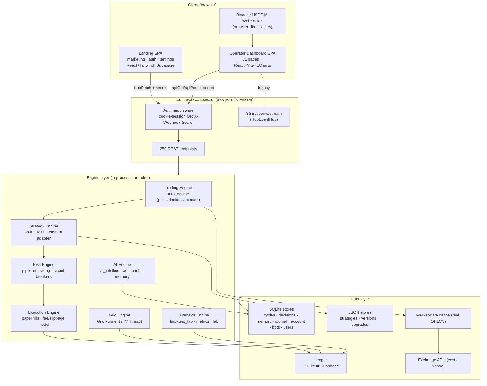
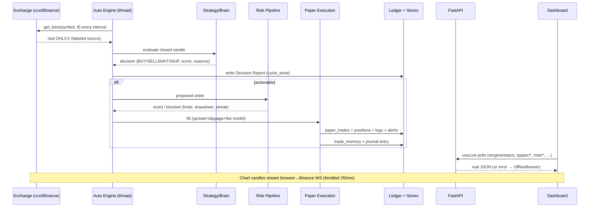
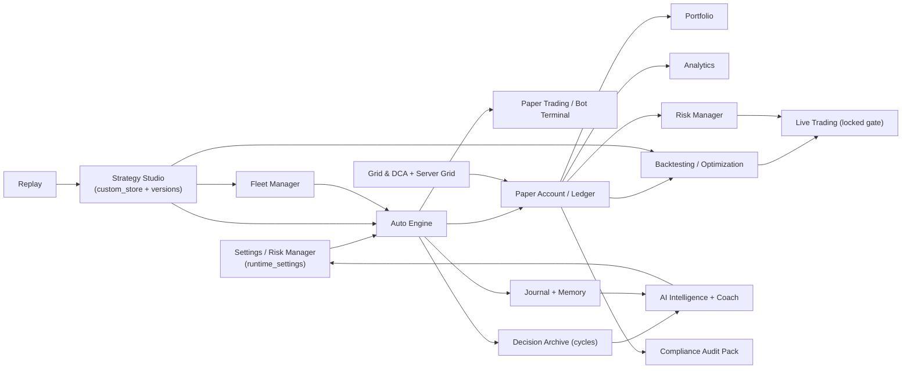

# TradeLogX Nexus — Technical Requirements Document (TRD)

*Platform audit and production-readiness specification. Audited from the live codebase — every number and endpoint here was verified against the source, not assumed. Paper-trading platform; live execution is gated and not yet implemented.*

**Version:** 1.0-draft · **Audited:** 2026-07 · **Scope:** `automation-hub` (FastAPI backend), `automation-hub-dashboard` (operator SPA), `tradexa-landing` (marketing + auth + settings SPA)

---

## 0. Executive summary

TradeLogX Nexus is a **single-operator, paper-trading intelligence platform**: a FastAPI engine that turns real market data into explainable paper trades, wrapped in two React SPAs. It is **feature-complete and internally honest** — the audit found **zero un-labeled fabricated data** anywhere in the product; every metric is either a live backend read or a clearly-labeled marketing demo.

**Overall production-readiness: 7.6 / 10** for its actual scope (single-tenant paper OS). It is production-ready to deploy and operate today for one owner. It is **not yet a multi-tenant SaaS** — that requires per-user identity/data isolation, live execution, and horizontal scaling, all detailed in §16 (Roadmap to v1.0).

| Dimension | Score | One-line verdict |
|---|---:|---|
| Backend architecture & correctness | 8.5 | 851 tests, honest data, sound threading; single-process |
| API design | 8.0 | 250 endpoints, consistent auth gating, typed models |
| Data / persistence | 7.0 | Clean schema + Supabase durability; free-tier disk is ephemeral |
| Authentication / authorization | 6.5 | Solid HMAC cookie + secret model, but **two disjoint auth systems** and weak defaults |
| Security | 7.0 | Constant-time, boot hardening, CSP, scoped secrets; `CORS *`, no rate limiting |
| Real-time / data flow | 8.5 | WS throttle+reconnect, deduped poller — excellent |
| Frontend architecture | 7.5 | Strict TS, lazy routes, shared poller; no unit tests, a11y unaudited |
| Data honesty (no mocks) | 10.0 | Zero unlabeled fakes — a genuine strength |
| Scalability | 5.0 | Single-process, single-owner, SQLite/JSON — fine single-tenant, not SaaS |
| Testing | 7.5 | Backend strong; dashboard E2E-only; landing untested |
| Deployment / ops | 7.0 | Docker→Render + Vercel, health checks, watchdog; manual Render deploy |

---

## 1. Technology stack (verified)

| Layer | Technology |
|---|---|
| Backend | Python 3.11, **FastAPI** + Uvicorn (stdlib-heavy core; `pyproject` core deps = none) |
| Market data | **ccxt** (Binance/Bybit USDT-M), Yahoo fallback, local OHLCV cache (`market_data.db`) |
| Persistence | SQLite (default) + JSON files under `HUB_DATA_DIR`; **Supabase** (optional) for durable settings/ledger mirror |
| Dashboard SPA | **React 18 + Vite 5 + TypeScript 5.5** (`strict`), ECharts 5, reactflow 11, lucide-react; hand-written CSS + tokens |
| Landing SPA | React 18 + Vite 5 + TS, **Tailwind 3.4**, framer-motion 11, react-router 6, react-hook-form + zod, `@supabase/supabase-js` |
| Real-time | Browser→Binance USDT-M **WebSocket** (klines); server **SSE** (`HubEventHub`, legacy path); `useLive` polling layer |
| Deployment | **Docker** image (backend serves both built SPAs single-origin) on **Render**; **Vercel** for the SPAs; `/health` checks |

---

## 2. System architecture

**Note on the requested "Execution Engine → Exchange APIs" layer:** execution today is **paper only** — the Execution Engine writes fills to the ledger using a spread/slippage/latency model. The `ccxt`/Yahoo "Exchange APIs" edge supplies **market data**, not order routing. Live order routing is the primary v1.0 gap (§16).

---

## 3. Data-flow diagram

---

## 4. API architecture

- **250 HTTP endpoints** — 207 in `routers/*.py`, 43 in `app.py`; `webhook_api.py` defines **0** (it is the aggregator + shared-singleton module: `pipeline, engine, paper, ledger, controls, approvals, bot_os`, plus `_check_secret` and the Pydantic models).
- **By method:** GET 152 · POST 91 · DELETE 5 · PATCH 2 → **152 read / 98 mutating**.
- **12 routers:** `ai` (8), `analytics` (84), `bots` (2), `engine` (20), `grid` (3), `health` (13), `journal` (24), `paper` (11), `risk` (6), `settings` (24), `symbols` (12), plus `app.py` UI/auth (43).

### Authorization tiers
| Tier | Meaning | Count |
|---|---|---|
| **public** | middleware-exempt (`/login`, `/signup`, `/health`, `/version`, `/webhook`, `/assets`, brand files) | ~15 |
| **session-or-secret** | passes `_require_auth`: valid `hub_session` cookie **or** `X-Webhook-Secret` header | ~178 |
| **secret-write** | additionally `_check_secret()` — needs the admin key (or webhook secret unless scoped) | **71** |
| **webhook-secret** | `POST /webhook/tradingview`, self-gated by `_check_webhook_secret` | 1 |

**Known API-authz gaps (documented, low severity for single-owner):**
- **8 mutating endpoints are session-only, not secret-gated** — all compute/simulation, no state mutation of trading records: `POST /risk/position-size`, `/strategy/custom/simulate`, `/strategy/custom/optimize`, `/control/simulate`, `/control/auto-tune`, `/control/compare`, `/strategy/ai-review`, `/evolution/experiment`. Acceptable (they don't touch money/records) but should be noted.
- Response shapes are conventionally typed on the client (`src/lib/api.ts` interfaces) but there is **no OpenAPI response-model enforcement** on most routes (FastAPI `response_model` is largely unused).

### Conventions
- Secret passed as `X-Webhook-Secret` header. Errors: `401 {"error": "Sign in required"}` (wall) / `401 "Invalid or missing credential"` (secret-write).
- CSV/JSON export routes (`/…/export?fmt=`) use same-origin cookie auth via `<a href>`.

---

## 5. Database relationship diagram

Dual-backend **Ledger** (`SqliteLedger` default ⇄ `SupabaseLedger` when `SUPABASE_URL/KEY` set & reachable; `get_ledger()` probes once, falls back safely). Everything else is SQLite/JSON under `HUB_DATA_DIR`, with a **Supabase mirror** for the three stores that must survive a free-tier redeploy.

```mermaid
erDiagram
  users ||--o{ user_settings : owns
  users ||--o{ bots : configures
  paper_trades ||--o| positions : "realizes"
  webhook_events ||--o{ paper_trades : "triggers"
  paper_trades ||--|| trade_memories : "remembered as"
  paper_trades ||--|| trade_decision_journal : "journaled as"
  cycle_reports ||--o{ decisions : "cycle contains"
  strategy_custom ||--o{ strategy_versions : "history"
  strategy_versions ||--o{ upgrades : "evolves"

  users { text username PK "PBKDF2 hash+salt, role" }
  user_settings { text username PK "namespace PK, data JSON — Supabase-mirrored" }
  bots { text id PK "name strategy symbol tf mode risk_json state" }
  webhook_events { text id PK "alert_id symbol side entry stop status reason" }
  positions { text id PK "symbol side size entry stop status pnl" }
  paper_trades { text id PK "symbol side size entry exit pnl rr source status opened/closed_at" }
  bot_logs { text id PK "ts level stage symbol message" }
  alerts { text id PK "ts severity category title detail read" }
  cycle_reports { text id PK "ts symbol tf price decision score report_json" }
  decisions { text id PK "ts symbol strategy side scores confidence decision reason executed" }
  trade_memories { text trade_id PK "full trade + grade + regime + sections_json + FTS — Supabase-mirrored" }
  trade_decision_journal { text trade_id PK "sections_json + events + evolution_memory" }
  skipped_trades { text id PK "ts symbol stage reason snapshot_json" }
  account_state { int id PK "singleton: initial current available realized unrealized" }
  strategy_custom { text id PK "definition + versions[30] + favorite/tags/folder (JSON file)" }
  strategy_versions { text vid PK "params stats gates{backtest,sim,paper,live} (JSON file)" }
  upgrades { text uid PK "suggestion lifecycle + approval history (JSON file)" }
```

**Storage inventory (physical):**
`hub.db` (bots, users, user_settings, _migrations) · `ledger.db` (webhook_events, positions, paper_trades, bot_logs, alerts, memory_reviews) · `cycles.db` · `decisions.db` · `trade_memory.db` (+FTS5) · `journal.db` · `skipped.db` · `account.db` · `watchlists.db` · `market_data.db` · JSON: `custom_strategies.json`, `strategy_versions.json`, `upgrades.json`, `lessons.json`, `journal.json`, `safety_state.json`, `providers.json`.
**Supabase-mirrored:** `user_settings` table + `__hub__/grid-state`, `__hub__/runtime-overrides`, `__probe__/__probe__`; and the `trade_memories`/`memory_reviews` mirror when `SupabaseLedger` is active.

---

## 6. Feature dependency map

**Critical path (a trade's lineage):** Settings→Engine→Strategy→Risk→Execution→Ledger→(Portfolio/Analytics/Risk/Audit). **AI feedback loop:** Ledger→Memory/Journal→AI Coach→AI Recommendations→Settings (one-click apply). Both are wired end-to-end today.

## 7. Per-feature audit

Each feature is audited across the 15 requested dimensions. **DB tables** reference §5. **Data source** is verified live unless noted. Legend for states: L=loading, E=error, S=success, ∅=empty.

### 7.1 Dashboard (`Overview.tsx`)
- **Purpose:** at-a-glance operator home — profitability, engine health, risk, activity.
- **User flow:** land post-login → scan equity/KPIs → drill into a card → act.
- **Functional:** answers "am I profitable / engine on / which strategy / warnings / drawdown / today's trades". Child cards: DashboardHero, MetricCards, EquityCurve, PerformanceOverview, MyBots, PnlDistribution, RiskCenter mini, Recent Alerts, Bot Activity, WhyNoTrades.
- **Technical:** all child cards `useLive`; lazy-loaded; no local mutation.
- **UI:** stat row + grid; gold-led theme; responsive to single column ≤900px.
- **Backend:** `/paper/account`, `/strategy/performance`, `/risk/summary`, `/engine/status`, `/paper/equity-curve`, `/ledger/alerts`, `/bots/live`.
- **API:** read-only GETs.
- **DB tables:** paper_trades, positions, account_state, alerts, bots.
- **Validation:** none (read-only).
- **States:** L per-card via `useLive.loading`; E → inline; ∅ → "Awaiting trades…"; S → live values.
- **Edge cases:** engine stopped (WhyNoTrades explains); backend down (per-card error). **Gap:** no `OfflineBanner` here — a full outage shows several empty cards rather than one banner.
- **Security:** session-gated.
- **Future:** single OfflineBanner at page top; user-arrangeable cards.

### 7.2 Strategy Studio (`StrategyStudio.tsx`)
- **Purpose:** no-code strategy builder (blocks/canvas) compiling to the live engine.
- **User flow:** pick template/blank → add entry/exit blocks → backtest → AI review → save → deploy → (History/clone/compare).
- **Functional:** block catalog, AND/OR groups, stop/target/risk config, canvas (reactflow), templates, AI review, **version history + restore + compare + clone** (Phase 2a), export JSON.
- **Technical:** `useLive` catalog/templates/saved; `apiPostJson` save/simulate/review/deploy; modal for history diff.
- **UI:** toolbar + builder/palette or canvas; library table with History(N)/Clone/Deploy.
- **Backend:** `/strategy/blocks|templates|custom` (GET), `/strategy/custom` (POST save, snapshots version), `/strategy/custom/{id}/{history,restore,duplicate,deploy,favorite,meta}`, `/strategy/custom/simulate`, `/strategy/ai-review`.
- **API:** save/restore/deploy = **secret-write**; simulate/ai-review = session-only compute.
- **DB tables:** strategy_custom (JSON, 30-deep versions), + deploy reconfigures the engine.
- **Validation:** ≥1 entry rule to save; name/symbol/tf required.
- **States:** L "Testing…/Reviewing…"; E toast; S toast + refetch; ∅ "No saved strategies".
- **Edge cases:** deploy without real data; no-op save (skips version); restore is itself undoable.
- **Security:** all mutations secret-gated.
- **Future:** server-side spec schema validation (`response_model`); diff of nested rule arrays.

### 7.3 Paper Trading — Bot Observation Terminal (`BotTerminal.tsx`)
- **Purpose:** the heart of the app — watch the bot decide/trade on live candles + grid tester.
- **User flow:** pick symbol/tf/strategy → watch candles + decision engine → optional grid → server-grid 24/7 → account/blotter.
- **Functional:** live chart (Binance WS), decision engine panel, entry checklist, confidence gauge, account bar, Close Position, browser grid + **server grid (24/7)**, leverage, strategy→engine sync, developer mode.
- **Technical:** Binance USDT-M WS with **250ms render throttle** + **1s→30s reconnect backoff**; `useLive` for engine/risk/account/ai/positions/trades/logs/perf/grid; localStorage `nexus.terminal.grid`.
- **UI:** header controls, account stat row, chart + right panel, grid strip; live-only (no replay).
- **Backend:** `/engine/status`, `/risk/summary`, `/paper/account`, `/ai/analyze`, `/paper/positions`, `/paper/trades`, `/ledger/logs`, `/strategy/performance`, `/replay/run`, `/grid/status|start|stop`, `/engine/timeframe`, `/paper/close`.
- **API:** grid start/stop, close, timeframe = **secret-write**.
- **DB tables:** paper_trades, positions, cycle_reports (via analyze), grid-state.
- **Validation:** grid range lower<price<upper, ≥2 levels; perp-only stream (USDT/USDC/BUSD quote).
- **States:** "LIVE · streaming" vs "LIVE · polling" (wsOk); grid preview vs live; server-grid feed health.
- **Edge cases:** non-streamable symbol → REST fallback banner; WS drop → auto-reconnect; grid warm-up guard prevents replaying history as fills.
- **Security:** session + secret for mutations.
- **Future:** many inline `chip-btn`/`select` lack `aria-label`; heaviest page for a11y work.

### 7.4 Replay (`Replay.tsx`)
- **Purpose:** candle-by-candle step-through of decisions on historical/real data.
- **User flow:** choose symbol/strategy/tf → step/play → inspect each decision + viz overlays.
- **Functional:** replay engine with `meta.viz` indicator overlays, EMA-cross/supertrend markers, intraday TFs (1/3/5/15m).
- **Backend:** `/replay/run` (+ source), `/replay/*` reads.
- **DB tables:** market_data cache (real) or labeled synthetic.
- **States:** honest `data_is_real`/`data_source_label`; ∅ "load data".
- **Edge cases:** synthetic clearly labeled "Demo sample (synthetic)".
- **Security/Validation/UI/Future:** session-gated; TF factor validation; promoted to nav; add scrub-bar + speed control.

### 7.5 Backtesting + Optimization Lab (`Backtesting.tsx`, `Optimization.tsx`)
- **Purpose:** prove a strategy on history; sweep parameters for a robust config.
- **User flow:** view track record → monthly returns + R-distribution → Robustness Lab (walk-forward / **Monte Carlo fan chart** / OOS / sliced) → Optimization Lab sweep matrix + overfit verdict.
- **Functional:** equity curve, trade stats, monthly-returns table (Phase 2c), R-multiple histogram (Phase 2c), execution realism, research A/B lab; **MC equity fan chart** (Phase 3b); parameter **results matrix + out-of-sample verdict** (Phase 3a).
- **Backend:** `/strategy/performance`, `/paper/trades`, `/lab/{walk-forward,monte-carlo,out-of-sample,sliced}`, `/control/auto-tune`, `/execution/realism`, `/research/*`.
- **API:** research run/save = secret-write; sweeps = session-only compute.
- **DB tables:** paper_trades; live market_data (real-required).
- **Validation:** requires real history (honest "load data first").
- **States:** L "Sweeping…"; E amber banner; matrix heat-shaded; ∅ per-panel.
- **Edge cases:** thin trade count (<10) → MC declines honestly; overfit flagged not adopted.
- **Security:** session + secret. **Future:** batch multi-symbol sweeps; persist sweep results.

### 7.6 Live Trading (`LiveTrading.tsx`)
- **Purpose:** the (locked) live-execution gate + broker/fill-model config + **Execution Quality**.
- **User flow:** see why locked → safety checklist → broker status → fill model → execution-quality panel.
- **Functional:** locked until safety flow passes + broker connected; checklist (backtest/sim/paper/risk/broker/manual); `BrokerConnections`; `FillModelControl` (perfect/realistic); **Execution Quality** (modeled cost, honestly gated on live venue).
- **Backend:** `/system/status`, `/settings`, `/paper/trades`, `/brokers`, `/execution/fill-model`, `/safety/live-readiness`.
- **DB tables:** none new (config).
- **States:** LOCKED badge; broker "not connected" (honest, `broker_connected:false`).
- **Edge cases:** **live order routing not implemented** — the core v1.0 gap. Execution telemetry is simulated + labeled.
- **Security:** fill-model change = secret-write; live path fail-closed.
- **Future:** real broker adapters (ccxt/Alpaca/OANDA deps already declared), per-venue telemetry.

### 7.7 Portfolio (`Portfolio.tsx`)
- **Purpose:** allocation, exposure, risk across open paper positions.
- **Backend:** `/paper/account`, `/risk/summary`, `/risk/portfolio`, `/paper/positions`. **DB:** positions, account_state.
- **States:** **has `OfflineBanner`** (one of only 2 pages) — correctly avoids "outage = $0". ∅ handled.
- **Functional/UI:** doughnut allocation, long/short exposure, parametric VaR, per-symbol; links to Markets/Symbols.
- **Future:** historical allocation over time.

### 7.8 Allocation Planner (`Allocation.tsx`)
- **Purpose:** plan capital split across strategy sleeves (Phase 4b).
- **Functional:** sleeves (alloc% · risk% · maxpos) → real $ risk budget, blended risk, worst-case capital-at-risk, doughnut; over-allocation guard. **Deterministic math on user numbers — no projected returns.**
- **Backend:** `/control/options`, `/paper/account` (default capital). **State:** localStorage `nexus.allocation.sleeves.v1`.
- **Edge cases:** honestly notes engine runs one strategy live at a time today.
- **Future:** blend real per-strategy expectancy (needs league data).

### 7.9 Analytics (`Analytics.tsx`)
- **Purpose:** realized P&L analytics (daily grouping, distributions).
- **Backend:** `/strategy/performance`, `/paper/trades`. **DB:** paper_trades. Client-side daily grouping.
- **Future:** per-condition/session/symbol consolidation (partly in Strategy Proof).

### 7.10 AI Intelligence (`AIIntelligence.tsx`)
- **Purpose:** pre-trade analysis + grounded **apply-suggestion loop** (Phase 2b).
- **Functional:** setup score, confidence, explanation, risk; alerts/insights/profile/calibration/coach/patterns; **AI Recommendations** card → one-click Apply pushes a real setting to `/settings`.
- **Backend:** `/ai/{analyze,insights,profile,confidence-accuracy,alerts,coach,recommendations}`, `/trade-memory/insights`, `POST /settings`.
- **DB:** trade_memories, cycle_reports, runtime_settings.
- **Edge cases:** recommendations grounded (config-hygiene from settings; behaviour needs coach evidence); disappears once applied.
- **Security:** apply = secret-write. **Future:** apply strategy-level suggestions into Studio.

### 7.11 Journal (`Journal.tsx`)
- **Purpose:** searchable record of every journaled trade; **deep-linkable** (`#/trade/<id>`, Phase 3d).
- **Backend:** `/journal/trades`, `/journal/evolution`, `PATCH/DELETE /journal/{id}`, `/trade-memory/*`. **DB:** trade_decision_journal, evolution_memory.
- **States:** expandable rows, copy-link; ∅ "fills as engine trades".
- **Security:** edit/delete = secret-write. **Future:** bulk filters, export.

### 7.12 Decision Archive (`Decisions.tsx`)
- **Purpose:** every analysis cycle (incl. WAIT/SKIP) explained + searchable; **deep-linkable** (`#/decision/<id>`); hosts **Audit Pack** export (Phase 4c).
- **Backend:** `/engine/cycles`, `/engine/cycles/{id}`, `/audit/export?fmt=json|html`. **DB:** cycle_reports, decisions.
- **Functional:** per-cycle Decision Report, filter by decision/symbol, copy-link, **SHA-256 integrity-stamped audit pack**.
- **Edge cases:** focused card fetches linked cycle even if outside the loaded window.
- **Future:** pagination beyond 150; server-side full-text search.

### 7.13 Memory (`Memory.tsx`)
- **Purpose:** permanent per-trade memory + pattern recognition + coaching.
- **Backend:** `/trade-memory/{growth,insights,reviews}`, `/trade-memory/{id}`, `/similar/{id}`. **DB:** trade_memories (+FTS5), memory_reviews.
- **Functional:** searchable memory, lessons, mistakes, best/worst setups; honest "uncaptured field" markers.
- **Future:** vector similarity beyond FTS.

### 7.14 Risk Manager (`RiskCenter.tsx`)
- **Purpose:** limits, drawdown, exposure, circuit breakers, **correlation matrix** (Phase 3c), recovery.
- **Functional:** editable risk params (live-applied), presets, drawdown recovery, health scorecard, position-size calc, **correlation heatmap folding in held positions + concentration-risk flags**.
- **Backend:** `/risk/{summary,portfolio,correlation,correlation-check,recovery,position-size,presets,preset}`, `/ledger/alerts`, `/health/scorecard`, `POST /settings`. **DB:** positions, runtime_settings.
- **Validation:** risk_per_trade ∈ (0,0.5], drawdown ∈ (0,1], etc. (server-enforced in `POST /settings`).
- **Security:** settings/presets = secret-write. **Future:** per-symbol exposure caps enforcement.

### 7.15 Settings (`Settings.tsx`)
- **Purpose:** risk/execution params (live-applied, persisted) + account + infra readouts.
- **Functional:** editable risk block (mirrors Risk Manager), entry mode, session hours, report hour, quality gate, streak scaling, trading-days mask; readonly env-set infra (strategy, symbols, broker, storage tier).
- **Backend:** `GET/POST /settings` (partial updates; **Supabase-mirrored** so they survive redeploy), account endpoints. **DB:** runtime_settings (+ `__hub__/runtime-overrides` mirror).
- **Validation:** server-side ranges per field; partial POST accepted.
- **Security:** `POST /settings` = secret-write. **Future:** settings audit trail (who/when).

### Supporting pages (hash-only)
Fleet Manager (§Phase 4a), Grid & DCA, Bot Health, Logs, Alerts, Markets, Symbol Explorer, Strategies, Strategy Proof, Simulation, Evolution, Safety Center, Paper Account, AI Assistant, BotDetail — all `useLive`-backed against real endpoints (verified).

---

## 8. Cross-cutting technical requirements (17 dimensions)

| # | Dimension | Current state | Requirement / gap |
|---|---|---|---|
| 1 | Frontend architecture | Vite 5 + TS `strict`; dashboard hash-router, landing react-router; Context + shared `useLive`; ~31 lazy pages | ✅ solid. Two separate design systems (CSS-vars vs Tailwind) is intentional |
| 2 | Backend architecture | FastAPI + 12 routers + `webhook_api` aggregator; in-process threaded engines | ✅ clean; single-process is the scaling ceiling (§ scalability) |
| 3 | API endpoints | 250, consistent gating, typed client interfaces | ⚠ add `response_model` enforcement; document OpenAPI |
| 4 | Database schema | SQLite/JSON stores + Supabase mirror; clear logical tables | ⚠ no formal migrations for JSON stores; free-tier disk ephemeral |
| 5 | Authentication | HMAC-signed cookie (`secret_key`, 7-day), PBKDF2 users, single owner | ⚠ **two disjoint systems** (Supabase landing ≠ backend cookie); `admin/admin` default |
| 6 | Authorization | middleware wall + `_check_secret` write-gate; scoped webhook/admin keys | ✅ coherent; 8 compute POSTs session-only (documented) |
| 7 | State management | React Context + `useLive` cache + localStorage; no Redux | ✅ appropriate for scale |
| 8 | WebSocket | Binance USDT-M klines, 250ms throttle, 1s→30s reconnect backoff, cleanup | ✅ excellent |
| 9 | Real-time data flow | `useLive` dedup + in-flight guard + backoff + tab-visibility pause | ✅ excellent; SSE path is legacy (React uses polling+WS) |
| 10 | Error handling | `useLive {error}` (28 pages), broad backend `except`+log, fail-closed live | ⚠ `OfflineBanner` in only 2 pages — adopt widely |
| 11 | Logging | Ledger `bot_logs` (staged), decision journal, watchdog, boot logs; `/ledger/logs` | ✅ rich; no structured/JSON log shipping |
| 12 | Performance | Poller dedup, code-split, WS throttle, retention pruning | ⚠ 1MB+ ECharts bundle; several 2s pollers; SQLite write contention at scale |
| 13 | Security | §11 | see §11 |
| 14 | Scalability | Single process, in-memory engine, SQLite/JSON, single owner | ⚠ hard ceiling for multi-tenant SaaS (§16) |
| 15 | Testing | 851 backend tests + 22 core; ~33 dashboard E2E (mocked); landing 0 | ⚠ no frontend unit tests; landing auth untested |
| 16 | Mobile responsiveness | 13 dashboard breakpoints, off-canvas drawer; Tailwind on landing | ⚠ dense tables rely on `overflow-x:auto`, not reflow |
| 17 | Accessibility | roles/aria on core controls, Esc-close, sign-prefixes, reduced-motion (landing) | ⚠ thin aria on BotTerminal; no focus-trap/skip-link; charts no text alt; **not WCAG-audited** |

---

## 9. Real-vs-mock data audit (explicit requirement)

**Result: PASS — zero un-labeled fabricated data in the product.** Two independent passes (grep + dedicated sub-audit) found no `TODO/FIXME/lorem/dummy/stub`, and `Math.random()` is never used for a displayed metric (only toast IDs + a real API-key generator).

- **Dashboard (operator app):** every widget on all 8 core pages (Dashboard, Portfolio, Analytics, Risk, BotTerminal, Journal, Decisions, Memory) and supporting pages is backed by a real `useLive`/`apiGet` call. Static arrays are structural label/grouping definitions filled from live data — not fabricated numbers. On backend-down the app surfaces `error`, never fake values.
- **Landing (marketing app):** hand-authored preview datasets (equity paths, brain scanner, terminal, scanner, screenshots, engine telemetry) are **each clearly labeled on-screen** ("demo data", "sample data", "preview", "Equity · demo"). Marketing figures (99.9% uptime, <100ms) are framed as engineering targets, not trading returns.
- **Auth demo mode:** when Supabase is unconfigured, the landing auth returns explicit `DEMO(...)` results and shows a persistent "Demo mode — no real account is created" banner. No fabricated sessions.
- **Landing settings pages** (Billing/Team/Audit/Usage/Integrations/ApiKeys): wired to `hubFetch` or show honest "Not connected / Coming soon" empty states — **never static mockups**; principle enforced in code ("never fabricates invoices, metrics or logs").

**Action:** nothing to remove. The labeled marketing demos are appropriate for a marketing site. *Optional* hardening: gate the aspirational marketing numbers behind a "targets, not guarantees" disclaimer (already largely present).

---

## 10. Security audit

**Strengths**
- HMAC-SHA256 session, **constant-time** compare (`hmac.compare_digest`); session signed with `secret_key`, deliberately **not** the webhook secret (prevents authed users forging owner tokens — CR-1).
- **Boot hardening (M-7):** on a cloud host refuses to start with the dev `secret_key`; loudly warns on `password=admin`.
- **Credential separation (M-5):** `HUB_API_KEY` + `HUB_SCOPE_WEBHOOK=1` decouples the control key from the TradingView webhook secret; webhook secret can be limited to alert-posting only.
- PBKDF2 password hashing (salt per user); cookies `HttpOnly`, `SameSite` configurable (`None`→`Secure`); optional CSP `frame-ancestors`.
- CORS `allow_credentials=False` (cookies never sent cross-origin → cross-origin must use the header secret).

**Findings / hardening backlog**
| Sev | Finding | Recommendation |
|---|---|---|
| High | Weak defaults ship enabled (`admin/admin`, `webhook_secret=dev-webhook-secret`, admin_key falls back to it) | Force a first-run owner + rotate secret; refuse default secret in prod (partly done via M-7) |
| High | **CORS `allow_origins=["*"]`** | Restrict to known origins (landing + dashboard hosts) in prod |
| Med | **No rate limiting / brute-force lockout** on `/login`, `/signup`, `/webhook` | Add per-IP throttle + login backoff |
| Med | Two disjoint auth systems (Supabase vs cookie) confuse the trust boundary | Unify (§16): either backend trusts Supabase JWT, or drop marketing auth |
| Med | Single-owner model — no per-user isolation, no roles beyond owner/operator | Required before multi-tenant (§16) |
| Low | 8 compute POSTs session-only (no secret) | Acceptable (no record mutation); note in API docs |
| Low | Supabase RLS not documented in this repo | Verify RLS policies before storing multi-user data |

---

## 11. Performance audit

**Strengths:** shared poller eliminates duplicate requests (many panels → one call); in-flight guard prevents pile-ups; exponential backoff on error; **tab-hidden pause**; WS coalesced to ≤4 renders/sec; retention pruning (logs 50k/alerts 10k/events 20k); code-split pages.

**Findings**
| Sev | Finding | Recommendation |
|---|---|---|
| Med | ECharts vendor chunk ~1MB (>500KB warning) | Lazy-load charts; consider lighter chart lib for sparklines |
| Med | Several 2s pollers on data-dense pages | Raise floors; more SSE/WS push, less polling |
| Med | SQLite single-writer under concurrent engine + request threads | Move to Postgres (Supabase) for write concurrency at scale |
| Low | `/replay/run` recomputes indicators over 500 bars on each symbol/tf change | Short-TTL server cache |
| Low | Free-tier Render cold starts + ephemeral disk | Paid instance + persistent disk, or full Supabase source-of-truth |

---

## 12. Deployment checklist (production)

**Secrets / config**
- [ ] Set `HUB_SECRET` (32+ random) — app refuses dev value on cloud ✅ enforced
- [ ] Set `HUB_API_KEY` **and** `HUB_SCOPE_WEBHOOK=1` (decouple control from webhook)
- [ ] Set `HUB_WEBHOOK_SECRET` (rotate from default)
- [ ] Change owner password from `admin` (or complete first-run owner signup)
- [ ] `SUPABASE_URL` + `SUPABASE_KEY` set on the **backend** service (durability across redeploys)
- [ ] `HUB_FRAME_ANCESTORS` set if embedding; else default (no CSP header)
- [ ] `HUB_COOKIE_SAMESITE=none` only if cross-site embedding (forces Secure/HTTPS)

**Data / durability**
- [ ] Persistent disk mounted (`HUB_DATA_DIR`) **or** Supabase as source of truth — else data resets on redeploy
- [ ] Verify `/health` shows `settings_supabase` + `ledger_supabase` connected

**Frontend**
- [ ] `VITE_API_BASE` / runtime `__HUB_CONFIG__` point at the backend
- [ ] `APP_URL` / `VITE_APP_URL` correct so landing "Launch Platform" resolves
- [ ] Both SPAs built into the Docker image (single-origin) or deployed to Vercel

**CI / release**
- [ ] `pytest` green (851 tests); `tsc --noEmit` + `vite build` clean both apps
- [ ] Playwright E2E green (dashboard)
- [ ] Render auto-deploy ON (or documented manual "Choose Commit to Deploy")
- [ ] `/version` reports the deployed commit

**Ops**
- [ ] Watchdog + daily-report threads confirmed running (boot log)
- [ ] Backups/retention verified (`/ops/backups`, `/ops/storage`)
- [ ] Restrict CORS `allow_origins` to real hosts

---

## 13. Production-readiness score

| Area | Score | Gating issues to reach 9+ |
|---|---:|---|
| Correctness & data honesty | 9.5 | — (best-in-class) |
| Backend engine & tests | 8.5 | frontend unit tests; response models |
| API & auth | 7.0 | unify auth; rate limiting; secret rotation |
| Data durability | 7.0 | Postgres/Supabase source-of-truth; JSON-store migrations |
| Security | 7.0 | CORS lockdown, brute-force protection, defaults |
| Performance | 7.5 | chart bundle, polling floors |
| Scalability (single-tenant) | 8.0 | fine as-is for one operator |
| Scalability (multi-tenant SaaS) | 4.0 | requires §16 architecture |
| Frontend quality | 7.5 | a11y audit, OfflineBanner adoption |
| Ops/deploy | 7.0 | auto-deploy, disk/Supabase, monitoring |
| **Overall (as single-operator paper OS)** | **7.6** | **Production-ready to ship today** |
| **Overall (as multi-tenant SaaS)** | **~5.0** | **needs identity, isolation, live exec, scale** |

---

## 14. Roadmap to Version 1.0

**Phase A — Production hardening (ship-blockers for a public single-tenant launch)**
1. Security: restrict CORS to real origins; add `/login`+`/webhook` rate limiting; enforce non-default secrets + first-run owner; document Supabase RLS.
2. Durability: make Supabase (Postgres) the source of truth for ledger + settings, or mount a persistent disk; add migration/versioning for JSON stores.
3. Deploy: Render auto-deploy; `/version` surfaced in-app (already present); uptime monitoring on `/health`.
4. Frontend: adopt `OfflineBanner`/`EmptyState` uniformly; ship a first a11y pass (aria on BotTerminal controls, focus-trap in modals/drawer, skip-link).

**Phase B — Auth unification (the UX blocker you hit)**
5. Collapse the two auth systems into one: either (a) backend verifies the Supabase JWT and mints its own session (keep the premium email/OAuth UX), or (b) drop marketing Supabase auth and route "Launch Platform" → the backend's own premium `/login`. Pick one; today they're parallel and confusing.

**Phase C — Multi-tenant SaaS foundation** *(the "institutional SaaS" ambition)*
6. Real user model: per-user accounts, roles, and **per-user data isolation** (namespace every store by `user_id`; move to Postgres with RLS).
7. Per-user engine instances or a scheduler (the engine is currently one in-process singleton) — extract to a worker model so N users don't share one engine.
8. Billing/usage metering (landing settings pages already stubbed honestly for this).

**Phase D — Live execution** *(makes it a "trading platform", not just paper)*
9. Broker adapters via the already-declared deps (ccxt / alpaca-py / oandapyV20); order routing behind the existing safety gate.
10. Real per-venue execution telemetry (latency/slippage/fill-rate) — unlocks the honest placeholder in Live Trading.

**Phase E — Scale & polish**
11. Postgres migration for write concurrency; SSE/WebSocket push to replace hot polling; chart-bundle code-split; frontend unit tests (vitest) + landing E2E.

**Definition of v1.0:** Phases A + B complete (secure, durable, one coherent auth) = a shippable single-tenant product. Phases C + D = the multi-tenant, live-trading SaaS. Phase E is ongoing hardening.

---

*End of TRD. All figures verified against the codebase on the audit date. No feature was modified in producing this document.*
